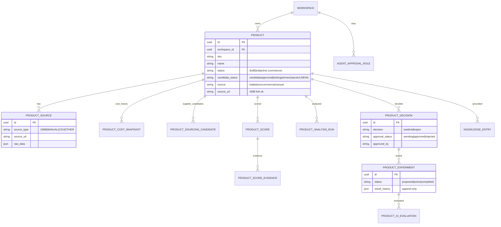

# M5.13 Product Candidate Source Correction — 设计文档

> 状态：**设计稿，等待审核**。本阶段不修改业务代码、不执行 migration、不部署。
> 目标：最小架构调整，让 Product Analyst 支持「1688 / MANUAL / CSV / OTHER」候选来源，
> 并明确「Product Candidate → WooCommerce Draft」的人工审批边界。

---

## 1. 现状分析（代码事实，已核实）

| 能力 | 现状 | 位置 |
|---|---|---|
| 候选产品入口 | ✅ 已存在：`intake_product()` 创建 `status="candidate"` 的 Product | `services/product_intelligence.py:intake_product` |
| 候选来源 | ✅ `source_type: 1688 / MANUAL / OTHER`（缺 CSV） | `schemas/product_intelligence.py:ProductIntakeRequest` |
| 1688 URL | ✅ `source_url` 可保存 1688 链接（http(s) 校验） | 同上 + `ProductSource.source_url` |
| 成本快照 | ✅ `product_cost_snapshots`（append-only） | `models/product_intelligence.py` |
| 供应商候选 | ✅ `product_sourcing_candidates`（source_type 默认 1688） | 同上 |
| 评分 | ✅ `product_scores` + `product_score_evidences` | 同上 |
| 分析运行 | ✅ `product_analysis_runs` | 同上 |
| 决策 | ✅ `product_decisions`（pending→approved/rejected，actor+trace） | 同上 |
| 实验 | ✅ `product_experiments`（proposed/active/completed + result_history） | 同上 |
| 审批推进 | ✅ approve 后 `product.status = "test"` | `services/product_intelligence.py:approve_decision` |
| Product Analyst | ✅ 以 `product_id` 分析（不要求 WooCommerce） | `services/pilot_product_analyst.py` |
| WooCommerce | ✅ 只读 connector：products/orders/customers → `status=active/draft` | `integrations/woocommerce.py` |
| Activation Gate | ✅ `real_products` 按 workspace 产品计数（无 WooCommerce 前置） | `pilot/activation_gate.py` |

**结论**：Product Analyst 技术管线本身不依赖 WooCommerce。真实缺口只有 4 处（见 §2）。

---

## 2. 设计变更（最小调整，4 项）

### 2.1 候选来源扩展：增加 CSV

- `SOURCE_TYPES = ("1688", "MANUAL", "CSV", "OTHER")`（`models/product_intelligence.py`）
- `ProductIntakeRequest.source_type` 的 `Literal` 增加 `"CSV"`
- 新增批量入口（复用单条 intake，不新建业务表）：
  - `POST /api/v1/products/intake/csv`：逐行解析 CSV → 每行调用 `intake_product()`（同事务）
  - CSV 模板复用 `docs/product_import_template.csv`
- 1688 URL 录入保持现状：`source_type="1688"` + `source_url=<1688 链接>`，人工录入必要字段，**不要求 1688 API**

### 2.2 候选生命周期与商务状态分离

**新增 1 个 migration、1 个可空列**（最小 DDL）：

```text
products.candidate_status  VARCHAR(16) NULL
  取值：candidate | approved | testing | winner | rejected
  语义：Product Candidate 生命周期（与商务状态解耦）
```

- `products.status` 保持为**商务/执行状态载体**（`draft` / `test` / `active`；WooCommerce draft/published/sold 落在这里）
- 数据迁移（backfill，非 destructive）：
  - `status='candidate'` → `candidate_status='candidate'`
  - `status='test'` → `candidate_status='testing'`
  - 其余（WooCommerce 同步的 `active/draft` 等）→ `candidate_status=NULL`（纯商务产品，不参与候选流程）
- 状态转移（由现有服务触发，追加赋值，不改变现有判断逻辑）：
  - decision approved → `candidate_status='approved'`（同时保留现有 `product.status='test'`）
  - experiment start → `candidate_status='testing'`
  - experiment 完成 + 人工判定 winner → `candidate_status='winner'`
  - decision rejected / 人工驳回 → `candidate_status='rejected'`

### 2.3 Product Analyst 分析 Product Candidate（无需改管线）

- Product Analyst / Product Context Builder 已按 `product_id` 工作，候选产品（`candidate_status IN (candidate, approved, testing, winner)`）可直接分析
- `activation_gate.real_products` 检查不变（按 workspace 产品计数），文档明确：**不要求 WooCommerce published 作为前置**
- WooCommerce 维持 downstream 角色：commerce / order / sales / inventory / customer source（connector 不删除、不改写逻辑）

### 2.4 Product Candidate → WooCommerce Draft 人工审批边界（新增）

**边界定义**：候选产品进入 WooCommerce 必须经过第二次人工审批；系统**不自动创建、不自动 publish** WooCommerce 商品。

- 新增 RBAC 权限：`product.candidate.promote`（`approval_rbac.APPROVAL_PERMISSION_PREFIX` 增加 `"PRODUCT_CANDIDATE": "product.candidate"`，approval_type=`PRODUCT_CANDIDATE`）
- 新增端点：
  - `POST /api/v1/product-candidates/{product_id}/promote`
    - 前置：`candidate_status IN ('approved','winner')`
    - 人工 actor（`resolve_actor`）+ RBAC `product.candidate.promote`；Agent actor → 403；无权限 → 403；跨 workspace → 404；重复 promote → 幂等/400
    - 动作：生成 **WooCommerce Draft 商品载荷**（JSON：sku/name/category/price/inventory/description/image），写入 `event_log`（`product.candidate.promoted`，actor/action/note/trace_id），`candidate_status` 保持（或置 `promoted` 标记）
    - **Phase 1 不调用 WooCommerce 写 API**：由人工在 WooCommerce 后台按载荷创建 draft；未来如需系统写通道，须单独设计 + 人工授权
- WooCommerce draft → publish：始终由人工在 WooCommerce 后台操作，OS 不自动

---

## 3. ER 图（复用现有表，仅 `products` 加 1 列）



> 说明：`product_cost` / `product_cost_snapshots` / `product_scores` / `product_analysis_runs` /
> `product_sourcing_candidates` / `product_ai_evaluations` / `knowledge_entries` 全部复用，**不新建业务表**。

---

## 4. 数据流（1688 → … → WooCommerce → Learning）

```mermaid
flowchart LR
    A[1688 URL 人工录入] --> B[Intake: source_type=1688 + source_url]
    C[MANUAL 录入] --> B
    D[CSV 批量录入] --> B
    B --> P[(products candidate_status=candidate)]
    P --> CTX[Product Context Builder + PII Guard]
    CTX --> PA[Product Analyst + Real LLM]
    PA --> DEC[(product_decisions pending)]
    DEC -->|人工审批 product.decision.approve| AP[approved]
    AP --> EXP[(experiment proposed)]
    EXP -->|人工 start started_by| RUN[(experiment active/testing)]
    RUN --> RES[真实业务结果 manual/external/connector]
    RES --> EVAL[Evaluation product_ai_evaluations]
    EVAL --> CAL[Calibration ≥3 samples → 人工 approve]
    CAL --> WIN[candidate_status=winner]
    WIN -->|人工 promote product.candidate.promote| DRAFT[WooCommerce Draft 载荷]
    DRAFT -->|人工在 WC 后台创建 draft| WCPUB[人工 publish]
    WCPUB --> ORDERS[真实订单]
    ORDERS --> SYNC[WooCommerce connector 只读 sync]
    SYNC --> LEARN[Knowledge → Second Context]
```



**审批边界（4 道，全部人工）**
1. `product.decision.approve`：候选 → 测试（已有）
2. `product.decision.experiment.start`：`started_by` 人工（已有）
3. `product.candidate.promote`（**新增**）：候选 → WooCommerce Draft（生成载荷，不自动写）
4. WooCommerce draft → publish：人工后台操作（OS 不自动）

---

## 5. 落地范围（审核通过后执行）

- **Migration（1 个）**：`products.candidate_status` 可空列 + backfill（非 destructive）
- **代码（小）**：
  - `SOURCE_TYPES` 增加 `"CSV"`；`ProductIntakeRequest.source_type` Literal 增加 `"CSV"`
  - CSV 批量 intake 端点（复用 `intake_product`）
  - `approve_decision` / `start_experiment` / `complete_experiment` 追加维护 `candidate_status`（不改变现有判断逻辑）
  - promote 端点 + RBAC permission `product.candidate.promote`
  - `activation_gate.real_products` 检查说明更新（文档层面，逻辑已兼容）
- **测试**（回归 + 新增）：
  - 1688 URL intake / manual intake / CSV intake
  - Product Analyst 分析 candidate（WooCommerce 不存在时仍可运行）
  - WooCommerce 仅 downstream（sync 产品 `candidate_status=NULL`）
  - workspace isolation
  - 审批边界：promote 需 RBAC；Agent→403；无权限→403；跨 workspace→404；重复→400/幂等
- **不执行**：不开发第二个 Agent、不自动 publish、不自动采购、不自动投广告、不修改 rules/SCORE_WEIGHTS

---

## 6. 风险与兼容性

- 兼容：现有 `status` 语义不变，现有查询/测试不受影响；新列可空，WooCommerce 同步行不受影响
- 风险：`candidate_status` 与 `status` 双字段易混淆 → 通过文档 + 唯一写入点（服务层）控制
- 风险：CSV 批量 intake 需校验逐行失败不污染事务 → 单事务 + 行级错误收集
- 待确认：promote 生成载荷后，`candidate_status` 是否需要新状态（如 `promoted`）→ 建议保持 `winner`，用 `event_log` 记录 promote 动作（可追溯、不扩枚举）

---

## 7. 待审核确认点

1. `candidate_status` 列名与取值是否认可（candidate/approved/testing/winner/rejected）
2. promote 边界：Phase 1 只生成 Draft 载荷、由人工在 WooCommerce 后台创建，是否认可
3. CSV intake 入口形态：批量 API 端点 vs CLI 导入，倾向 API（可审计）
4. WooCommerce 同步产品 `candidate_status=NULL`（不参与候选流程）是否认可
