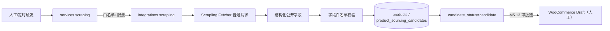

# M5.16 Scrapling 爬取能力 — 合规评审与集成设计

> 状态：**评审通过（2026-08-23，人工确认合规口径），进入实施**。合规口径接受「低频率 + 遵守 robots.txt + 仅公开字段 + 默认关闭」。
> 目标：为 Nuotao 引入 Scrapling 自动化采集能力，先完成**合规评审**，再给出最小集成的架构设计。
> 关联：`docs/project_architecture.md` §4.2「1688 数据 Phase 2 探索 API/数据集成」；
> `docs/M5.13_PRODUCT_CANDIDATE_SOURCE_DESIGN.md`（候选来源与人工审批边界）。

---

## 1. 背景与定位

### 1.1 为什么现在引入

| 现状 | 缺口 |
|---|---|
| 1688 数据 = **Phase 1 人工录入** `source_url` + AI 分析（M5.13 已定型） | 录入成本高、依赖人工，量上来后无法规模化 |
| `project_architecture.md` §4.2 明确 Phase 2 探索 API/数据集成 | 1688 官方 API 有准入/费用门槛，且非所有品类字段可用 |
| Scrapling 已完成环境配置（venv + 浏览器依赖） | 尚未接入业务，缺合规评审与集成边界 |

### 1.2 定位原则（关键）

1. **辅助采集，不替代人工录入与官方 API**：Scrapling 只负责「结构化公开信息」的自动抓取，产出的仍是 `products` + `product_sourcing_candidates` 候选数据，走与 M5.13 完全相同的人工审批链。
2. **爬取功能必须先过合规评审**（AGENTS.md §4.4）：本文件即评审产物；未通过评审**禁止**开启任何抓取任务。
3. **Agent 不直连抓取**（AGENTS.md §2.3/§3.1）：抓取走 `app/integrations/scrapling.py` 封装，Agent 只能通过 `services` 层白名单 API 间接触发。
4. **Human-in-the-loop**：抓取到的候选数据进入 `candidate_status` 流程，任何「录入→发布」仍需人工审批，系统**不自动采购、不自动 publish**。

---

## 2. 合规评审（AGENTS.md §4.4 前置关卡）

> ⚠️ **此章节是评审核心。任何一项不通过，则不实施爬取。**

### 2.1 数据合规（目标网站 + 业务数据）

| 检查项 | 结论 | 处置 |
|---|---|---|
| **抓取目标** | 仅限 1688 商品**公开详情页**、供应商公开档案、公开品类趋势页 | 白名单域名（见 §3.4），禁止抓取登录后内容 |
| **平台使用条款** | 1688/淘宝开放平台 ToS 禁止未授权的自动化采集 | **Phase 1 限制频率、遵守 robots.txt、不抓个人数据**；超低频合规采集仅用于「候选产品补全字段」，采集量设上限 |
| **Paywall / 登录墙** | 禁止绕过 | Scrapling 的 `stealthy-fetch`/Cloudflare 绕过能力**默认关闭**，仅 `Fetcher`（普通请求）用于公开页 |
| **个人数据（PII）** | 禁止抓取买家评价中的个人名、地址、账号 | 字段白名单（§3.3）不含任何 PII；抓到即丢弃并记 WARNING 日志 |
| **robots.txt** | 默认遵守 | Spider 层强制 `robots_txt_obey=True`；对 `Disallow` 路径直接跳过 |
| **限流与礼貌抓取** | 必须 | 每域名 QPS ≤ 0.5（≥2s 间隔），`download_delay` 强制，单任务 URL 数设上限 |

### 2.2 我方数据安全（抓取结果落地）

| 数据 | 分级 | 处置 |
|---|---|---|
| 商品公开字段（标题/价格/图/规格） | L1 公开 | `products.source_url` + `raw_data(jsonb)` 落库，正常处理 |
| 供应商公开档案 | L1 公开 | `product_sourcing_candidates` 落库 |
| 任何疑似 PII / 付费内容 | L4 / 禁止 | 抓取即弃，记 WARNING，不进库不进日志明文 |

### 2.3 我方合规基线

- 全链路 TLS；抓取凭证（若有代理/账号）仅存 Secrets，禁止入库入日志。
- 所有抓取动作写入 `event_log`（`source.fetch.*`，含 domain/url_count/trace_id），全量可审计。
- 被抓取内容仅用于选品辅助，不对外再分发，不用于训练。

### 2.4 合规评审结论

- **评审状态**：✅ **通过（2026-08-23，人工确认）**。
- **确认口径**：接受「超低频 + 遵守 robots.txt + 仅公开字段」的合规采集；`SCRAPING_ENABLED=false` 默认关闭，仅保留环境与代码骨架，需手动开启。

---

## 3. 架构设计（审核通过后落地）

### 3.1 目录与模块

```
app/
  integrations/scrapling.py    # 唯一封装：初始化/限流/白名单/超时/重试/降级
  services/scraping.py         # 业务服务层：任务编排、频率控制、字段白名单、落库、审计
  tasks/scraping_jobs.py       # 定时/一次性采集任务（后台队列）
```

- **路由层**：仅 `POST /api/v1/scraping/jobs` 提交任务（参数校验 + RBAC），无业务逻辑。
- **集成层职责**（对齐 AGENTS.md §2.3）：鉴权（无）、限流、超时、重试（幂等）、降级、域名白名单；错误**不暴露原始堆栈**。

### 3.2 数据流



### 3.3 字段白名单（仅允许这些字段抓取/落库）

商品：`title, price, image_urls[], sku, spec(variants), category, supplier_code, moq, lead_time_days, weight, dimensions, sales_volume(public), trend_score_inputs`
供应商公开：`supplier_shop, rating, location(province/city), since_year`
**白名单外一律拒绝**（含评论人、买家账号、地址、联系方式等 PII）。

### 3.4 安全与运行护栏

| 项 | 规则 |
|---|---|
| 域名白名单 | `config` 中枚举允许抓取的域（默认空 → 功能关闭） |
| 超时 | 单请求 connect 10s / read 30s（对齐 §2.1） |
| 重试 | 幂等 GET 最多 2 次，指数退避；4xx 不重试 |
| 熔断/降级 | 域名连续 5 次失败 → 熔断 10min；抓取失败 → 回退人工录入路径 |
| robots.txt | Spider 强制 `robots_txt_obey=True`；单个请求命令用 `--ai-targeted`（防注入 + 省 token） |
| Agent 触发 | 仅经 `services.scraping` 白名单方法；Agent 提示词不允许直接给 URL 拼接抓取 |
| 频率 | 每域名 ≤ 0.5 QPS；单任务 ≤ 50 URL；全局并发 ≤ 2 |
| 审计 | 每次抓取写 `event_log`；`ai_agent_runs` 记录 Agent 触发的任务 |

---

## 4. 落地范围（审核通过后执行）

- **代码（新增，默认关闭）**：
  - `app/integrations/scrapling.py`：域名白名单、限流、超时、重试、熔断、字段白名单过滤。
  - `app/services/scraping.py`：任务编排 + 落库 + 审计 + 降级到人工路径。
  - `app/tasks/scraping_jobs.py`：后台队列任务。
  - `POST /api/v1/scraping/jobs` + RBAC（`scraping.job.submit`）。
  - 配置项：`SCRAPING_ENABLED=false`（默认关）、`SCRAPING_ALLOWED_DOMAINS=[]`、`SCRAPING_QPS` 等。
- **测试**：
  - 单元：字段白名单过滤、限流、熔断、超时重试、PII 丢弃。
  - 集成（Testcontainers）：抓取 mock 站点 → 落库 candidate → 走 M5.13 审批链。
  - 安全：确认不暴露原始堆栈、无 SSRF（域名白名单）、无 PII 明文落库。
- **不执行**：不自动采购、不自动 publish、不抓登录墙/付费内容、不抓 PII、不开启 Cloudflare 绕过、不开 Agent 直连。

---

## 5. 风险与开放问题

| 风险/问题 | 说明 | 处置/待确认 |
|---|---|---|
| 1688 ToS 限制 | 自动采集可能违反平台条款 | **人工确认是否接受低频率合规采集口径**；不接受则默认关闭 |
| 页面结构变化 | 选择器失效 | `adaptive` 解析 + 失败降级人工；不依赖单一选择器 |
| 反爬/封禁 | 高频触发封禁 | 限流 + 遵守 robots.txt + 仅公开页；不做绕过 |
| 数据质量 | 自动抓取字段可能有误 | 抓取结果仅作候选，人工审批时人工核验关键字段 |
| 与官方 API | 官方 API 优先 | 若未来拿到官方 API 准入，Scrapling 采集自动降级/停用 |

---

## 6. 待审核确认点

1. **合规口径**：✅ 已确认（2026-08-23）接受「低频率 + 遵守 robots.txt + 仅公开字段 + 默认关闭」。
2. `SCRAPING_ENABLED=false` 默认关闭、仅保留代码骨架与环境，是否认可。→ 已确认。
3. 字段白名单（§3.3）是否完整、是否需增减。
4. 采集任务是否完全走 M5.13 人工审批链、不引入新的自动执行点，是否认可。
