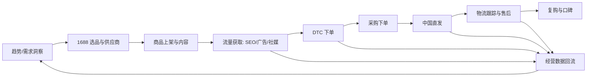

# Nuotao Outdoor — 商业理解文档

> 版本：v0.3
> 状态：规划阶段
> 用途：对齐业务认知，作为技术架构与路线图的输入

---

## 1. 商业模式

### 1.1 业务模式总览

Nuotao Outdoor 是 AI 驱动的跨境户外品牌，核心逻辑：**用中国供应链的成本优势 + AI 运营效率，服务海外户外消费市场**。

| 要素 | 说明 |
|---|---|
| 供给端 | 中国 1688 供应链（白牌/贴牌，轻库存） |
| 渠道端 | WooCommerce DTC 独立站（自有流量资产） |
| 履约端 | 中国直发海外（邮政小包/专线），爆品后转海外仓 |
| 需求端 | 欧美户外爱好者（高客单、重品质、重内容） |
| 竞争壁垒 | 品牌内容 + AI 运营效率 + 供应链响应速度 |

### 1.2 三阶段演进

| 阶段 | 战略重点 | 关键动作 | 成功标志 |
|---|---|---|---|
| 阶段 1 | 验证 | 1688 选品 → DTC 独立站 → 中国直发 | 稳定出单、毛利率为正、跑出爆品 |
| 阶段 2 | 复制放大 | 爆品海外仓、本地化履约、提升时效与复购 | 履约时效显著改善、复购率提升 |
| 阶段 3 | 平台化 | 海外代理商、B2B 分销渠道 | 非 DTC 收入占比提升、渠道网络形成 |

### 1.3 收入与成本结构

**收入模型（DTC）**
- 销售收入 = 客单价 × 订单量
- 客单价：户外品类建议定位中高（$30–120 区间，随品类而定，具体以市场调研为准）
- 附加收入：多件折扣、捆绑销售、复购（耗材/配件）、EDM 再营销

**成本结构（单订单视角）**

| 成本项 | 说明 | 占客单价比例（经验参考） |
|---|---|---|
| 采购成本 | 1688 商品 + 国内运费 | 15–30% |
| 头程/尾程运费 | 中国直发海外 | 20–40%（重货/大件占比高） |
| 平台/支付费 | Stripe/PayPal + WooCommerce | 3–5% |
| 营销成本 | 广告 + 内容 + EDM | 15–30% |
| 售后损耗 | 退款、丢件、客诉补偿 | 2–8% |
| **目标净利率** | — | **10–25%（经验区间，需用真实数据校准）** |

> 假设：户外大件（帐篷/桌椅）运费占比高，小件（头灯/配件）毛利更优但客单低。首期选品应优先「轻、小、高价值、强内容属性」的品类以控制运费占比。此部分为行业经验区间，非财务承诺，需以实际报价和销售数据校准。

### 1.4 价值主张（消费者视角）

- 户外产品「买对不买贵」：AI 选品保证品质与性价比
- 内容驱动：专业户外场景内容（使用场景、对比测评）降低决策成本
- 服务保障：中文客服团队（AI 辅助）提供超过当地竞品的响应速度

---

### 1.5 目标市场战略（已确认）

| 优先级 | 市场 | 定位 | 关键要求 |
|---|---|---|---|
| 主市场 | 美国 | 首发验证，跑通单位经济模型 | 英文（US）、USD、州级销售税（经济关联）、中国直发时效管理 |
| 次市场 | 德国 / 欧盟 | 第二增长曲线 | 德语、EUR、欧盟 VAT/IOSS、德国包装法（LUCID）、电器法（WEEE，如含电子件）、GDPR |
| 未来 | 英国 / 加拿大 / 澳大利亚 | 规模化复制 | GBP/CAD/AUD、当地 VAT/GST/HST、澳洲生物安全检疫（户外品类需注意） |

**市场进入策略**

1. 美国先跑通「选品→上架→成交→履约→复购」闭环，验证单笔订单单位经济模型（UE）。
2. 模型验证后再开德国/欧盟：启用德语内容、EUR 定价、IOSS 税务登记，完成本地化合规。
3. 英国/加拿大/澳大利亚在系统支持多市场（多币种/多语言/多税制）后按同一模板快速复制。

**对系统的要求（直接影响架构）**

- 商品需支持按市场差异化定价（`price_by_region`）与多语言内容（英文/德语）。
- 税务引擎必须抽象为「税制适配器」：美国州销售税（Stripe Tax/TaxJar）与欧盟 IOSS 是两套逻辑，禁止混写。
- 客服需覆盖美欧时区，德语为第二语言基线。
- 物流按市场路由：美国走小包/专线，欧盟走 IOSS 通道以快速清关。

---

## 2. 业务目标

### 2.1 北极星指标（North Star Metric）

**月度净利润（或毛利额）** —— 该指标同时反映选品、营销、供应链、履约效率，是各 AI Agent 的最终对齐目标。

辅助指标体系：

| 层级 | 指标 | 说明 |
|---|---|---|
| 增长 | 月访问量、转化率、客单价、新客数 | 市场与营销健康度 |
| 效率 | 毛利率、运费占比、广告 ROAS、库存周转 | 选品与供应链健康度 |
| 服务 | 发货时效、物流时效、退货率、NPS/评分 | 客户满意度 |
| 复购 | 复购率、EDM 打开率、LTV | 品牌资产 |

### 2.2 分阶段业务目标

| 阶段 | 目标（示例性，需按实际校准） |
|---|---|
| 阶段 1（0–6 月） | 跑通全流程；月订单 100–500；毛利率 ≥ 30%；验证 1–2 个爆品 |
| 阶段 2（6–18 月） | 海外仓上线；履约时效 < 7 天；复购率 ≥ 15%；月订单 1,000+ |
| 阶段 3（18 月+） | 10+ 代理商/B2B 客户；非 DTC 收入占比 ≥ 30% |

> 以上数字是规划参考，不代表承诺；建议以首 3 个月真实数据重新校准目标。

---

## 3. 用户画像

| 画像 | 特征 | 需求 | 触达渠道 |
|---|---|---|---|
| 初级露营者 | 25–40 岁，家庭/情侣，欧美城市 | 入门装备、安全易用、教程内容 | SEO、社媒、EDM |
| 资深户外玩家 | 30–50 岁，追求性能 | 专业装备、参数对比、测评 | 红人合作、论坛/社群 |
| 礼品/团购用户 | 企业、社群 | 批量、定制、B2B | B2B 网站、代理商 |
| 复购客户 | 已购客户 | 配件、耗材、新品 | EDM、会员体系 |

---

## 4. 核心业务流程

**流程关键点**
- 每个环节产生数据，回流到选品与营销决策（数据飞轮）。
- 环节之间由 AI Agent 自动衔接，人工只处理例外（审批、客诉升级、供应商异常）。

---

## 5. AI 如何切入每个业务环节

| 环节 | 痛点（人工模式） | AI 解决方案 | 人工保留点 |
|---|---|---|---|
| 选品 | 1688 商品多、筛选耗时、易凭感觉 | 采集+成本模型+趋势评分自动推荐 | 最终选品审批 |
| 内容 | 多语言文案/图片制作慢、SEO 弱 | LLM 生成卖点、SEO 文章、EDM；图片工具辅助 | 品牌调性审核 |
| 营销 | 广告投放需持续盯盘 | 广告数据归因分析 + 投放建议 | 预算审批 |
| 采购履约 | 订单多后人工对单易错 | 自动生成采购单、跟踪物流、异常预警 | 供应商关系维护 |
| 客服 | 时差导致响应慢 | 7×24 机器人 + 知识库 | 复杂客诉 |
| 分析 | 周报月报耗时 | 自动聚合 + 周报生成 + 异常预警 | 经营决策 |

---

## 6. 关键风险与对策

| 风险 | 影响 | 对策 |
|---|---|---|
| 选品失败/库存积压 | 资金占用 | 先小单测试（MOQ 内）、预售、爆品后补货 |
| 物流时效与丢件 | 差评、退款 | 多物流商路由、17TRACK 监控、自动预警补发 |
| 平台依赖（流量单一） | 收入波动 | SEO 内容资产 + EDM 私域 + 多社媒渠道 |
| LLM 成本失控 | 利润侵蚀 | 模型路由、缓存、预算上限、降级策略 |
| 数据合规（GDPR） | 罚款、封站 | 最小化收集、加密、数据导出/删除流程 |
| 供应商断供/品质 | 履约失败 | 供应商评分、双供应商备份、样品抽检 |
| 汇率波动 | 利润波动 | 定价含汇率缓冲、多币种结算策略 |
| 广告竞争加剧 | ROAS 下降 | 差异化内容 + 复购留存降低获客依赖 |

---

## 7. 竞争优势分析

| 对比维度 | 传统跨境卖家 | Nuotao Outdoor（目标） |
|---|---|---|
| 选品 | 经验驱动、人工筛选 | 数据 + AI 驱动、可复制 |
| 内容 | 外包/模板化 | AI 批量生成 + 品牌化 |
| 客服 | 高成本、有时差 | AI 7×24 + 人工兜底 |
| 供应链 | 人工对单 | 自动化 + 异常预警 |
| 决策 | 事后看报表 | 实时看板 + 预测 |

**真正的壁垒**：不是单一工具，而是「数据飞轮 + 流程自动化 + 品牌内容资产」的组合，以及跑通后的运营知识沉淀（这本身也是 AI 系统的训练与知识库资产）。

---

## 8. 商业决策与待验证假设

1. ✅ 已确认：首批市场 = 美国（主）、德国/欧盟（次）；未来扩展英国/加拿大/澳大利亚。
2. 首期品类假设为「轻小件户外装备 + 1–2 款中件爆品」，需市场调研确认。
3. ✅ 已确认：1688 数据策略 = Phase 1 人工录入 + AI 分析；Phase 2 探索 API/数据集成。
4. DTC 起步阶段预计以 SEO + 红人 + 小额广告测试为主，避免烧钱。
5. 定价策略需覆盖「运费占比高」的现实，可考虑「满额包邮」「组合购」提升客单。
6. ✅ 已确认：LLM 策略 = 多供应商架构（OpenAI 主、DeepSeek 备），避免厂商锁定。

> 本文档为规划基线，随市场验证结果持续更新；已确认决策的权威记录见 `docs/business_decisions.md`。

---

## 9. 变更记录

| 版本 | 日期 | 变更 |

|---|--|---|

| v0.3 | 2026-08-11 | 确认 1688 数据策略（Phase 1 人工录入+AI 分析）与 LLM 多供应商策略（OpenAI 主、DeepSeek 备） |
| v0.2 | 2026-08-11 | 确认目标市场（美国主、德国/欧盟次、未来英/加/澳），新增 1.5 目标市场战略 |

| v0.1 | 2026-08-11 | 初稿 |
