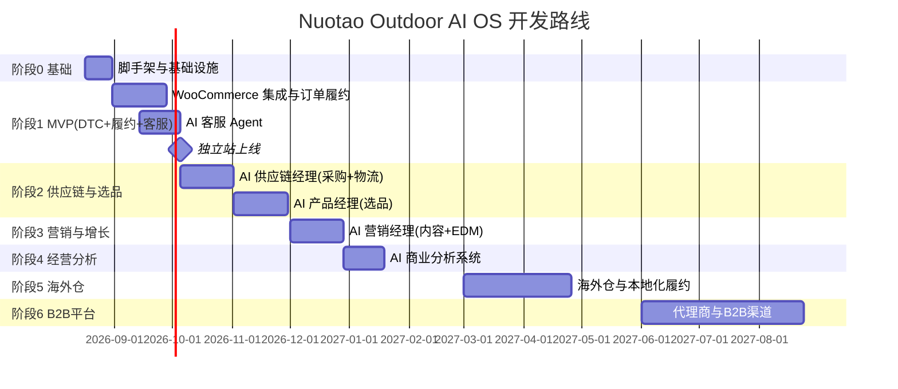
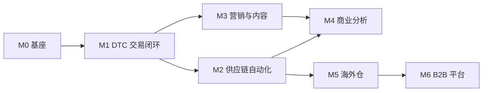

# Nuotao Outdoor AI OS — 开发路线规划

> 版本：v0.15
> 状态：P2-8 商品品牌归因治理首期完成，下一步为 P2-9 成本覆盖治理
> 目标：从 0 到 1 构建 AI 原生跨境户外电商操作系统
> 最近更新：2026-09-13 — 正式采用 B2C + B2B 双模式架构；B2B 完整规模化仍属 M6，但从当前阶段起建设工作区、客户、价格和订单兼容底座

---

## 1. 路线图总览

> 时间线为规划参考（按当前日期 2026-08-11 推算），实际以里程碑验收为准；若为单人开发，建议按「核心闭环优先」裁剪范围。

---

## 2. 里程碑与交付物

### 里程碑 M0 — 项目启动（1–2 周）
**目标：可开发的工程基座**

| 交付物 | 验收标准 |
|---|---|
| 仓库与 CI | Git 仓库、GitHub Actions 流水线（lint/test/build）跑通 |
| 环境 | Docker Compose 一键起 PostgreSQL/Redis/MinIO/WooCommerce |
| 数据库 | Alembic 迁移框架 + 核心表初版 schema |
| 规范 | AGENTS.md、代码规范、提交规范落地 |
| 监控 | Sentry + 结构化日志接入 |

### 里程碑 M1 — DTC 交易闭环（约 6–8 周）
**目标：能真实收款、履约、发货（美国首发，多市场基座就绪）**

| 交付物 | 验收标准 |
|---|---|
| WooCommerce 独立站 | 选品完成上架，支付（Stripe/PayPal）可用 |
| 多币种/多语言 | USD/EUR 定价与英文/德语商品内容就绪（商品按市场差异化定价） |
| 税务合规 | 美国州销售税自动计算；欧盟 IOSS 登记并接入收款（税制适配器） |
| 合规登记 | 德国 LUCID（包装法）/ WEEE（如适用）登记完成 |
| 订单同步 | 新订单实时入本地库，状态机正确 |
| 采购/发货流程 | 手动下单时可自动生成采购单并回填物流号 |
| 通知 | 订单确认、发货通知邮件自动化 |
| LLM 网关 | OpenAI/DeepSeek 双通道接入，可切换、可降级（LiteLLM） |
| AI 客服 MVP | 常见问题机器人 + 转人工（邮件/工单） |

**业务验收**：真实订单跑通「下单→采购→发货→送达→评价」，回款与对账无误。

### 里程碑 M2 — 供应链自动化（约 8–10 周）
**目标：选品与履约决策数据化、半自动化**

| 交付物 | 验收标准 |
|---|---|
| 选品数据录入 | Phase 1 人工录入/批量导入 + AI 结构化分析（录入模板与质检）；Phase 2 探索 API/数据集成 |
| 成本模型 | 单订单落地成本与毛利测算准确 |
| 选品建议 | AI 产品经理输出候选清单 + 审批流 |
| 采购自动化 | 按规则自动生成采购单，异常人工介入 |
| 物流监控 | 轨迹同步、时效异常预警 |

**业务验收**：新上架商品 80% 由 AI 建议流程产出；物流异常 100% 有预警。

### 里程碑 M3 — 营销与内容系统（约 6–8 周）
**目标：低成本获客引擎**

| 交付物 | 验收标准 |
|---|---|
| 内容生成 | 卖点、SEO 文章、EDM 草稿批量生成 + 审核流 |
| SEO 基建 | 结构化数据、sitemap、关键词策略落地 |
| EDM | 弃购挽回、复购营销自动化 |
| 广告分析 | 投放数据回流与 ROAS 归因（先手动、后自动） |

**业务验收**：自然流量占比提升；EDM 转化可归因；内容生产人工工时下降 50%+。

### 里程碑 M4 — 商业分析系统（约 4–6 周）
**目标：经营决策自动化**

| 交付物 | 验收标准 |
|---|---|
| 统一看板 | 订单/收入/毛利/广告 ROI 日更 |
| 周报 | AI 自动生成经营周报（含异常解释） |
| 预警 | 毛利下滑、退款率上升、断货风险自动提醒 |

**业务验收**：经营会议基于系统周报；关键异常 24h 内被预警。

### 里程碑 M5 — 海外仓（阶段 2，约 8–12 周）
| 交付物 | 验收标准 |
|---|---|
| 海外仓对接 | 头程发货 + 海外仓入库/出库/库存同步 |
| 库存模型 | 多仓库存、安全库存、补货建议 |
| 时效升级 | 履约时效进入目标区间 |

### 里程碑 M6 — B2B 规模化与代理商（约 12–16 周）
| 交付物 | 验收标准 |
|---|---|
| 代理门户 | RFQ、报价确认、合同签署、订单与库存查询 |
| B2B API | 开放接口 + 鉴权 + 配额 |
| 渠道管理 | 代理商佣金/返点、账期管理 |

> 架构前置（当前阶段）：按 `COMMERCE-001` 先完成 B2B 工作区隔离、统一客户主数据、阶梯价、RFQ/报价/合同、订单状态机与应收模型。M6 表示业务规模化，不代表数据库可以等到 M6 才开始兼容 B2B。

---

## 3. 团队与分工（建议）

| 角色 | 人数建议 | 职责 |
|---|---|---|
| 创始人/产品负责人 | 1 | 业务决策、选品审批、供应商关系 |
| 全栈/AI 工程师 | 1–2 | 后端 + AI Agent + 集成 |
| 前端/独立站 | 0.5–1 | WooCommerce 主题 + 管理控制台 |
| 市场/内容（AI 辅助） | 0.5–1 | 品牌内容、红人、广告执行 |
| 供应链运营 | 0.5–1 | 供应商对接、异常处理、质检 |

> 单人起步可行：优先 M1，把「下单→发货→客服」闭环跑通，再逐步补齐 AI 能力。

---

## 4. 开发优先级原则

1. **先闭环、后智能**：先跑通真实交易与履约，再叠加 AI 自动化。
2. **AI 只做建议，关键动作人审**：避免早期 AI 失控带来资金/口碑损失。
3. **数据先行**：从第一天记录结构化事件，保证后续 AI 有数据可用。
4. **成本敏感**：每个 AI 功能上线前评估 LLM 成本与业务价值。
5. **小步快跑**：每个里程碑有可验收的业务结果，而不是「架构完美」的代码。

---

## 5. 里程碑依赖关系

- M0、M1 是硬前置，其余可并行（M2 与 M3 可同步推进）。
- M4 依赖 M2/M3 的数据，但看板框架可在 M1 后先搭。

---

## 6. 风险与应对（开发侧）

| 风险 | 影响 | 应对 |
|---|---|---|
| 范围膨胀 | 延期 | 每个里程碑冻结范围；未排期需求进 Backlog |
| 欧盟合规（VAT/IOSS/包装法） | 罚款、清关失败 | IOSS 登记、LUCID/WEEE 登记、税制适配器验证 |
| 单人瓶颈 | 延期 | 明确最小闭环；必要时外包 WooCommerce 主题等低风险项 |
| WooCommerce 插件质量参差 | 安全/性能 | 插件最小化、锁版本、依赖审计 |
| LLM 依赖（模型/成本/幻觉） | 功能不稳 | LLM Gateway + 降级；关键输出加校验与人审 |
| 1688 数据合规 | 法律风险 | 开发前确认采集方式；宁可用人工录入+半自动 |
| 汇率/运费波动 | 模型失真 | 成本模型参数化，定期校准 |

---

## 7. 成本与资源计划（开发期）

| 项目 | 估算（一次性） | 说明 |
|---|---|---|
| 域名 | 10–15 USD/年 | 建议品牌域名 |
| 代码托管 | 0 | GitHub 免费/Pro 档 |
| 开发环境 | 0–20 USD/月 | 本地 + 1 台测试 VPS |
| 第三方 API（物流/支付测试） | 0–50 | 沙箱免费为主 |
| LLM（开发测试） | 20–100 USD/月 | 设上限 |

> 以上为规划估算，实际以采购为准。

---

## 8. 工程纪律（贯穿全程）

- **分支策略**：`main` 保护，功能分支 + PR 评审（单人开发也保留 PR 记录）。
- **提交规范**：Conventional Commits（feat/fix/docs/chore/refactor/test）。
- **文档同步**：架构变更必须更新 `/docs` 相关文档与版本号。
- **数据备份**：每日自动备份数据库到对象存储，保留 N 天，定期演练恢复。
- **环境隔离**：dev/staging/prod 三套环境，密钥入 Secrets 管理，绝不入仓库。
- **质量门禁**：里程碑验收清单（见各里程碑）未过不进入下一阶段。

---

## 8.5 已完成工作记录（v0.5）

### M0-M4 里程碑全部完成（2026-09-11）

| 里程碑 | 状态 | 完成日期 | 核心交付 |
|--------|------|----------|----------|
| M0 工程基座 | ✅ 完成 | 2026-08 | 仓库/CI/Docker/Alembic/AGENTS.md/监控 |
| M1 DTC 交易闭环 | ✅ 完成 | 2026-09-11 | WooCommerce 60 SKU/支付/订单同步/采购发货/通知/客服/税务/LLM网关 |
| M2 供应链自动化 | ✅ 完成 | 2026-09-11 | 选品/成本模型/采购自动化/供应商管理/库存/物流监控 |
| M3 营销与内容 | ✅ 完成 | 2026-09-11 | 内容生成/SEO基建/EDM自动化/广告分析ROAS |
| M4 商业分析 | ✅ 完成 | 2026-09-11 | 统一看板/AI周报/回款台账/业务预警(毛利/退款/断货) |

### v0.5 关键补齐项
1. **采购成本数据源修复**：fulfillment_service 从硬编码 40% 比例改为从 ProductCost 表获取实际采购成本，兜底比例移至配置（procurement_fallback_cost_ratio）
2. **供应商管理闭环**：新增 Supplier 主表 CRUD（Schema/Service/API），与 SupplierProfile 智能画像、PurchaseOrder 采购单形成完整供应链管理链路
3. **内容营销数据模型**：新增 ContentItem / EDMCampaign / SEORecord 三张数据库表，替代 JSON 文件存储，支持内容审核流、EDM 发送指标、SEO 排名快照
4. **业务预警自动评估**：新增 business_alert_service，从数据库实时查询订单/退款/库存数据，自动评估毛利下滑/退款率上升/断货风险/收入下滑/AOV下降，接入调度器每 6 小时自动运行
5. **预警去重与自动恢复**：活跃告警按 (workspace, type, resource) 去重，指标恢复后自动解除告警

### v0.6 B2C + B2B 双模式经营闭环（2026-09-13）

- P0 双模式数据隔离、统一客户账户、渠道级订单唯一键、B2B 状态机和退款身份安全已完成。
- P1 价格簿/阶梯价、RFQ/报价/合同、发票/收款/应收、B2B WMS/TMS 履约和 Agent 业务范围已完成。
- P2 首批 B2B Sales、Quotation、Collection 建议型 Agent 已接入统一审批中心。
- P2 双渠道经营分析已接入 `/analytics/channels`，利润只使用成本快照或可追溯采购成本；默认按币种展示，配置直接汇率后可选择报告币种合并。
- P2 汇率底座已通过迁移 `0041` 落地，支持工作区级直接汇率、B2B 成本币种换算和指定报告币种合并。
- P2 B2B 客户门户已完成首期：复用统一销售主链路，客户只能访问自己的 RFQ、报价、合同和订单；客户可提交 RFQ、接受/拒绝已发送报价、登记客户签署，并将生效合同幂等转换为订单。门户使用独立令牌，操作人和客户决策人均进入审计。
- P2 代理商年度协议已完成首期：以订单/发票/收款为达成事实，增加连续阶梯返利、目标进度、人工审批和结算登记，不复制销售数据，不自动付款；`0043` 迁移和 Chrome 端到端验收通过。
- P2 信用风控与信用保险已完成首期：以敞口、逾期、账龄和坏账形成可解释评分，经管理员审批的政策可确定性执行 `watch/hold/frozen`；所有 B2B 下单入口统一校验信用状态和额度，人工解除、保单与索赔均有审计；`0044` 迁移、API/RBAC、订单入口和 Chrome 端到端回归通过。
- P2 跨渠道客户身份与隐私合规已完成首期：工作区级 HMAC 身份链接、确定性冲突、管理员审批合并、追加式同意账本、EDM 发送门禁和数据主体请求台账已通过 `0045` 落地；Chrome 桌面完整审批链与 390px 移动端验收通过。
- P2-7 多品牌、多法人和内部交易合并已完成首期：`0046` 新增品牌、法人、商品品牌归因和交易归因；B2C 订单、B2B 订单与发票可自动归因；管理员批准后消除内部收入；`/analytics/consolidation` 已通过 Chrome 桌面与 390px 验收。内部利润会计级抵销仍明确保留到后续。
- P2-8 商品品牌归因治理已完成首期：未绑定品牌商品支持批量补空且不覆盖已有品牌；品牌可编辑默认销售法人；未归因订单/发票、混品牌和缺少法人证据可查询；具备完整证据的历史交易可自动补全，所有批量动作逐项审计。
- P2-9 下一步为成本覆盖治理：列出缺少有效 `ProductCost` 的商品和交易，提供可审计的成本补齐入口；成本证据完整前不计算伪造毛利，不启用内部利润抵销。
- 旧模拟商品排行和 60% 收入估算接口已返回 `410 Gone`。

### 4阶段12任务全部完成（v0.4 继承）

| 阶段 | 任务 | 状态 | 完成日期 |
|------|------|------|----------|
| 第一阶段（紧急） | 1. 删除/合并2个冗余菜单项（selection、image-gen） | ✅ 完成 | 2026-09-04 |
| 第一阶段（紧急） | 2. 1688商品一键导入WooCommerce闭环 | ✅ 完成 | 2026-09-04 |
| 第一阶段（紧急） | 3. 出单后半自动1688下单采购 | ✅ 完成 | 2026-09-04 |
| 第二阶段（高价值） | 4. 选品管理+采购自动化后端API对接 | ✅ 完成 | 2026-09-04 |
| 第二阶段（高价值） | 5. 库存定期同步 | ✅ 完成 | 2026-09-04 |
| 第二阶段（高价值） | 6. 一件代发物流流程打通 | ✅ 完成 | 2026-09-04 |
| 第三阶段（中期） | 7. AI经营周报+成本模型API对接 | ✅ 完成 | 2026-09-04 |
| 第三阶段（中期） | 8. 海外仓API对接 | ✅ 完成 | 2026-09-04 |
| 第三阶段（中期） | 9. 内容生成/EDM/SEO对接真实服务 | ✅ 完成 | 2026-09-04 |
| 第四阶段（后期） | 10. AI能力深化（选品模型、客服自动回复、动态定价） | ✅ 完成 | 2026-09-04 |
| 第四阶段（后期） | 11. 系统运维优化 | ✅ 完成 | 2026-09-04 |
| 第四阶段（后期） | 12. B2B/多语言/客服模板等P3页面API对接 | ✅ 完成 | 2026-09-04 |

### 前端控制台API对接完成

| 类别 | 总数 | 已完成 | 完成率 |
|------|------|--------|--------|
| 前端页面总数 | 47 | 47 | 100% |
| 使用mock数据的页面 | 29 | 0 | 100%已对接 |
| 核心页面完整数据映射 | 4 | 4 | 100% |
| 非核心页面数据映射完善 | 23 | 23 | 100% |

**核心页面（已有完整数据映射）：**
- Dashboard.tsx、Orders.tsx、Customers.tsx、Products.tsx

**非核心页面（已完成数据映射完善）：**
- Finance、Logistics、Procurement、Warehouse、Suppliers、CostModel、EDM、SEO、Marketing、ActivityPlanner、CRM、Tickets、Influencer、B2BAgents、OverseasWarehouse、ListingLocalization、ApiManagement、CustomerTemplates、FinanceReport、ProductListing、Logs、Users、Settings

**每个页面统一完成：**
1. 新增xxxData状态，存储真实API数据
2. 完善loadXxxData函数，调用真实API并设置状态
3. 完善统计数据计算，优先使用真实API数据，失败则使用mock数据降级
4. 前端构建成功并部署到生产服务器
5. API验证通过（所有端点返回200）

### 后端测试覆盖

- 测试总数：567个通过，2个跳过
- 核心域测试覆盖：订单、履约、成本模型、状态机、Agent工具均有对应测试
- 集成测试：40个需要真实PostgreSQL/Redis环境（本地未配置）

### 生产部署状态

- 生产服务器：Hetzner 95.217.218.178
- 前端部署路径：/var/www/nuotao-console/
- 后端部署路径：/opt/nuotao/backend/
- 生产站点：nuotaooutdoor.com（WooCommerce），admin.nuotaooutdoor.com（后端API/控制台）
- API文档：https://admin.nuotaooutdoor.com/docs

---

## 9. 下一步行动（前 2 周）

1. ✅ 已确认：首批市场 = 美国（主）、德国/欧盟（次）；下一步细化首批品类。
2. ✅ 已确认：1688 数据策略 = Phase 1 人工录入 + AI 分析，Phase 2 探索 API/数据集成。
3. ✅ 已确认：LLM 策略 = 多供应商（OpenAI 主、DeepSeek 备），LiteLLM 网关防锁定；预算上限运营期设定。
4. 初始化仓库：目录结构、CI、Docker Compose、数据库 schema v1。
5. 搭建 WooCommerce + Stripe 沙箱，跑通测试下单。

> ✅ 三项前置确认已完成，可启动 M0（详见 `docs/business_decisions.md`）。

---

## 10. 变更记录

| 版本 | 日期 | 变更 |

|---|--|---|

| v0.15 | 2026-09-13 | P2-8 完成：商品品牌批量治理、品牌默认法人编辑、归因缺口查询和历史自动归因补全；Chrome 3 项通过，下一步 P2-9 成本覆盖治理 |
| v0.14 | 2026-09-13 | 完成 P2-7 多品牌、多法人、交易归因和内部收入审批消除首期；`0046`、自动归因、合并报表、Chrome 桌面与 390px 验收通过；启动 P2-8 商品品牌归因治理 |
| v0.13 | 2026-09-13 | 完成 P2-6 跨渠道客户身份与隐私合规首期：确定性与人工合并、同意账本、EDM 门禁、数据主体请求、RBAC、迁移往返和 Chrome 端到端验收；明确 P2-7 多品牌/多法人合并报表范围 |
| v0.12 | 2026-09-13 | 完成 B2B 信用风控与信用保险 P2 首期：政策审批、确定性评分、自动暂停/冻结、订单统一阻断、人工解除、保单与索赔；迁移、权限、组合回归和 Chrome 端到端验收通过 |
| v0.11 | 2026-09-13 | 完成代理商年度协议与分级返利 P2 首期：三口径目标进度、连续阶梯、返利审批和结算登记；迁移、组合回归与 Chrome 端到端验收通过 |
| v0.10 | 2026-09-13 | 启动代理商年度协议与分级返利 P2：三口径目标进度、连续阶梯、返利计算审批和结算登记 |
| v0.9 | 2026-09-13 | 完成 B2B 客户门户 P2 首期：RFQ、报价决策、客户签署、合同转订单、独立令牌、范围隔离与审计；后端、迁移和 Chrome 端到端验收通过 |
| v0.8 | 2026-09-13 | 启动 B2B 客户门户 P2：RFQ、报价决策、客户签署、合同转订单、范围隔离与审计 |
| v0.6 | 2026-09-13 | B2C+B2B 双模式闭环；双渠道经营分析；价格/销售/财务/履约/Agent 范围治理；移除模拟经营接口 |
| v0.5 | 2026-09-11 | M0-M4 里程碑全部完成；采购成本数据源修复；供应商管理闭环；内容营销数据模型；业务预警自动评估接入调度器 |
| v0.4 | 2026-09-05 | 4阶段12任务全部完成；前端47个页面API对接完成；23个非核心页面数据映射完善完成；后端测试567个通过；生产部署完成 |
| v0.3 | 2026-08-11 | 确认 1688 数据策略与 LLM 多供应商策略；M1 增加 LLM 网关交付项，M2 调整为选品数据录入 |
| v0.2 | 2026-08-11 | 确认市场战略（美国主、德国/欧盟次、未来英/加/澳）；M1 增加多币种/多语言/税务合规交付项与欧盟合规风险 |

| v0.1 | 2026-08-11 | 初稿 |
