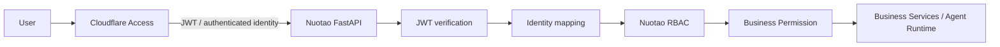
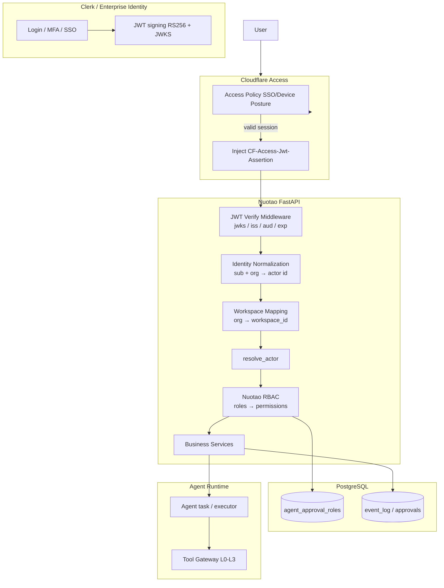

# Nuotao Identity Architecture
> Clerk / Enterprise Identity + Cloudflare Access + Nuotao RBAC

> 版本：v0.1（架构设计稿）
> 状态：**设计阶段，等待实施指令**（IDENTITY-001 ADR 已记录）
> 适用：Nuotao AI OS 全平台（Console / API / Worker 身份链路）

---

## 1. 决策概述

正式确定 Nuotao 全平台身份认证与访问控制为三层架构（ADR `IDENTITY-001`）：

```text
Clerk / Enterprise Identity   →  身份提供方（Login / User / Organization / JWT / Identity lifecycle）
Cloudflare Access            →  Zero Trust 边界（SSO / Access Policy / Edge protection / JWT propagation）
Nuotao Identity Layer        →  JWT verification / identity normalization / user↔workspace mapping / actor resolution
Nuotao RBAC                  →  业务角色 / 业务权限 / workspace isolation
```

**不可违背的边界：**
- 生产可信身份**唯一来源** = 经 Cloudflare Access + Clerk 签名验证的 JWT。
- 禁止 `request body actor` 作为生产身份来源。
- 禁止直接信任 `X-Actor` 头（必须经网关签名/claims 验证）。
- 禁止 Agent 自声明 actor / admin / operator。
- 禁止前端决定权限（仅展示服务端已授权动作）。

---

## 2. 目标架构



- 生产配置：`ACTOR_PROVIDER=header`（header 必须来自 Cloudflare Access / trusted proxy 注入的已验证 JWT）。
- Staging 与 Production 使用**同一套身份模型与代码路径**，仅 provider 配置、密钥与网关不同。

---

## 3. 组件职责

### 3.1 Clerk / Enterprise Identity（身份提供方）
- Login / Logout / MFA / User lifecycle / Organization（org）管理
- 签发 JWT（RS256，JWKS 公开）
- 提供 `CLERK_SECRET_KEY` / Frontend API key（服务端环境变量，不入 DB / 日志 / event_log / trace）
- Enterprise 版支持 SAML/SSO 对接公司 IdP（如 Entra ID / Okta）

### 3.2 Cloudflare Access（Zero Trust 边界）
- 应用访问策略（Application Access Policy）：仅允许已认证/合规设备访问 Nuotao 控制台与 API
- SSO 联合（与 Clerk 或公司 IdP）
- Edge 层身份传播：在请求注入 `CF-Access-Jwt-Assertion`（已签名 JWT），后端只信任该头
- 禁止绕过：任何直连源站的流量无有效 Access JWT → 401

### 3.3 Nuotao Identity Layer（应用内身份层）
- JWT 签名/claims 验证（JWKS 缓存，校验 iss / aud / exp / nbf / sub）
- identity normalization：`sub`/`email`/`org` → 统一 actor id（安全字符集校验、保留字拒绝）
- user ↔ workspace 映射（org → workspace_id，见 §8）
- actor resolution：`resolve_actor()` 输出经过验证的 actor（代码接缝 `app/core/actor.py`）

### 3.4 Nuotao RBAC
- 角色表 `agent_approval_roles`（workspace_id + role_name + permissions + actors + enabled）
- 服务端强制：`approval_rbac.check_approval_permission()` → 403
- 业务权限命名空间：`tool.*` / `recommendation.*` / `calibration.*` / `dlq_replay.*` / `agent.lifecycle.*` / `product.decision.*` / `product.candidate.*`
- workspace isolation：所有服务查询带 workspace 过滤，跨 workspace → 403/404

### 3.5 PostgreSQL / Agent Runtime（消费方）
- PostgreSQL：角色/审批/审计（`agent_approval_roles`、`agent_approvals`、`event_log`）持久化；**不存储 JWT / secret**
- Agent Runtime：Agent 永远以系统身份（`agent_id`）执行，走 L0-L3 工具门禁；**不参与身份解析、不冒充 operator**

---

## 4. 完整身份链路



---

## 5. 身份流程

1. **登录**：用户在 Clerk Hosted UI 登录（MFA/SSO），Clerk 维护 session。
2. **访问**：用户访问 Nuotao Console/API → Cloudflare Access 校验登录态与设备策略，注入 `CF-Access-Jwt-Assertion`（JWT 含 `sub`、`org`、`email`、`roles` 等 claims）。
3. **验证**：FastAPI 中间件用 Clerk JWKS 验证 JWT 签名与 claims（iss/aud/exp/nbf）。验证失败 → 401，**绝不回退 body actor**。
4. **映射**：`sub`/`org` → normalized actor id + workspace_id（服务端映射）。
5. **授权**：`resolve_actor()` → workspace 角色 → 权限 → 业务动作（approve/reject/experiment/promote 等），缺失权限 → 403。
6. **审计**：actor / action / note / trace_id / timestamp 写入 `event_log`；Agent 动作以 `agent_id` 独立审计。

---

## 6. JWT 验证边界

| 维度 | 边界 |
|---|---|
| 信任来源 | 仅 Cloudflare Access 注入的 `CF-Access-Jwt-Assertion`（或 trusted proxy 等价头） |
| 签名验证 | Clerk JWKS（RS256），远端 JWKS 缓存（TTL） |
| 必须校验 claims | `iss`（Clerk issuer）、`aud`、`exp`、`nbf`、`sub` 非空 |
| 身份归一化 | `sub`/`org` → actor id：非空、≤64 字符、安全字符集 `[A-Za-z0-9_.@+-]`；拒绝保留身份 `agent`/`system` |
| 拒绝 | request body actor；裸 `X-Actor`（无网关签名）；过期/伪造/错误 aud 的 JWT；JWT secret 出现在请求 body |
| 失败行为 | 401（未验证）/ 403（无权限）；不降级到 body provider |
| 密钥管理 | `CLERK_SECRET_KEY` / JWKS 仅服务端；禁止写入 DB、event_log、trace、console、应用日志 |

---

## 7. RBAC 边界

- **角色模型**：`actor → workspace roles → permission → 动作`；角色在 `agent_approval_roles` 配置（API：`POST/GET /api/v1/approval-roles`）。
- **服务端强制**：所有审批/操作端点经 `approval_rbac.check_approval_permission()`；无权限 → 403（即使 UI 隐藏按钮）。
- **权限命名空间**：`product.decision.approve/reject`、`product.candidate.promote`（M5.13）、`calibration.approve/reject`、`tool.approve/reject`、`recommendation.approve/reject`、`dlq_replay.approve/reject`、`agent.lifecycle.approve`。
- **Agent 边界**：L0-L3 工具门禁；L3（approve/publish/purchase/campaign/inventory/refund）永不自动执行；Agent 无权限自声明角色。
- **跨 workspace**：workspace 由服务端从 JWT org 映射，客户端指定 → 校验归属，越权 → 403/404。

---

## 8. Workspace 映射方案

- **来源**：JWT claim `org`（Clerk Organization）→ Nuotao `workspace_id`（UUID）。
- **映射存储**（实施阶段落地，本设计不落库）：
  - Phase 1（最小）：`workspace_identity_links` 表（`org_id`、`workspace_id`、`role`、`enabled`），服务端启动/首次登录时 upsert；或 staging 用环境变量映射表。
  - 生产：DB 表 + 管理 API 维护；Clerk org lifecycle webhook 同步。
- **请求路由头**：`X-Workspace-Id` 仅作为路由提示，**必须**经服务端校验属于 JWT org；无映射 → 403。
- **默认**：单 workspace 映射到默认 org；多市场（Phase 2+）由 org↔workspace 一对多支持。

---

## 9. Staging → Production 演进方案

| 阶段 | 内容 | 条件 |
|---|---|---|
| S0 现状 | `ACTOR_PROVIDER=body`（仅本地技术验证）；readiness/gate 如实 `BLOCKED_REAL_OPERATOR` | 无真实身份系统 |
| S1 代码接缝 | 实现 `JwtActorProvider` + JWT 验证中间件（JWKS）；保持 `BodyActorProvider` 仅 staging；同一代码路径 | 代码实施（本阶段不做） |
| S2 Staging 身份 | 接入 Clerk **Test Instance**（Test mode）+ Cloudflare Access staging 策略（或 staging 可信代理注入等价已签名 JWT）；`ACTOR_PROVIDER=header`；workspace 映射表落地；RBAC 角色 seed | 真实 Clerk/CF 凭据（staging） |
| S3 Production | Clerk **production application** + Cloudflare Access production policy；强制 `ACTOR_PROVIDER=header`；拒绝 body；JWT 验证强制 | 业务批准 + 生产凭据 |
| 持续 | Staging/Production 同一身份模型；每次身份层变更跑 RBAC/越权/跨 workspace 回归 | CI 门禁 |

**不变量**：Staging 与 Production 使用同一 `resolve_actor → RBAC → permission` 路径；差异仅 provider 配置、JWKS、网关。

---

## 10. 禁止事项

- request body actor 作为生产可信身份
- 直接相信 `X-Actor` 头（未签名）
- Agent 自声明 actor / admin / operator
- 前端决定权限
- JWT / CLERK_SECRET_KEY / Cloudflare 凭据写入 DB、event_log、trace、console、日志
- 本阶段：不接入真实 SSO、不改数据库、不部署 Cloudflare、不创建 Clerk/Cloudflare production 资源

---

## 11. 代码接缝（现状 → 目标）

| 现状 | 目标 |
|---|---|
| `app/core/actor.py`：`BodyActorProvider` / `HeaderActorProvider` | 新增 `JwtActorProvider`（JWKS 验证 + claims 归一化）；生产仅启用 JWT |
| `app/core/workspace.py`：`get_workspace_id()` 读 `X-Workspace-Id` 头 | 服务端 org→workspace 映射校验（header 仅路由） |
| `app/services/approval_rbac.py`：RBAC 服务端强制（已具备） | 保持不变，权限命名空间扩展 |
| `app/core/config.py`：`actor_provider=body` | 生产 `ACTOR_PROVIDER=header` + `CLERK_*` 配置 |

---

## 12. 相关文档

- ADR：`docs/business_decisions/ADR/IDENTITY-001.md`
- 架构总览：`docs/project_architecture.md` §3.24
- 项目规范：`AGENTS.md` §4 数据安全 / §3 AI Agent 权限


---

## 13. Implementation?M5.14?Staging Identity Foundation?

> ???????STAGING ONLY???? Clerk / Cloudflare ?????

### 13.1 ????

| ?? | ?? | ?? |
|---|---|---|
| JWT ?? + ????? | `backend/app/core/identity.py` | RS256 ?????JWKS??iss/aud/exp/nbf/sub ???`sub -> actor_id`?`org -> organization_id`?email ? display |
| JWKS ??? | `backend/app/services/clerk_jwks.py` | fetch / cache / TTL / unknown kid -> refresh once / failure -> 401 |
| Actor ?? | `backend/app/core/actor.py` | `JwtActorProvider`?`ACTOR_PROVIDER=header` ???? JWT??? body.actor / X-Actor |
| Workspace ?? | `backend/app/models/identity.py` + `backend/app/services/workspace_identity.py` | `workspace_identity_links`?org -> workspace_id? |
| ???? | `backend/app/api/deps.py` | `require_authenticated_actor` -> `require_workspace_context` -> `require_permission` |
| ???? | `backend/app/api/v1/endpoints/identity.py` | `GET /api/v1/identity/me` ????? |
| ?? | `backend/app/core/config.py` | `TRUSTED_IDENTITY_HEADER` / `CLERK_JWKS_URL` / `CLERK_ISSUER` / `CLERK_AUDIENCE` / `JWT_CLOCK_SKEW_SECONDS` / `JWKS_CACHE_TTL_SECONDS` / `JWKS_FETCH_TIMEOUT_SECONDS` |
| ?? | `backend/alembic/versions/0023_identity_links.py` | `workspace_identity_links` ? |

### 13.2 JWT verification

- ??? `CF-Access-Jwt-Assertion`?`TRUSTED_IDENTITY_HEADER`??? RS256 JWT?
- ???? Clerk JWKS ?????????? decode-only / base64-only / ??? header?
- ?? `iss` / `aud` / `exp` / `nbf` / `sub`????? -> 401??? fallback ? body actor?
- `sub` ???????<=64?`[A-Za-z0-9_.@+-]`??? `agent` / `system`?
- `org` ????? -> 401??email ?? display metadata????????

### 13.3 JWKS cache

- TTL ? `JWKS_CACHE_TTL_SECONDS` ????????????? key rotation??
- unknown `kid` -> ?????????? -> 401?`JwksKeyNotFoundError`??
- ???? / ? 200 / ? dict payload -> `JwksUnavailableError` -> 401?
- ?????????? Clerk URL?staging ????? header provider fail-closed?401??

### 13.4 Workspace mapping

- `workspace_identity_links`?`workspace_id` + `organization_id` ???? role / mapping_metadata / enabled?
- `resolve_workspace_from_identity(organization_id)`???? enabled ?????? -> 403?
- `X-Workspace-Id` ????????????? -> 403??? workspace ???????????

### 13.5 RBAC

- ?? `backend/app/services/approval_rbac.py`?`agent_approval_roles`??????
- ?????????`product.candidate.*`?M5.13 ????`product.experiment.*`?
- `require_permission("product.decision.approve")` ????? -> 403???? `identity.authorization_denied`?

### 13.6 FastAPI dependency chain

```text
request
  -> require_authenticated_actor   (JWT verification, 401)
  -> require_workspace_context     (org -> workspace mapping, 403)
  -> require_permission            (RBAC, 403)
  -> business service
```

- ? API ? `resolve_actor(request, body.actor)` ? `ACTOR_PROVIDER=body` ??????staging??
- `ACTOR_PROVIDER=header` ????? actor ?????? JWT?`body.actor` ????
- ????????????????? `body.actor`?

### 13.7 Audit

- ????`identity.authenticated` / `identity.authentication_failed` / `identity.workspace_resolved` / `identity.authorization_denied`?
- ????actor_id / organization_id / workspace_id / authentication_method / result / trace_id?
- ?????JWT?API key?signature?credentials?email ? PII?

### 13.8 Staging mock issuer

- ???? ephemeral RS256 key????????????? git / ?? / event_log / trace?
- ?? staging ?? Clerk Test Instance ? JWKS?? `docs/development.md` ? Staging Identity Setup??
