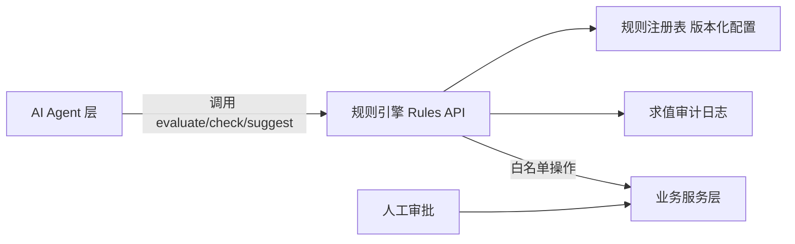

# Nuotao Outdoor AI OS — 企业运营规则层（Operating Rules v1）

> 版本：v1.0
> 状态：草案（待审核与数据校准）
> 文档定位：**企业运营规则的单一规格来源**。规则层位于 AI Agent 与业务服务之间：Agent 不实现业务规则，只通过规则引擎调用；所有参数可配置、可版本化、可审计。
> 关联文档：`docs/product_strategy.md`（规则引用源）、`docs/project_architecture.md`（架构）、`docs/business_decisions.md`（DEC-013）
> 规则属性约定：所有 `v1 阈值` 均为初始参数（假设），须按真实运营数据校准；正式校准前以本文档为准。

---

## 1. 规则体系设计（总则）

### 1.1 规则层定位

- **规则层只做「判定与建议」**，不直接改数据；执行动作仍由业务服务完成。
- AI Agent 通过白名单工具调用规则引擎，禁止在 Agent 提示词或代码中自行实现规则。

### 1.2 规则模型（Rule Schema）

每条规则记录包含以下字段（规则注册表落库/落配置）：

| 字段 | 说明 |
|---|---|
| `rule_id` | 唯一编号，如 `PROD-SEL-001` |
| `name` | 规则名 |
| `category` | 所属域（product / price / profit / supplier / sku / inventory / ads / cs / agent） |
| `type` | `hard`（硬约束）/ `soft`（评分建议）/ `flow`（状态机与审批流） |
| `version` | 规则版本（如 v1、v2） |
| `status` | `draft` / `active` / `deprecated` |
| `effective_from` / `effective_to` | 生效时间窗 |
| `scope` | 适用市场/品类/Agent 范围 |
| `when` | 触发条件（结构化表达式） |
| `then` | 判定结果或动作建议 |
| `params` | 可配置参数（阈值、权重、限额） |
| `output` | 输出结构（pass/fail/score/suggestion） |
| `approval` | 所需审批级别（L0 自动 / L1 运营 / L2 负责人） |
| `owner` | 规则负责人 |
| `audit` | 是否记录每次求值（默认 true） |

### 1.3 规则优先级与冲突解决

1. **hard > soft > flow**：硬规则判定失败时，软规则与流程规则不得推进。
2. **具体规则 > 通用规则**：品类/市场特定规则优先于全局规则。
3. **最新生效版本优先**：`status=active` 且时间窗覆盖当前时刻。
4. **特殊情况**：允许人工审批覆盖（override），必须记录原因、审批人、被覆盖规则与版本，进入审计。

### 1.4 执行模型（程序化约定）

- 规则引擎暴露三类只读判定接口（规格见 §11）：
  - `check(rule_group, context)` → pass/fail + 原因 + 版本 + trace_id
  - `evaluate(rule_id, context)` → 结构化结果（用于硬规则/流程规则）
  - `suggest(rule_group, context)` → 评分/建议（用于软规则）
- 每次求值输出必须包含：`rule_version`、`reasons[]`、`trace_id`，全部落审计日志。
- 规则引擎判定失败时，Agent 不得绕过（无 override 权限时）；override 必须走审批。

### 1.5 配置化要求

- 所有阈值、权重、限额、价带、审批上限集中在规则注册表（配置），**禁止硬编码在业务代码、提示词或工具函数中**。
- 参数以 `params` 字段存储，变更即产生新版本（copy-on-write），旧版本保留可回溯。

### 1.6 版本升级机制

| 步骤 | 要求 |
|---|---|
| 发起 | 规则变更（阈值/权重/新增规则）在 `docs/operating_rules.md` 更新并升版本号 |
| 记录 | 变更记录 + 生效日期 + 理由 |
| 灰度 | 可按市场/品类/时间窗指定生效范围（先小范围验证） |
| 回滚 | 切换 `effective_from` 即可回退到旧版本 |
| 审计 | 规则版本变更与每次求值均留痕 |

---

## 2. 规则清单总览

| 域 | 规则组 | 规则数 | 关键参数（v1） |
|---|---|---|---|
| 产品选择 | PROD-SEL | 9 | 运费占比 ≤40%、退货率 ≤15% |
| 产品评分 | PROD-SCORE | 5 | 6 维权重、≥75/60/<60 阈值 |
| 定价 | PRICE | 8 | 四层价带、毛利率目标、折扣上限 |
| 利润计算 | PROFIT | 7 | 成本明细口径、营销摊销、损耗计提 |
| 供应商 | SUPPLIER | 6 | S/A/B/C 分级、不良率 >3% 预警 |
| SKU 生命周期 | SKU-LIFE | 8 | 测试期 4–8 周、衰退/清仓阈值 |
| 库存 | INV | 7 | 安全库存、周转 >90 天清仓 |
| 广告测试 | ADS-TEST | 7 | 测试预算、ROAS ≥2.0、熔断 110% |
| 客服处理 | CS | 7 | 自动退款 ≤$20、SLA 24/48h |
| Agent 权限 | AGENT-PERM | 7 | 操作分级 L0/L1/L2、高风险清单 |

---

## 3. 产品选择规则（PROD-SEL）

> 规则源：`docs/product_strategy.md` §2。全部为进入候选池的前置判定。

| 规则 ID | 类型 | 规则内容 | 参数（v1） | 审批 |
|---|---|---|---|---|
| PROD-SEL-001 | hard | 美/欧合规检查通过（法规库匹配） | 法规库版本 | L1 复核 |
| PROD-SEL-002 | hard | 知识产权筛查无侵权风险 | 筛查清单 | L1 复核 |
| PROD-SEL-003 | hard | 供应商等级 ≥ B 且有生产资质 | 等级阈值=B | 自动 |
| PROD-SEL-004 | hard | 成本数据完整可核实（采购价/运费/包装） | 必填字段清单 | 自动 |
| PROD-SEL-005 | hard | 运费占售价 ≤ 阈值 | ≤40% | 自动 |
| PROD-SEL-006 | hard | 预估退货率 ≤ 阈值 | ≤15% | 自动 |
| PROD-SEL-007 | soft | 品类吸引力评分（品类评估模型） | ≥70 进入；60–69 需 L1 审批 | L1 |
| PROD-SEL-008 | soft | 品牌一致性（定位/人群/语气） | 评分 ≥6/10 | 自动 |
| PROD-SEL-009 | hard | 类目范围：仅允许核心品类 + 探索品类（Phase 1） | 允许类目清单 | 自动 |

- 任一 `hard` 失败 → 拒绝并记录原因；`soft` 低分不直接拒绝，但需附人工理由。
- 输出：`sourcing_candidates.status = rejected / candidate`。

---

## 4. 产品评分规则（PROD-SCORE）

> 规则源：`docs/product_strategy.md` §6（评分模型 v1）。本文档固化其调用规格。

| 规则 ID | 类型 | 规则内容 | 参数（v1） |
|---|---|---|---|
| PROD-SCORE-001 | soft | 六维评分：利润潜力/物流友好度/市场需求/竞争强度/差异化/合规风险 | 权重 30/20/15/10/15/10 |
| PROD-SCORE-002 | soft | 总分 = Σ(维度分 × 权重) × 10；≥75 优先候选；60–74 可测试（附理由）；<60 拒绝 | 阈值 75/60 |
| PROD-SCORE-003 | hard | 任一 PROD-SEL 硬规则失败 → 总分直接判为拒绝（不计算） | — |
| PROD-SCORE-004 | hard | 输出必须可解释：每维度附数据来源与依据 | 必填字段 |
| PROD-SCORE-005 | flow | 校准触发：每 100 SKU 或每季度对比实测数据校准权重与阈值 | 校准周期 |

- 评分结果写入 `sourcing_candidates.score_detail`（各维度分 + 依据 + 规则版本）。

---

## 5. 定价规则（PRICE）

> 规则源：`docs/product_strategy.md` §5。

| 规则 ID | 类型 | 规则内容 | 参数（v1） | 审批 |
|---|---|---|---|---|
| PRICE-001 | soft | 层级价带：引流 $10–25 / 主力 $25–60 / Hero $40–120 / 高端 $100+ | 四层上下限 | 自动 |
| PRICE-002 | hard | 售价 = 落地成本 ÷ (1 − 目标毛利率)，须同时满足层级目标毛利率 | 引流 20% / 主力 35% / Hero 40% / 高端 45% | 自动 |
| PRICE-003 | hard | 最终定价须落在市场价带区间，不高出竞品上限 30% | 市场价带数据 | L1 调价 |
| PRICE-004 | soft | 心理定价：尾数 .99（$X.99） | 尾数规则 | 自动 |
| PRICE-005 | flow | 多币种：EUR = USD 价 × 汇率 × 市场系数（含税显示） | 市场系数 1.05–1.15 | 自动 |
| PRICE-006 | flow | 满额包邮门槛（美国）；低于门槛收运费 | $49–59 | L1 |
| PRICE-007 | hard | 促销折扣上限 ≤30%；Hero 折扣 ≤15% | 30% / 15% | L1 |
| PRICE-008 | flow | 调价审批：日常调价 ≤10% 自动记录；>10% 或 Hero 调价需 L1 | 10% | L1 |

- 价格变更全部走 `price_change_log`，含旧价、新价、规则版本、审批人。

---

## 6. 利润计算规则（PROFIT）

> 目的：统一「利润」口径，所有 Agent、报表、决策使用同一套公式，防止口径打架。

| 规则 ID | 类型 | 规则内容 | 参数（v1） |
|---|---|---|---|
| PROFIT-001 | hard | 落地成本 = 采购价 + 国内运费分摊 + 头程分摊 + 尾程 + 支付/平台费 + 营销摊销 + 售后损耗（明细字段必填） | 支付费率 2.9%+$0.30 |
| PROFIT-002 | hard | 毛利率 = 1 − 落地成本 ÷ 售价（含营销摊销口径） | — |
| PROFIT-003 | hard | 单订单贡献利润 = 订单收入 − 该订单落地成本 | — |
| PROFIT-004 | flow | 营销摊销：按归因周期摊销（如 7 天点击归因） | 归因窗口 7 天 |
| PROFIT-005 | flow | 售后损耗计提 = 退货率 × 单位平均损失（月度滚动） | 滚动窗口 30 天 |
| PROFIT-006 | flow | 汇率口径：订单按成交日汇率锁定，成本按采购日汇率 | 汇率源（银行中间价） |
| PROFIT-007 | hard | 报表与决策必须使用 PROFIT-001~006 同一口径，禁止临时口径 | — |

- 输出：`profit_snapshot`（订单级 + SKU 级 + 日/周/月聚合），供商业分析 Agent 与周报使用。

---

## 7. 供应商准入规则（SUPPLIER）

| 规则 ID | 类型 | 规则内容 | 参数（v1） | 审批 |
|---|---|---|---|---|
| SUPPLIER-001 | hard | 准入材料齐全：营业执照/生产资质、样品、产能证明、联系方式 | 材料清单 | L1 |
| SUPPLIER-002 | hard | 供应商评分卡评级（资质/品质/交期/配合度） | S/A/B/C 四档 | L1 |
| SUPPLIER-003 | hard | C 级不采购；B 级限制采购额 | B 级月采购额上限 | L1 |
| SUPPLIER-004 | flow | 首单要求：样品检验 + 小批量验证（≤ 测试量） | 小批量上限 | L1 |
| SUPPLIER-005 | flow | 品质监控：到货不良率 >3% 触发预警；连续两批 >3% 降级 | 3% | L1 |
| SUPPLIER-006 | flow | 淘汰触发：重大品质事故/交期违约/合规问题/恶意涨价 | 事件清单 | L2 |

- 供应商评级与预警写入 `suppliers.rating` 与 `supplier_events`。

---

## 8. SKU 生命周期规则（SKU-LIFE）

> 规则源：`docs/product_strategy.md` §8。状态机 + 转换阈值。

| 规则 ID | 类型 | 规则内容 | 参数（v1） | 审批 |
|---|---|---|---|---|
| SKU-LIFE-001 | flow | 状态机：候选→测试→增长→成熟→衰退→清仓/淘汰 | 状态集 | 自动 |
| SKU-LIFE-002 | flow | 测试期 4–8 周，测试预算上限 | 周期/预算 | L1 |
| SKU-LIFE-003 | flow | 测试→增长：转化率 ≥ 品类基准、ROAS ≥ 目标、退货率 ≤10% | 阈值参数组 | L1 |
| SKU-LIFE-004 | flow | 增长→成熟：连续 4 周稳定出货 + 毛利率达标 | 4 周 | 自动+周报确认 |
| SKU-LIFE-005 | flow | 成熟→衰退：连续 4 周销量环比下滑 ≥15%，或毛利率跌破阈值 | 15% | L1 |
| SKU-LIFE-006 | flow | 衰退→清仓：库存周转 >90 天 | 90 天 | L1 |
| SKU-LIFE-007 | flow | 紧急淘汰：合规事件/重大客诉/供应商断供（可先下架后审） | 事件清单 | L2 |
| SKU-LIFE-008 | hard | 淘汰/衰退 SKU 必须输出复盘记录并回流评分校准集 | 必填 | L1 |

---

## 9. 库存规则（INV）

| 规则 ID | 类型 | 规则内容 | 参数（v1） | 审批 |
|---|---|---|---|---|
| INV-001 | flow | 安全库存 = 日均销量 × 安全天数 | 安全天数 14 天 | 自动 |
| INV-002 | flow | 再订货点 = 日均销量 × 采购提前期 + 安全库存，触发补货建议 | 提前期按供应商 | 自动 |
| INV-003 | flow | 建议补货量 = 覆盖(提前期 + 安全天数) − 在途 − 现有 | — | 自动 |
| INV-004 | flow | 库存周转 >90 天 → 清仓/促销建议 | 90 天 | L1 |
| INV-005 | flow | 断货预警：预计断货日 = 现有库存 ÷ 日均销量，< 提前期 → 预警 | 预警提前量 | 自动 |
| INV-006 | hard | Phase 1 单一发货点（中国直发）；多仓模型为 Phase 2 扩展点 | 仓库维度预留 | — |
| INV-007 | flow | 库存资金占用月度报告（金额 + 周转天数） | 月度 | 自动 |

- 库存为「可售库存 = 采购在途 + 在仓 − 已售未发 − 预留」，口径统一由 INV 域定义。

---

## 10. 广告测试规则（ADS-TEST）

| 规则 ID | 类型 | 规则内容 | 参数（v1） | 审批 |
|---|---|---|---|---|
| ADS-TEST-001 | hard | 单广告组测试预算上限 | 每日/组上限 | L1 |
| ADS-TEST-002 | flow | 测试周期 2–4 周，期内数据完整才判定 | 周期 | 自动 |
| ADS-TEST-003 | soft | 判定标准：ROAS ≥ 2.0 且 CPA ≤ 目标 → 可放量 | ROAS 2.0 | L1 |
| ADS-TEST-004 | flow | 放量规则：达标后预算日增幅 ≤50%，单组预算上限 | 50% | L1 |
| ADS-TEST-005 | flow | 暂停规则：连续 3 天 ROAS < 1.0 或花费达上限未达标 | 3 天 / 上限 | 自动+通知 |
| ADS-TEST-006 | hard | 预算熔断：单日实际花费 > 预算 110% → 自动暂停 | 110% | 自动 |
| ADS-TEST-007 | flow | 归因口径统一 7 天点击归因（与 PROFIT-004 一致） | 7 天 | 自动 |

- 广告数据、预算变更、判定结果全部落 `campaign_log` 供审计与商业分析。

---

## 11. 客服处理规则（CS）

| 规则 ID | 类型 | 规则内容 | 参数（v1） | 审批 |
|---|---|---|---|---|
| CS-001 | flow | 首次响应 SLA：AI 即时；人工工作日 ≤2 小时 | 2h | 自动 |
| CS-002 | hard | AI 自动处理白名单：订单状态/物流查询/FAQ/退换货流程引导 | 白名单意图清单 | L1 维护 |
| CS-003 | flow | 转人工条件：情感激烈/金额争议/法律与安全/连续 2 次未解决 | 触发清单 | 自动 |
| CS-004 | flow | 退款权限：AI 自动 ≤$20；$20–100 需 L1；>$100 需 L2 | $20 / $100 | 分级 |
| CS-005 | flow | 补偿权限：优惠券/小额礼品 ≤$10 自动，>需 L1 | $10 | 分级 |
| CS-006 | flow | 客诉分级 SLA：P1（安全/欺诈/法律）24h 内升级；P2（一般）48h 内解决 | 24h/48h | L1 |
| CS-007 | hard | 合规话术：禁止夸大承诺、禁止歧视性用语、保护客户隐私（不索取无关 PII） | 词库 | 自动 |

- 客服 Agent 输出对外消息前必须过 CS-007 规则校验；退款/补偿执行记录 `refund_log`。

---

## 12. AI Agent 权限规则（AGENT-PERM）

### 12.1 操作分级

| 级别 | 定义 | 示例 |
|---|---|---|
| L0 | 规则内自动执行 | 白名单查询、自动回复、≤$20 退款、预算熔断 |
| L1 | 运营审批 | 上架、调价 >10%、促销、采购单、放量 |
| L2 | 负责人审批 | 大额退款 >$100、下架/淘汰、供应商淘汰、规则覆盖 override |

### 12.2 权限矩阵（Agent × 操作，v1）

| 操作 | AI 产品经理 | AI 营销经理 | AI 供应链经理 | AI 客户经理 | AI 商业分析 |
|---|---|---|---|---|---|
| 选品/评分建议 | L0 建议 | — | — | — | — |
| 商品上架草稿 | L1 建议 | — | — | — | — |
| 定价/改价 | L1 建议 | — | L1 建议（成本侧） | — | — |
| 生成采购单 | — | — | L1 建议 | — | — |
| 发货指令 | — | — | L1 | — | — |
| 退款执行 | — | — | — | L0(≤$20)/L1/L2 | — |
| 对外营销内容发布 | — | L1 | — | — | — |
| 对外客服回复 | — | — | — | L0（白名单内） | — |
| 广告预算调整 | — | L1（熔断 L0） | — | — | — |
| 库存补货建议 | — | — | L0 建议 | — | — |
| 经营数据读取 | 白名单只读 | 白名单只读 | 白名单只读 | 白名单只读 | 全量分析只读 |
| 删除/物理删除数据 | ✗ | ✗ | ✗ | ✗ | ✗（需 L2 流程） |

### 12.3 规则明细

| 规则 ID | 类型 | 规则内容 | 参数（v1） | 审批 |
|---|---|---|---|---|
| AGENT-PERM-001 | hard | 所有 Agent 操作必须匹配权限矩阵，越权返回拒绝 + 告警 | 矩阵版本 | 自动 |
| AGENT-PERM-002 | hard | Agent 只能调用注册工具（白名单），工具内做权限校验 | 工具清单 | L1 维护 |
| AGENT-PERM-003 | hard | 高风险操作清单（发货/退款/改价/下架/删除/对外发消息/大额采购）必须走对应审批 | 清单 | 分级 |
| AGENT-PERM-004 | hard | 无审批记录不得执行（审批状态从 `ai_suggestions` 读取） | — | 自动 |
| AGENT-PERM-005 | hard | 全链路审计：输入、规划、工具调用、输出、审批人、规则版本写入 `ai_agent_runs` | 必填 | 自动 |
| AGENT-PERM-006 | hard | override 必须 L2 审批并记录被覆盖规则与原因 | — | L2 |
| AGENT-PERM-007 | flow | 权限矩阵随新 Agent/新操作定期评审 | 季度 | L2 |

---

## 13. 规则调用规格（程序化约定）

> 以下为接口规格定义（非实现代码），供开发阶段实现规则引擎与 Agent 工具。

### 13.1 规则注册表（配置存储）

| 存储字段 | 说明 |
|---|---|
| rule_group / rule_id | 分组与唯一编号 |
| version / status / effective_from / effective_to | 版本生命周期 |
| scope | 适用市场/品类/Agent |
| when_conditions | 结构化条件（字段 + 操作符 + 值 + 逻辑组合） |
| then_result | 判定结果结构（pass/fail/score/suggestion + reasons） |
| params | 参数键值（阈值/权重/限额），独立可改版本 |
| approval_level | L0/L1/L2 |
| audit_required | 是否强制审计 |

### 13.2 规则引擎接口（规格）

| 接口 | 输入 | 输出 | 用途 |
|---|---|---|---|
| `check(group, context)` | 规则组 + 上下文（产品/订单/供应商对象） | pass/fail + reasons + rule_version + trace_id | 硬规则判定 |
| `evaluate(rule_id, context)` | 单条规则 + 上下文 | 结构化结果 + 参数快照 | 流程/状态判定 |
| `suggest(group, context)` | 规则组 + 上下文 | 评分/建议等级 + 依据 | 软规则建议 |
| `override(rule_id, context, reason)` | 规则 + 上下文 + 原因 | 覆盖记录（仅 L2） | 例外处理 |

### 13.3 与 AI Agent 的调用约定

1. Agent 通过白名单工具调用上述接口，工具名注册于 AGENT-PERM-002 工具清单。
2. 调用必须携带 `trace_id`（贯穿 Agent 运行与规则求值审计）。
3. 规则判定 `fail` 时 Agent 停止该路径，向人工提交说明，禁止自行绕过。
4. 所有阈值/权重变更走 §1.6 版本升级流程，Agent 自动读取最新生效版本。

---

## 14. 治理与变更记录

### 14.1 规则评审节奏

| 事项 | 周期 |
|---|---|
| 参数校准（评分权重、阈值、限额） | 每季度 或 每 100 SKU |
| 权限矩阵评审 | 每季度 |
| 新增 Agent / 新操作 | 随时，需 L2 审批后入矩阵 |

### 14.2 变更记录

| 版本 | 日期 | 变更 |
|---|---|---|
| v1.0 | 2026-08-11 | 建立运营规则层 v1：10 大规则域（PROD-SEL/PROD-SCORE/PRICE/PROFIT/SUPPLIER/SKU-LIFE/INV/ADS-TEST/CS/AGENT-PERM），定义规则模型、优先级、执行规格与版本升级机制 |
