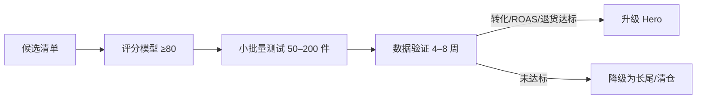
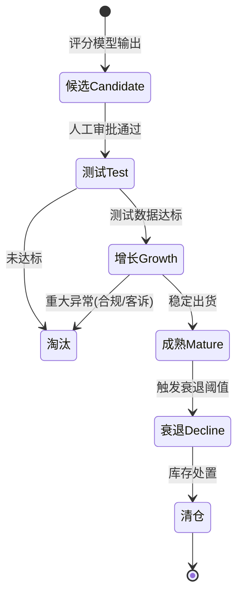

# Nuotao Outdoor — 产品战略（Product Strategy v1）

> 版本：v1.0
> 状态：草案（待审核与数据校准）
> 文档用途：**AI Product Agent 的产品判断核心规则书**。所有选品、定价、产品生命周期决策必须依据本文档执行；规则版本化，参数集中配置，随实测数据校准。
> 关联文档：`docs/business_context.md`、`docs/project_architecture.md`、`docs/business_decisions.md`（DEC-011 / DEC-012）

---

## 1. 品牌定位

### 1.1 定位声明

**Nuotao Outdoor 是 AI 驱动的户外装备品牌，为美国市场的入门至进阶户外爱好者提供「经过智能筛选、性价比可验证」的可靠装备，让每个人都能聪明地走进户外。**

### 1.2 品牌核心要素

| 要素 | 定义 |
|---|---|
| 品牌使命 | 用 AI 消除户外消费的信息差与价格差，降低入门门槛 |
| 品牌承诺 | 每一件上架产品都经过 AI 评分 + 人工审核，品质与性价比可验证 |
| 品牌人格 | 专业、可靠、务实、真诚（不夸大、不装、不割韭菜） |
| 目标人群 | 美国 25–45 岁入门/中级露营者、徒步者、户外家庭；第二市场为德/欧同类人群 |
| 差异化支柱 | ① AI 选品保证「买对不买贵」② 专业内容降低决策成本 ③ 中国供应链成本优势 + 品牌品质控制 |
| 品牌语气 | 内容（英文/德语）：具体、实用、有场景；避免玄学营销与夸大功效 |

### 1.3 品牌红线（所有产品与内容必须遵守）

1. 不夸大功能与安全承诺（户外装备涉及人身安全，禁止虚假宣传）。
2. 不使用侵权图案/外观/商标；上架前必须过知识产权筛查。
3. 不销售无合规依据的产品（美/欧法规为硬门槛）。
4. 每件产品必须有「可解释的选品理由」存档（评分模型输出）。

---

## 2. 产品选择原则

所有选品必须同时满足以下原则，违反任何一条即不入选：

### 2.1 硬性原则（一票否决）

| # | 原则 | 说明 |
|---|---|---|
| P1 | 合规底线 | 必须通过美国/欧盟适用法规评估（如 CPSC/CPSIA、REACH、电池运输、标签要求） |
| P2 | 知识产权 | 无品牌图案/外观专利侵权风险，需侵权筛查 |
| P3 | 供应商资质 | 供应商有生产资质、可提供样品、评分达标（分级见 §7） |
| P4 | 成本可核实 | 采购价、运费、包装等成本可核实，禁止拍脑袋报价 |
| P5 | 物流约束 | 运费占售价 ≤ 40%（v1 阈值），重货大件默认排除（Phase 1） |
| P6 | 退货风险 | 预估退货率 ≤ 15%（v1 阈值） |

### 2.2 方向性原则（评分项）

| # | 原则 | 说明 |
|---|---|---|
| S1 | 利润优先 | 目标落地毛利率 ≥ 30%（按产品层级浮动，见 §5） |
| S2 | 轻小优先 | 优先「轻、小、高价值、低运费占比」品类，控制头程/尾程成本 |
| S3 | 差异化 | 优先有改进空间或内容故事性的产品，避免纯同质化白牌 |
| S4 | 数据可验证 | 有可获取的市场数据（搜索趋势、竞品、评论）支持判断 |
| S5 | 品类聚焦 | 新品类必须通过「品类吸引力评估」（§3），禁止随手铺品 |
| S6 | 与品牌一致 | 产品必须符合品牌定位与目标人群，不碰低质低价杂货 |

---

## 3. 第一阶段品类战略

### 3.1 品类地图（v1 初判，需实测校准）

| 品类 | 轻小 | 运费占比 | 毛利空间 | 竞争强度 | 内容潜力 | 合规负担 | 阶段结论 |
|---|---|---|---|---|---|---|---|
| 露营灯 / 头灯 | ★ | 低 | 高 | 中 | 高 | 中（电池） | **首期核心 A** |
| 炊具 / 餐具 | ★ | 低 | 中高 | 中 | 中 | 低 | **首期核心 B** |
| 收纳 / 防潮袋 | ★ | 低 | 中 | 低-中 | 中 | 低 | **首期核心 C** |
| 水具（水壶/杯） | ★ | 低 | 中 | 中高 | 中 | 低 | ◐ 探索品类 |
| 徒步配件（手杖等） | ◐ | 低-中 | 中高 | 中 | 高 | 低 | ◐ 探索品类 |
| 帐篷 / 桌椅 | ✗ | 高 | 高 | 高 | 高 | 低 | ✗ Phase 2（海外仓后） |
| 服装服饰 | ◐ | 中 | 中 | 高 | 中 | 中（尺码） | ✗ 后期（尺码/退货风险） |

> 以上为初始判断（假设），正式品类进入必须用「品类吸引力评估」数据化确认。

### 3.2 品类吸引力评估（新品类进入门槛）

| 维度 | 权重 | 数据来源 |
|---|---|---|
| 市场规模与趋势 | 25% | Google Trends、平台搜索量、品类报告 |
| 竞争强度（反向） | 15% | 竞品数量、头部集中度、价格带分布 |
| 物流友好度 | 20% | 平均重量/体积、DIM 运费占比测算 |
| 毛利空间 | 20% | 成本模型估算（1688 报价 + 运费 + 费用） |
| 内容与差异化潜力 | 10% | 测评/教程内容空间、改进点 |
| 合规复杂度（反向） | 10% | 认证、标签、电池/化学品等负担 |

- 评分 ≥ 70 分：允许进入选品池；60–69：需人工审批；< 60：不进入。
- 首期最多同时运营 **2 个核心品类 + 1 个探索品类**（聚焦原则）。

### 3.3 SKU 策略

- 首期 SKU 总量建议 **20–50 个**（v1 假设，按运营资源调整）。
- 结构：约 60% 核心品类、25% 探索品类、15% 引流款/配件。
- 每个核心品类必须有 1–2 个 Hero Product（见 §4）。

---

## 4. Hero Product 策略

### 4.1 定义与目标

Hero Product = 品类的「流量 + 利润 + 品牌」担当款。每个核心品类 **1–2 款**，承担 SEO 主攻、广告主推、EDM 核心、红人样品四大职能。

### 4.2 Hero 入选标准（须全部满足）

| # | 标准 | v1 阈值 |
|---|---|---|
| H1 | 产品评分 | 总分 ≥ 80，且无否决项 |
| H2 | 差异化 | 有明确可讲述的改进点（功能/设计/材料/场景） |
| H3 | 利润 | 目标毛利率 ≥ 40%（含营销摊销前） |
| H4 | 内容 | 可支撑至少 3 个内容角度（测评、对比、场景教程） |
| H5 | 供应链 | 供应商可稳定供货、可支撑改良贴牌（§7） |

### 4.3 Hero 选择与验证流程



- Hero 测试期预算单独核算，上限需审批。
- Hero 的定价、活动、内容由「AI 营销经理」优先排期。
- Hero 升级必须人工审批（AI Product Agent 提议）。

### 4.4 长尾产品定位

- 非 Hero 产品用于：填充目录、拦截长尾搜索词、组合购与配件复购。
- 长尾产品不得挤占 Hero 的营销资源；与 Hero 冲突时优先 Hero。

---

## 5. 产品价格体系

### 5.1 定价层级（v1 参考价带，待市场校准）

| 层级 | 定位 | 价带（USD） | 目标毛利率* | 作用 |
|---|---|---|---|---|
| 引流款 | 拉新/复购入口 | $10–25 | ≥ 20% | 低门槛获客、组合购配件 |
| 主力款 | 收入主体 | $25–60 | ≥ 35% | 核心品类主力 SKU |
| Hero | 品牌担当 | $40–120 | ≥ 40% | 品牌与利润双担当 |
| 高端款 | 品牌溢价 | $100+ | ≥ 45% | Phase 2 海外仓后逐步引入 |

\* 毛利率 = 1 − 落地成本 ÷ 售价（含营销摊销与售后损耗后的目标值；营销摊销可单列预算科目，口径在 v1 统一为「含营销摊销」）。

### 5.2 落地成本模型（定价公式）

```
落地成本 = 采购价 + 国内运费分摊 + 头程分摊 + 尾程运费
         + 支付/平台费(约2.9%+固定) + 营销摊销 + 售后损耗(退货/赔付)

售价(不含税) = 落地成本 ÷ (1 − 目标毛利率)
最终定价 = 对照市场价带微调（落在竞品 $X–$Y 区间内），采用心理定价（$X.99）
```

- 售价必须同时满足：① 达到目标毛利率；② 在市场价带内（不高出 30%，不过低引发品质怀疑）。
- 成本参数集中配置（`cost_model` 配置表），定期按物流报价与汇率校准。

### 5.3 多市场与运费策略

| 项 | 规则 |
|---|---|
| 美国（主市场） | USD 定价；商品不含税显示，结账时按州税计算（税制适配器） |
| 德国/欧盟（次市场） | EUR 定价 = USD 价 × 汇率 × 市场系数（建议 1.05–1.15，含 VAT 显示，IOSS 通道） |
| 运费门槛 | 美国满额包邮建议 $49–59（v1 参考）；低客单单品收运费 |
| 调价规则 | 调价必须走审批流；日常调价幅度 ≤ 10%；促销折扣 ≤ 30%；Hero 不参与深度折扣（≤ 15%） |

---

## 6. 产品评分模型 v1

**评分模型是 AI Product Agent 的核心计算器**。所有候选产品必须输出 6 维评分 + 总分 + 否决项检查 + 可解释依据（每个维度附数据来源），存档于 `sourcing_candidates`。

### 6.1 维度与权重（v1）

| 维度 | 权重 | 0–10 打分依据（数据来源） |
|---|---|---|
| 利润潜力 | 30% | 目标毛利率：≥45%→10；每降5%扣1–2；<25%→0–2（成本模型） |
| 物流友好度 | 20% | 运费占售价：≤12%→10；12–18%→7–9；18–25%→4–6；25–35%→2–3；>35%→0–1（物流报价） |
| 市场需求 | 15% | 搜索趋势增长/竞品月销/评论量：领先→8–10；平稳→5–7；无数据或下滑→0–4（趋势与竞品数据） |
| 竞争强度（反向） | 10% | 竞品少且价格分散→8–10；红海且低价集中→0–3（竞品调研） |
| 差异化与内容潜力 | 15% | 有明确改进点/强故事性→8–10；纯同质→0–3（产品分析与内容评估） |
| 合规与品质风险（反向） | 10% | 无合规负担且退货风险低→8–10；高→0–3（合规评估） |

```
总分 = Σ(维度分 × 权重) × 10      （满分 100）
```

### 6.2 判定阈值

| 总分 | 判定 |
|---|---|
| ≥ 75 且无否决项 | 优先候选，进入小批量测试 |
| 60–74 且无否决项 | 可测试，必须附理由说明 |
| < 60 | 拒绝 |
| 任一否决项触发 | 拒绝（硬性，见 §2.1 P1–P6） |

### 6.3 示例计算（假设数据，仅演示计算方式，非真实产品）

| 维度 | 权重 | 假设得分 | 加权 |
|---|---|---|---|
| 利润潜力 | 30% | 8 | 2.40 |
| 物流友好度 | 20% | 9 | 1.80 |
| 市场需求 | 15% | 7 | 1.05 |
| 竞争强度 | 10% | 6 | 0.60 |
| 差异化 | 15% | 8 | 1.20 |
| 合规风险 | 10% | 7 | 0.70 |
| **合计** | 100% | — | **7.75 → 77.5 分 → 优先候选** |

### 6.4 模型校准机制

- v1 为初始参数；首 50–100 个 SKU 测试数据回流后校准权重与阈值（每季度或每 100 SKU）。
- 校准依据：测试转化率、实际毛利率、退货率、物流实测成本与预估偏差。
- 权重与阈值集中配置（规则库版本化），AI Product Agent 读取配置执行，禁止把参数硬编码在业务代码中。

---

## 7. 自有设计 / ODM / 1688 贴牌策略

### 7.1 供应模式分层（决策树）

| 模式 | 适用场景 | 投入 | 风险 | 阶段 |
|---|---|---|---|---|
| **1688 现货贴牌**（换标/换包装） | 引流款、验证期、长尾 | 低 | 同质化、品质波动 | Phase 1 主流 |
| **改良贴牌**（改颜色/材质/细节/包装） | 已验证的 Core/Hero 候选 | 中 | 需小批量与 MOQ | Phase 1.5–2 |
| **ODM 合作**（工厂现有设计/联合开发） | Hero、差异化旗舰 | 中高 | MOQ、开发周期 | Phase 2 |
| **自有设计**（自有 IP + 代工） | 品牌护城河产品 | 高 | 库存、开发失败 | Phase 3 |

### 7.2 升级规则（AI Product Agent + 人工）

1. **默认入口**：新产品一律从「1688 现货贴牌」开始，用最低成本验证市场。
2. **升级触发**：产品测试期数据达标（转化/ROAS/退货率）且评分 ≥ 75 → 提议升级「改良贴牌」。
3. **Hero 升级**：升级 Hero 时同步评估 ODM/自有设计，目标是做出「独家款」降低同质化竞争。
4. **护城河产品**（Phase 3）：自有设计 + 外观专利/商标保护，作为品牌长期壁垒。
5. 任何升级需人工审批；升级后 30 天内对比新旧版本数据，不达标可回退。

### 7.3 贴牌底线（所有模式通用）

- 品质：首单前供应商样品 + 到货抽检；不良率超阈值（v1：>3%）触发供应商预警。
- 品牌：品牌标识、包装、说明书合规（含美/欧标签与语言要求）。
- 供应商分级：S/A/B/C 四级（资质、品质、交期、配合度），C 级不进入采购，B 级限制采购额。
- 知识产权：上架前侵权筛查（图案/外观/商标）；发现风险立即下架候选。

---

## 8. 产品生命周期管理规则

### 8.1 生命周期状态机



### 8.2 阶段转换触发规则（v1 阈值，待校准）

| 转换 | 触发条件（v1） | 审批 |
|---|---|---|
| 候选 → 测试 | 总分 ≥ 60 且无否决项 | 人工 |
| 测试 → 增长 | 测试期 4–8 周内：转化率 ≥ 品类基准、ROAS ≥ 目标、退货率 ≤ 10% | 人工 |
| 增长 → 成熟 | 连续 4 周稳定出货且毛利率达标 | 系统自动 + 周报确认 |
| 成熟 → 衰退 | 连续 4 周销量环比下滑 ≥ 15%，或毛利率跌破阈值 | 系统提议 + 人工 |
| 衰退 → 清仓 | 库存周转天数 > 90 天（v1） | 人工 |
| 任意 → 淘汰 | 合规事件、重大客诉、供应商断供 | 人工（紧急可先下架后审） |

### 8.3 各阶段运营动作

| 阶段 | AI Product Agent 动作 | 协同 Agent |
|---|---|---|
| 候选 | 输出评分与选品理由，进入审批队列 | — |
| 测试 | 跟踪测试数据，对比预估 vs 实际 | AI 商业分析 |
| 增长 | 提议补货量、改良方案、Hero 升级 | AI 供应链经理 |
| 成熟 | 优化毛利（成本谈判/定价微调）、维持库存水位 | AI 供应链/营销 |
| 衰退 | 提议清仓折扣（≤ 30%）与下架时间表 | AI 营销经理 |
| 淘汰 | 生成复盘（为何失败），回流评分模型校准 | AI 商业分析 |

### 8.4 复盘与知识沉淀

- 每个淘汰/衰退 SKU 必须输出复盘记录：预估 vs 实际的偏差原因（价格/需求/物流/品质）。
- 复盘数据进入评分模型校准集与知识库，持续提升 AI Product Agent 判断力。

---

## 9. 规则治理与数据要求

### 9.1 规则版本化

- 本文档为 v1；评分权重、阈值、价带均为**初始参数（假设）**，需用真实数据校准。
- 参数变更：新增版本 + 变更记录 + 生效日期；AI Product Agent 只执行当前生效版本。
- 重大规则变更（权重、否决项、阈值结构）需人工评审。

### 9.2 AI Product Agent 数据输入（系统要求）

| 数据 | 来源 | 用途 |
|---|---|---|
| 候选商品信息 | 人工录入/导入（DEC-004） | 评分输入 |
| 成本数据 | 成本模型 + 物流报价 | 利润/物流维度 |
| 市场数据 | 趋势、竞品调研（人工 + 半自动） | 需求/竞争维度 |
| 合规评估 | 合规清单（美/欧法规库） | 否决项 |
| 历史表现 | 订单/退货/物流实测 | 模型校准 |

---

## 10. 假设清单与待校准项

1. 首期核心品类（露营灯/头灯、炊具/餐具、收纳/防潮）为初始判断，需品类吸引力评估确认。
2. 价带、毛利率目标、各阈值（§4/§5/§6/§8）为 v1 假设，以首 50–100 SKU 实测校准。
3. 美国市场满额包邮门槛 $49–59 为参考，需按客单价与运费实测调整。
4. 欧盟 EUR 定价市场系数 1.05–1.15 为初值，需按汇率与税负验证。
5. 服装服饰与大型装备（帐篷/桌椅）Phase 1 不做，属战略约束而非临时限制。

---

## 11. 变更记录

| 版本 | 日期 | 变更 |
|---|---|---|
| v1.0 | 2026-08-11 | 建立产品战略 v1：品牌定位、选品原则、品类战略、Hero 策略、价格体系、评分模型 v1、供应模式分层、生命周期规则 |
