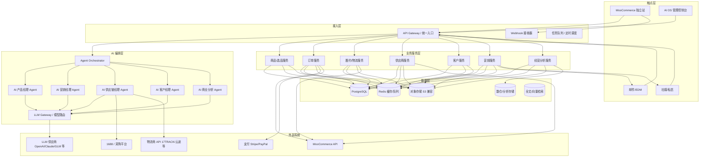
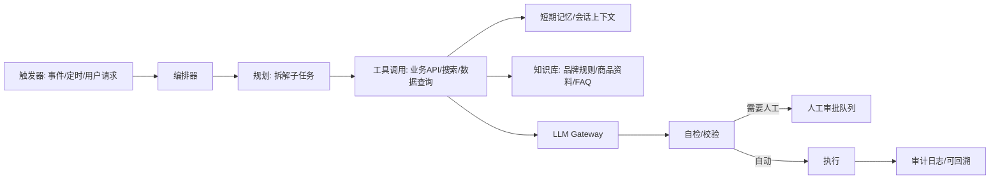
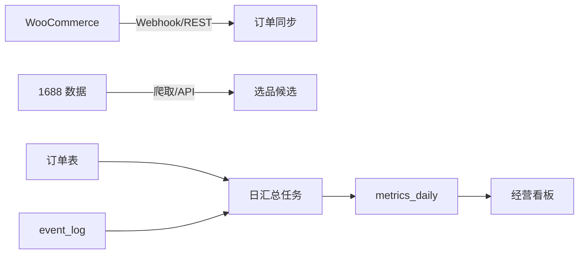

# Nuotao Outdoor AI OS — 项目架构分析

> 版本：v0.3（架构规划草案）
> 状态：规划阶段，未开始编码
> 适用阶段：Phase 1（1688 选品 + WooCommerce DTC + 中国直发）
> 作者角色：首席架构师

---

## 1. 需求分析

### 1.1 业务背景

Nuotao Outdoor 是 AI 驱动的跨境户外品牌，采用「中国 1688 供应链 → WooCommerce 独立站 → 海外消费者直发」的轻资产模式起步。爆品验证后建立海外仓，最终发展海外代理商与 B2B 渠道。

### 1.2 系统目标

建设 **AI Native Outdoor Commerce Operating System（AI 原生户外电商操作系统）**，以数据为底座，用 AI Agent 替代传统人工运营环节，实现：

| Agent | 核心职责 | 替代的传统岗位 |
|---|---|---|
| AI 产品经理 | 1688 选品、市场趋势分析、定价、SKU 生命周期管理 | 产品经理 |
| AI 营销经理 | SEO 内容、广告投放、社媒内容、邮件营销、活动策划 | 营销专员 |
| AI 供应链经理 | 供应商管理、采购、库存、物流跟踪、履约异常处理 | 供应链专员 |
| AI 客户经理 | 售前咨询、售后处理、客诉、评价管理、复购运营 | 客服团队 |
| AI 商业分析系统 | 经营看板、财务核算、归因分析、预测、异常预警 | 数据分析师 |

### 1.3 功能需求（Phase 1 MVP 范围）

1. **DTC 交易**：WooCommerce 独立站，多币种（USD 主、EUR 次）、多语言（英文/德语）、国际支付与本地化税费（美国州销售税 + 欧盟 IOSS VAT）。
2. **选品引擎**：采集/同步 1688 商品与供应商数据，结合平台趋势、利润率模型输出选品建议。
3. **订单履约自动化**：WooCommerce 订单 → 供应商采购单 → 物流单号回填 → 自动发货通知。
4. **AI 客服**：全渠道（邮件 + 站内工单 + 社媒私信）机器人应答，人工兜底。
5. **AI 营销**：商品卖点提炼、SEO 文案、广告素材与投放建议、EDM 自动化。
6. **经营分析**：订单、成本、利润、流量、广告 ROI 的统一看板与周报自动生成。
7. **多市场合规**：美国州销售税（经济关联）、欧盟 IOSS VAT、GDPR；德国 LUCID（包装法）/ WEEE（含电子件时）登记。

### 1.4 非功能需求（NFR）

| 维度 | 要求 |
|---|---|
| 成本 | Phase 1 月运营成本控制在低水平（服务器 + SaaS + LLM API），以开源优先 |
| 可用性 | 独立站 99.5%+，AI 服务允许降级（LLM 不可用时回退规则/人工） |
| 扩展性 | 模块化单体起步，按域拆分为可独立部署的服务；订单量 ×10 无架构重写 |
| 数据安全 | 客户 PII、支付数据、供应商数据分级管理；GDPR 合规基线 |
| 可维护性 | 约定式目录结构、统一日志/监控/CI；新人 1 天可上手 |
| AI 可靠性 | Agent 行为可审计、可回滚、有兜底，关键操作需人审（Human-in-the-loop） |

---

## 2. 总体架构设计

### 2.1 架构风格

- **阶段 1：模块化单体 + 事件驱动**。所有业务能力作为同一代码库内的模块（Python 服务），通过 PostgreSQL + Redis 支撑；WooCommerce 作为独立 DTC 系统通过 REST/Webhook 集成。
- **阶段 2：按域拆分微服务**。订单、供应链、营销、客户成功独立部署，引入消息队列。
- **阶段 3：开放平台**。对外提供 B2B API、代理门户，第三方可编程接入。

> 决策依据：团队初期小、成本敏感，微服务会放大运维负担；模块化单体 + 清晰领域边界可以在业务增长后再拆分。

### 2.2 分层架构



### 2.3 AI Agent 架构（核心）

**原则：Agent 不直接改业务数据，全部通过业务服务 API 操作；每个 Agent 的输出先落库为「AI 任务 + 建议」，需要执行的关键动作走审批流。**



**Agent 技术要点**

- 编排框架：LangGraph（状态图，支持人审节点、重试、超时），或轻量自研编排器。
- 模型路由（LLM Gateway）：多供应商架构，**OpenAI 为主、DeepSeek 为备**；按任务类型与成本路由（选品分析用高推理模型、客服用低成本快速模型、翻译用专用模型），统一降级与配额，避免厂商锁定。
- 工具层：只暴露白名单 API，Agent 无法直接执行 SQL 或触碰文件系统。
- 记忆：短期会话记忆（Redis）+ 长期知识库（向量检索，只读）。
- 审计：每次 Agent 运行的输入、规划、工具调用、输出、审批人全量落库（`ai_agent_runs`）。
- 护栏：金额/折扣/退款/发货等高风险操作必须人审；所有对外文案需规则校验（禁词、事实核对）。

### 2.4 模块划分（领域边界）

| 领域 | 模块 | 说明 |
|---|---|---|
| 商品域 | catalog | 商品、变体、价格、上下架 |
| 选品域 | sourcing | 1688 数据、供应商、选品建议、利润率测算 |
| 交易域 | orders | WooCommerce 订单同步、售后 |
| 履约域 | fulfillment | 采购单、物流轨迹、异常处理 |
| 客户域 | customers | 客户档案、工单、客服会话 |
| 营销域 | marketing | 内容、活动、EDM、广告 |
| 分析域 | analytics | 指标、报表、预测、预警 |
| AI 编排域 | ai-core | Agent 运行时、LLM Gateway、审批流、审计 |

### 2.5 关键流程设计

**选品流程（AI 产品经理）**
1. 手动录入/批量导入 1688 候选商品与供应商信息（Phase 1），触发选品任务；AI 负责结构化、分析与评分。
2. 计算落地成本模型（采购价 + 头程 + 尾程 + 平台费 + 营销预估 + 损耗）。
3. LLM 结合趋势数据（Google Trends / 平台搜索量）生成选品建议与卖点。
4. 建议进入审批队列，产品负责人确认后创建商品草稿。

**订单接收与审计流程（M1.5 已落地：WooCommerce → Webhook → Order → Event → Rule → Audit）**

1. WooCommerce 在订单创建时推送 `order.created` Webhook 到 `POST /api/v1/webhooks/woocommerce`。
2. 后端校验 HMAC-SHA256 签名（`X-Wc-Webhook-Signature`，密钥来自 `WOOCOMMERCE_WEBHOOK_SECRET`）与 payload 结构；支付网关 topic 返回 404 兼容；失败策略：4xx 不重试、5xx 由 WooCommerce 指数退避重试。
3. 幂等落库：`(workspace_id, external_order_id)` 唯一约束，重复投递返回 `duplicate` 不产生新数据。
4. 利润引擎计算 Contribution Margin 快照（Decimal，含商品落地成本、支付手续费估算、折扣），与订单一同持久化。
5. 规则引擎对 `PRICE` / `PROFIT` / `FULFILLMENT` 三个规则域执行 `check()`，结果写入 `rule_results` 与 `rule_execution_logs`；M1.5 不自动执行任何高风险动作。
6. `order.created` 事件写入 `event_log`，`trace_id` 贯穿 Webhook → 订单 → 规则日志 → 事件，形成完整审计链。

**订单查询与利润置信度（M1.6 已落地）**

1. `GET /api/v1/orders` 支持 status / external_order_id / SKU / 日期区间 / 分页 / 排序（白名单列）；`GET /api/v1/orders/{id}` 返回订单 + 行明细。
2. 利润快照新增 `cost_status`（KNOWN / ESTIMATED / UNKNOWN）、`profit_confidence`（HIGH / MEDIUM / LOW）与 `confidence_reasons`。
3. 规则种子 `PROFIT-003`（hard）：成本 UNKNOWN 时禁止给出盈利结论；未知成本不再默认“正常利润”。

**产品智能确定性链（M2.1 已落地，暂不调用 LLM）**

1. 录入（`POST /api/v1/products/intake`，或 CSV 扩展列）：1688 URL / 供应商 / 采购成本 / 重量 / 尺寸 / 目标市场，全部数据校验。
2. `Product → Cost → Logistics → Profit → Rule Engine → Score Context`：成本来自 `product_cost`，物流按重量/体积分档，利润按建议售价毛利率，规则走数据库规则注册表（PROD-GATE-*），输出 6 维评分（0-10）+ 总分（0-100）。
3. 每次分析落 `product_analysis_runs`（provider/model/input/output/token/cost/latency/trace_id）与 `product_scores`（model_version/rule_version/scored_at）。
4. 决策工作流：`pending → approved/rejected`，`test` 决策审批通过后产品进入 `test` 生命周期；成本历史写入 `product_cost_snapshots`（只追加，不覆盖）。

**产品智能数据完整性（M2.1.5 已落地，LLM 接入前的基础完善）**

1. 落地成本模型：`total_landed_cost = purchase_cost + domestic_shipping + international_shipping + packaging + tax_estimate + handling`（未显式提供国际运费时回退 `first_leg + last_leg`）；订单利润与产品利润统一优先取 `total_landed_cost`，保持 Decimal 金额体系。
2. 供应商候选（`product_sourcing_candidates`）：一个产品支持多个供应商报价（采购价 / MOQ / 交期 / 趋势分 / 利润模型），为后续 AI 供应链比价留出结构化数据。
3. 评分证据（`product_score_evidences`）：每个评分维度一行（score / source / evidence / confidence），使评分可解释、可审计；证据来源标注 `landed-cost-model-v1 / logistics-heuristic-v1 / pending-llm`，LLM 接入后升级为模型证据。
4. 测试闭环（`product_experiments`）：`proposed → active → completed`，保存 prediction / experiment / actual_result，完成时自动计算 calibration（预测 vs 实际差值），用于评分模型校准。

**产品分析师 AI 层（M2.2 已落地：第一个 AI 产品分析能力）**

1. LLM Gateway：统一模型入口（OpenAI 主 / DeepSeek 备，自动降级），返回 provider / model / tokens / cost / latency / trace_id；业务代码禁止直连模型。成本按 token 单价估算（仅预算用途）。
2. Prompt Registry：prompt 存数据库（`prompts` 表，name+version 唯一，active 版本生效），模板用 `{variable}` 占位并声明 variables，禁止硬编码。
3. Product Context Builder：`product_id` → 完整 JSON 上下文（product / cost / landed cost / supplier candidates / scores / evidence / rules / experiments），全部 JSON-safe。
4. Product Analyst Agent v1：Context → Prompt → LLM Gateway → Structured Output（decision/confidence/market_reasoning/risks/pricing/test_plan）→ Schema + 业务门禁校验（PROFIT-003：成本 UNKNOWN 禁止 test 决策且置信度 ≤ 0.5；硬规则否决强制降级 reject）→ 审计落库。
5. 权限边界：Agent 只读产品数据，只写 `product_analysis_runs` 与 pending 决策提案；无权 approve / publish / purchase。
6. AI Evaluation（`product_ai_evaluations`）：prediction vs actual 确定性差值 + 人工评分，为评分模型校准提供数据闭环。

**学习闭环（M2.3 已落地：从预测系统升级为可校准学习系统）**

1. Prediction Calibration：`product_ai_evaluations` 扩展 `prediction_result / error_type / confidence_bucket / success_flag / metric_snapshot`，每次评估自动做结果分类（成功/失败 + 错误类型：decision_mismatch / metric_miss / margin_miss / other）。
2. Confidence Calibration：`confidence_calibration` 按 LOW/MEDIUM/HIGH 分桶聚合 AI 置信度 vs 实测成功率，生成校准报告（样本数、成功数、成功率、平均置信度）。
3. Score Model Calibration：`score_calibration_runs` 从历史实验 + AI 预测 + 实际结果确定性地生成六维权重调整建议；**禁止自动修改规则**，必须 `proposed → 人工审批 → 版本更新`（审批仅记录决策与建议权重，规则表与评分代码永不被自动改动）。
4. Product Knowledge Memory：`product_knowledge_entries` 沉淀 success/failure 模式与品类洞察，支持按 category/product 查询，供未来 Agent 以经验证据为推理依据。

**营销学习闭环（M3.2 已落地：从数据记录升级为可学习系统）**

1. Campaign Evaluation（`campaign_ai_evaluations`）：每次预测（decision/roas/confidence）与实测结果对比，确定性分类 success / failure + error_type（decision_mismatch / metric_miss / other），只追加，供校准使用。
2. Creative Intelligence（`creative_analysis_runs`）：每次创意分析落审计行（input_snapshot / analysis_output / performance_result / model_version），为创意学习积累数据。
3. Marketing Knowledge Memory（`marketing_knowledge_entries`）：五类模式（creative_pattern / copy_pattern / audience_pattern / offer_pattern / failure_pattern），支持按 category / campaign / creative 查询。
4. Growth Context Builder：`campaign_id` → 完整 JSON 上下文（campaign + creatives + experiments + feedback + evaluations + knowledge），全部 JSON-safe，供未来 Growth Agent 使用。
5. Marketing Calibration（`marketing_calibration_runs`）：确定性发现 successful/failure patterns（成功率、平均实际 ROAS/CTR、error_type 分布、实验负向指标），生成 `proposed` 提案；**禁止自动修改营销规则**，必须人工 approve / reject。
6. 事件集成：所有写入均走 `event_log`（marketing.campaign_evaluation.recorded / marketing.creative_analysis.recorded / marketing.knowledge.created / marketing.calibration_run_*），trace_id 贯穿审计链。

**客户学习闭环（M3.4 已落地：从数据层升级为可学习认知层）**

1. Customer Evaluation（`customer_ai_evaluations`）：预测行为（reorder / churn 等 decision + confidence）与真实行为对比，确定性分类 success / failure + error_type（decision_mismatch / other），只追加，供校准使用。
2. Customer Pattern Mining（`customer_pattern_runs`）：确定性模式挖掘（purchase / segment / bundle / churn / pain 五类），基于客户档案、评估、交互与退款聚合，输出 pattern + 启发式 confidence（0.1/样本，上限 0.9）。
3. Customer Knowledge Memory：`customer_knowledge_entries` 扩展 entry_type（新增 churn_pattern / bundle_pattern / pain_pattern，保留 M3.3 五类兼容历史数据）。
4. Customer Calibration（`customer_calibration_runs`）：evaluation → pattern extraction → proposal → approve/reject；**禁止自动修改业务规则**，人工审批仅记录决策。
5. Cross-Domain Context Builder（`customer_context`）：组合 customer + orders（按 customer_reference_id 关联）+ interactions + reviews + refunds + marketing_data（campaigns）+ product_data（products）+ knowledge + evaluations，全部 JSON-safe，供未来 Customer Agent 使用。
6. 事件集成：所有写入均走 `event_log`（customer.evaluation_recorded / customer.pattern_run_completed / customer.calibration_run_*），trace_id 贯穿审计链。

**客户智能数据层（M3.3 已落地：用户认知基础，暂不开发 Customer Agent）**

1. Customer Profile（`customer_profiles`）：只存非识别引用 `customer_reference_id` 与市场/行为字段（country / language / segment / tags / 订单数 / 总营收），**禁止存储姓名/邮箱/地址/电话等 PII**；`(workspace_id, customer_reference_id)` 唯一。
2. Customer Interaction（`customer_interactions`）：email / chat / review / social 交互日志，content 不可变，仅分类字段可更新；自由 metadata 做 PII 键拦截（400 拒绝）。
3. Review Intelligence（`product_reviews`）：平台评论（rating / content / sentiment / issue_type / keywords），content 不可变，支持按产品/平台/情绪过滤。
4. Refund Intelligence（`refund_cases`）：退款原因/分类/金额（Decimal）/处理结果，按 category 聚合统计（case_count + total_amount），为退款模式学习提供数据。
5. Customer Knowledge Memory（`customer_knowledge_entries`）：五类模式（purchase_pattern / pain_point / segment_pattern / refund_pattern / loyalty_pattern），支持按 category / customer / product 查询。
6. 事件集成：所有写入均走 `event_log`（customer.profile_* / customer.interaction_* / customer.review_* / customer.refund_* / customer.knowledge_created），trace_id 贯穿审计链。

**营销智能数据层（M3.1 已落地：DTC 增长数据基础）**

1. 营销域（`campaigns`）：记录外部平台广告活动（meta / google / tiktok / pinterest），`(workspace_id, platform, campaign_id)` 唯一；服务层确定性派生 ctr / cpc / roas / roi（Decimal），只采集数据，不执行任何广告动作。
2. 创意素材域（`creative_assets`）：结构化保存 hook / angle / copy / 平台与素材类型，`performance_snapshot` 留存表现快照，供未来 Growth Agent 学习“什么内容有效”。
3. 客户反馈域（`customer_feedback`）：review / support / social 等来源的反馈**只追加**（content 不可变），带 sentiment / issue_type / rating 分类，供未来 Customer Agent 路由与学习。
4. 营销实验（`marketing_experiments`）：A/B 提案生命周期 `proposed → active → completed`，完成时确定性计算 B−A deltas（calibration）；仅记录结果与提案，不自动投放。
5. 事件集成：所有 campaign / creative / feedback / experiment 的创建、更新、删除与状态转换均写入 `event_log`，trace_id 贯穿审计链。

**供应链学习闭环（M4.2 已落地：预测 → 评估 → 分类 → 模式挖掘 → 校准提案 → 人工审批 → 知识沉淀）**

1. Supplier Evaluation（`supplier_ai_evaluations`）：预测供应商表现（approve/reject、质量、交期）与实测对比，确定性分类 success/failure + error_type（decision_mismatch 等）+ confidence bucket，只追加。
2. Logistics Evaluation（`logistics_ai_evaluations`）：预测交付结果（on_time/delayed + delivery_time_days）与实测对比，记录 carrier / route（shipment 自动回填 origin → destination）/ delay_reason，确定性分类。
3. Supplier Pattern Mining（`supplier_pattern_runs`）：确定性挖掘五类模式（quality / delivery / price / risk / capacity），基于供应商画像（quality_score / defect_rate / on_time_rate / risk_level / MOQ）与评估聚合，启发式置信度（0.1/样本，上限 0.9）。
4. Logistics Pattern Mining（`logistics_pattern_runs`）：确定性挖掘四类模式（delay / carrier / route / country），delay_reason 分布、按承运商/线路/目的国聚合（国家从目的地址末段确定性提取）。
5. Supply Chain Calibration（`supply_chain_calibration_runs`）：聚合供应商+物流评估与模式运行，生成 successful/failure patterns 提案；**禁止自动修改业务规则**，必须人工 approve / reject，二次审批 400 拒绝。
6. Knowledge Memory 扩展：`supply_chain_knowledge_entries` 新增 supplier_success_pattern / supplier_failure_pattern / logistics_success_pattern / logistics_failure_pattern / season_pattern / country_pattern 六类沉淀。
7. 事件集成：所有写入均走 `event_log`（supply.supplier_evaluation_recorded / supply.logistics_evaluation_recorded / supply.*_pattern_run_completed / supply.calibration_run_*），trace_id 贯穿审计链；工作区隔离。

**供应链智能数据层（M4.1 已落地：供应链与履约数据基础，暂不开发 Supply Chain Agent、不自动采购）**

1. Supplier Intelligence（`supplier_profiles`）：供应商质量/履约/风险画像（factory_type(factory/trading/agent) / lead_time / MOQ / quality_score / on_time_rate / defect_rate / certifications / risk_level），一个供应商一份画像，`(workspace_id, supplier_id)` 唯一。
2. Purchase Order Domain（`purchase_orders` + `purchase_order_items`）：采购生命周期 `draft → approved → ordered → partial_received → received`（draft/approved 可取消，分批到货走 partial_received），状态机校验非法转换；金额字段全部 Decimal，subtotal/total 由行项自动计算，`(workspace_id, po_number)` 唯一。
3. Inventory Domain（`inventory_snapshots`）：按 product/location 记录 quantity/reserved/available/in_transit，`available = quantity − reserved`（显式传入时以显式值为准）；location 固定三仓 `cn`（中国仓）/ `us`（美国仓）/ `eu`（欧洲仓），含 `snapshot_time` 盘点时间戳。
4. Logistics Domain（`shipment_records` + `logistics_events`）：承运商/起讫地/运单号/状态/交付时效/延误原因；物流轨迹事件只追加（CASCADE 随 shipment 删除）。
5. Supply Chain Knowledge（`supply_chain_knowledge_entries`）：五类模式记忆（supplier / logistics / delay / quality / risk_pattern），支持按 category / supplier / product 查询，供未来 Supply Chain Agent 学习。
6. 事件集成：所有写入均走 `event_log`（supply.supplier_profile_* / supply.purchase_order_* / supply.inventory_* / supply.shipment_* / supply.logistics_event_added / supply.knowledge_created），trace_id 贯穿审计链；工作区数据隔离。

**真实数据接入与经营建议层（M4.3 已落地：Connector Framework + Decision Intelligence，全部只读、建议须人工审批）**

1. 统一 Connector 契约：每个连接器实现 `validate() / transform() / sync() / audit()` 四方法；支持 WooCommerce / Logistics / Marketing / Supplier 四类只读同步。
2. 数据接入方式：可推送批次（`data`，测试/手动）或配置实时源（WooCommerce REST v3 Basic Auth）；外部数据一律单向流入，归一化后经既有服务幂等落库。
3. 幂等抓手：订单 `(workspace, external_order_id)`、产品 `(workspace, sku)`、客户 `(workspace, customer_reference_id 哈希)`、广告活动 `(workspace, platform, campaign_id)`、物流 `(workspace, tracking_number)`、供应商 `(workspace, code)`。
4. 每次同步写入 `connector_runs`（running → success/failed + records_count + error_message + trace_id），并追加 `connector.run_completed` 事件；嵌套服务回滚（如重复创建触发 rollback）后自动从库中重载 run，保证审计不丢。
5. 客户同步遵循 PII 策略：仅存 `customer_reference_id` 确定性哈希 + 行为聚合字段，姓名/邮箱/地址永不落库。
6. Decision Intelligence（`business_recommendations`）：领域化经营建议（product/marketing/customer/supply_chain/operations）以 `proposed` 状态创建，必须人工 approve / reject（二次审批 400），**不自动执行任何商业动作、不自动修改规则**。

**订单履约流程（AI 供应链经理）**

1. WooCommerce 新订单 Webhook → 订单服务落库。
2. 自动匹配供应商与采购规则（库存/成本/时效）生成采购单。
3. 1688/物流商接口下单，回填物流单号。
4. 物流轨迹自动同步，异常（超时/退件）触发客服 Agent。

---

**Agent 运行时基础（M5.0 已落地：注册 → 任务 → 执行 → 权限门禁 → 审批 → 审计）**

1. Agent 注册前置条件：`prompts` 表必须存在 `AGENT_<AGENT_ID>`（大写）且 `version` 匹配、`status=active` 的版本化提示词，保证提示词不硬编码、可评审、可回滚。
2. 任务入队：`POST /api/v1/agent-tasks` 创建 `pending` 任务（仅 active agent 可创建），支持优先级 1-5。
3. 执行生命周期：`start_execution`（pending → running，落 context_snapshot）→ `complete_execution`（落 output/provider/model/tokens/cost/latency，任务 completed）或 `fail_execution`。
4. 工具权限门禁（L0-L3）：所有工具调用必须走 `execute_tool_call`，先查 `agent_tools` 白名单（enabled），再校验 Agent 等级 ≥ 工具等级；L3 高风险工具不自动执行 → 执行进入 `waiting_approval`，人工 approve（execution/task → completed）或 reject（execution → rejected + task → failed），二次审批 400；L0-L2 放行但每次调用落审计（tool_calls JSONB + `agent.tool_call_allowed` 事件）。
5. Agent 记忆：`agent_memory`（domain 关联 product/marketing/customer/supply_chain/operations）+ `GET /api/v1/agent-memory/knowledge-snapshot` 拉取四个知识域快照，为 Agent 提供 grounding。
6. 评估闭环：`agent_evaluations` 记录 prediction vs actual_result（复用确定性分类 success/failure/unknown + confidence bucket + accuracy），供未来 Agent 校准。
7. 全程事件化：`agent.*` 事件写入 `event_log`，`trace_id` 贯穿任务 → 执行 → 工具调用 → 审批；全部 workspace 数据隔离。

**Agent 运行时生产加固（M5.1 已落地：队列 → 策略 → 预算 → 并发 → 重试 → 超时 → 工具网关 → 指标 → 清扫）**

1. Task Queue（Phase 1 用 Redis Streams，模块化单体，不引入 Celery/Kafka）：`POST /api/v1/agent-tasks` 创建任务后即 XADD 入队（DB 是事实源、队列是加速器，sweeper 兜底 reconcile 补入队）；worker 通过 consumer group（XREADGROUP/XACK）消费，延迟重试存 Redis ZSET、到期回写 stream；提供内存后端（`TASK_QUEUE_BACKEND=memory`）供测试/本地。
2. Worker 流水线：claim → 幂等检查（任务非 `pending` 直接跳过，重复投递不产生副作用）→ Execution Policy → Budget Gate（预算不足在调用模型前拦截）→ 并发门禁（进程内 per-agent，超出按 `task_queue_defer_delay` 延迟重入队，不消耗 attempt）→ attempt 审计 → 执行（LLM Gateway，`max_context_size` 截断上下文）→ complete/fail → Retry 决策 → ack。
3. Retry Engine：`agent_retry_policies` 版本化策略（max_attempts / backoff_base / multiplier / max_backoff / retry_on_error_types）；错误分类 `llm/network/timeout/transient` 可重试、`auth/invalid/budget/unknown` 终态；每次 attempt 落不可变 `agent_task_attempts`（只追加），任务 `attempt_count` 只增。
4. Execution Policy：`agent_execution_policies`（max_concurrent / execution_timeout_seconds / approval_timeout_seconds / max_context_size / retry_policy_id，per-agent 版本化 + is_current），默认值来自 config，可被数据库版本覆盖，禁止硬编码。
5. Budget Policy：`agent_budget_policies`（monthly_budget / max_cost_per_execution / alert_threshold），按月聚合已完成执行成本，`usage + projected > budget` 直接拦截；越过 `alert_threshold` 发 `agent.budget_alert` 事件。
6. Execution Timeout：worker 内 `asyncio.wait_for` 超时 → 该次尝试 fail 并按策略重试；sweeper 兜底把崩溃遗留的 `running` 执行按超时 fail 并重试/dead-letter，防止永久卡死。
7. L3 人工审批超时：`expire_stale_approvals` 只**自动 reject**（绝不自动 approve），任务 fail 并记录 `approval timed out`；审批期限来自 Execution Policy。
8. Tool Gateway/Handler：`agent_tools` 增加 `handler_name + args_schema` 绑定进程内 handler（`register_handler` 注册，handler 只接收最小 ToolContext、返回 JSON-safe 结果）；L0-L2 经网关执行并审计，L3 仍停 `waiting_approval` 人工审批；handler 缺失或失败一律 deny 403 + 审计事件。
9. Agent Metrics：`agent_metrics` 按 workspace+agent+UTC 日聚合（executions/success/failure/timeout/retried/tokens/cost/avg/p95/error_breakdown），`POST /api/v1/agent-metrics/snapshot` 手动快照、`GET /api/v1/agent-metrics` 查询。
10. 事件贯穿：`agent.task_*`（enqueued/requeued/deferred/dead_letter）、`agent.execution_*`（timed_out/budget_blocked）、`agent.approval_expired`、`agent.tool_call_*`（executed/denied）、`agent.metrics_snapshotted`、`agent.budget_alert` 全部写入 `event_log`，`trace_id` 贯穿任务 → 执行 → 工具调用 → 审批 → 重试；全部 workspace 隔离。

**Product Analyst Agent 接入运行时（M5.2 已落地：第一个真正业务 Agent）**

1. Agent 注册与 Prompt：`AGENT_PRODUCT_ANALYST v1` Prompt（Prompt Registry 版本化管理，禁止硬编码）+ `product_analyst` Agent（permission_level=L2，openai/gpt-4o-mini 默认）；幂等种子 `ensure_product_analyst_agent`（prompt 缺失则建、agent 缺失则注册），worker 运行时绝不自动注册。
2. Worker Executor 接入：新增 `app/worker/product_analyst_executor.py`，把 M2.2 `analyze_product` 管线**整体复用**进 M5.1 worker（claim→幂等→策略→预算→并发→attempt→执行→重试→ack 全复用，不复制业务逻辑）；worker 增加按 agent 分发的 executor 注册表，`python -m app.worker` 启动时注册 `product_analyst → product_analyst_executor`，未注册 agent 回退通用 LLM executor；任务输入 `{"product_id": "<uuid>", "action": "analyze"}`。
3. 上下文快照：Product Context Builder 构建 JSON-safe context → 写入 `product_analysis_runs.input_snapshot`，并合并进 `agent_executions.context_snapshot.product_context`（完整、可 JSON 序列化）。
4. LLM：统一走 LLM Gateway（OpenAI 主 / DeepSeek 备自动降级）；复用 M5.1 执行超时（`asyncio.wait_for`）、Retry Engine（llm/network/timeout/transient 可重试 + 指数退避；auth/invalid/budget/unknown 终态）、Budget Gate（模型前拦截）、执行审计。
5. 三层校验：Pydantic `ProductAnalysisOutput` schema → 业务门禁（PROFIT-003：UNKNOWN 成本禁止 `test` 决策且置信度 ≤ 0.5）→ Rule Engine（PRODUCT 组 hard rule 否决强制 `reject`）；LLM 输出保留原始 `decision` + `enforced_decision` 标记，**LLM 不得覆盖 hard rule**。
6. 审计落库：成功写 `product_analysis_runs`（completed）、`product_decisions`（approval_status=pending）、`product_ai_evaluations`（prediction 快照，供 Learning Loop 实验实际回流）、`ai_agent_runs`、`agent_executions`、`event_log`（product.analyst.analyzed / product.ai_evaluation.recorded）；schema/门禁失败写 failed run + execution/attempt 审计，不产生决策。
7. 权限边界：Agent 只读产品数据（Context Builder）+ 写 analysis / decision proposal / prediction；不得 approve / publish / purchase / campaign / 库存分配；L3 工具绝不自动执行；决策保持 `pending → 人工 approve/reject`，Agent 无法自动批准。
8. 全链路：worker 沿用任务创建时的 `trace_id`，task → execution → LLM → analysis → decision → evaluation → event 全部一致；所有调用 workspace 隔离；M5.2 不新增数据表（复用 M2/M5 模型）。

**生产验证（M5.2.1 已落地：真实 PostgreSQL / Redis Streams / LLM Gateway 验证 + Evaluation 统一桥）**

1. PostgreSQL 真实验证：嵌入式 PG16（pgserver）跑完整迁移链 0001→0018（含 downgrade 演练 0018→0017→0012→head），校验 FK/UNIQUE/JSONB/Numeric/BIGSERIAL/UUID 类型与 workspace 隔离；事务 rollback 后 agent task / execution / attempt / event 数据一致性；孤儿执行（不存在的 task_id）被 FK 拒绝。
2. Redis Streams 真实验证：真实 redis-server（Windows 二进制自动解析/缓存）验证 XADD/XREADGROUP/XACK、consumer group 不相交分发、PEL crash reclaim（XAUTOCLAIM，worker 每次消费前先 reclaim 超时未 ack 消息）、延迟重试 ZSET 到期回写 stream、dead-letter；DB 任务行是幂等事实源（同一 task 重复投递只执行一次，同一 (workspace, agent, idempotency_key) 只建一个任务，API 层幂等去重不二次入队）；**修复 redis-py `BLOCK 0` 语义陷阱**（`block_ms=0` 在 Redis 协议中永久阻塞 → 仅 `block_ms>0` 传 BLOCK，保持内存后端一致语义）。
3. LLM Gateway 真实/可 mock 验证：OpenAI 正常路径、OpenAI 5xx/超时 → DeepSeek fallback、401 终态不 fallback、双 provider 失败进入终态 dead-letter；provider/model/tokens/cost/latency/trace_id 完整进入 `agent_executions`；schema failure 不重试、provider failure 按 M5.1 retry policy 重试；真实测试不产生任何 approve/purchase/campaign/inventory 动作。
4. Evaluation/Calibration 统一桥：新增 `app/services/evaluation_bridge.py` —— M5 `agent_evaluations` 与 M2.3 `product_ai_evaluations` 复用同一套确定性分类（`ai_evaluation` 单一来源，不复制分类逻辑）；Product Analyst prediction 经桥镜像到 `product_ai_evaluations`（append-only），actual 回填后进入 M2.3 confidence/score calibration；仅人工批准的 calibration 可同步知识（proposed/rejected 拒绝），禁止自动修改 SCORE_WEIGHTS 或 rules。
5. 幂等增强：`agent_tasks` 增加 `idempotency_key`（迁移 0018，partial unique index），生产方重试同一 (workspace, agent, key) 返回既有任务且不重复入队；worker 端重复投递按任务状态幂等跳过。

## 3. 数据库设计

### 3.1 设计原则

- 单一事实来源：业务库（PostgreSQL）为主，WooCommerce 数据以订单为主键映射，不同步原始表。
- 事件日志化：重要状态变更写 `event_log`，支撑审计与下游分析。
- 成本控制：分析型查询尽量走数仓/只读副本，避免影响在线交易。

### 3.2 核心表设计（Phase 1）

| 表 | 用途 | 关键字段 |
|---|---|---|
| `products` | 商品主数据 | id, sku, title, variants(jsonb), cost_cny, price, status, supplier_id |
| `suppliers` | 供应商档案 | id, name, 1688_shop, rating, payment_terms, status |
| `sourcing_candidates` | 选品候选 | id, source_url, title, cost, moq, trend_score, profit_model(jsonb), status |
| `purchase_orders` | 采购单 | id, order_ids[], supplier_id, items(jsonb), total_cost, status |
| `orders` | 订单（映射 WC） | id, wc_order_id, customer_id, items(jsonb), payment_status, fulfillment_status |
| `shipments` | 物流单 | id, order_id, carrier, tracking_no, events(jsonb) |
| `customers` | 客户 | id, email(enc), name(enc), country, lifetime_value, tags[] |
| `conversations` | 客服会话 | id, customer_id, channel, messages(jsonb), resolved_by, status |
| `tickets` | 工单 | id, conversation_id, issue_type, priority, status |
| `campaigns` | 营销活动 | id, name, channel, budget, content, start_at, end_at |
| `content_assets` | 内容资产 | id, type, lang, body, seo_meta(jsonb), status |
| `ai_agent_runs` | Agent 运行审计 | id, agent, trigger, input(jsonb), plan(jsonb), tool_calls(jsonb), output(jsonb), approval(jsonb), cost, status |
| `ai_suggestions` | Agent 建议 | id, agent, target_type, target_id, summary, payload(jsonb), status(待审/通过/拒绝) |
| `event_log` | 事件日志 | id, entity_type, entity_id, event, payload(jsonb), created_at |
| `metrics_daily` | 日汇总指标 | date, orders, revenue, cogs, ad_spend, roi, profit |

> 注：Phase 1 不引入独立数仓，`metrics_daily` 由定时任务聚合；数据量到达一定规模后再迁移分析存储（如 ClickHouse / BigQuery）。
> 多市场支持：`products` 按市场差异化定价（`price_by_region` jsonb）；多语言内容独立表（lang / title / description / seo_meta）；税务按市场走「税制适配器」（美国州销售税 / 欧盟 IOSS）。

### 3.3 数据流



---

## 4. 技术选型

### 4.1 选型原则

- 开源优先、低成本；付费项仅限 LLM API 与必要 SaaS（支付、物流）。
- 生态成熟、招人容易；避免小众框架。
- WooCommerce 已是业务决策（用户指定），围绕它集成。

### 4.2 选型对比

| 层级 | 候选 | 选择 | 理由 |
|---|---|---|---|
| DTC 电商 | WooCommerce / Shopify / Magento | **WooCommerce**（已指定） | 开源、无订阅费、API 生态成熟；自托管成本可控 |
| 后端语言 | Python / Node / PHP | **Python 3.12（FastAPI）** | AI 生态最强；FastAPI 异步高性能、自动文档 |
| AI 编排 | LangGraph / 自研 | **LangGraph 起步，自研薄封装** | 状态图原生支持人审/重试；避免过度依赖 |
| 模型访问 | 多供应商直连 / LiteLLM | **LiteLLM Gateway（OpenAI 主、DeepSeek 备）** | 统一路由、降级、成本统计，避免厂商锁定 |
| 主数据库 | PostgreSQL / MySQL | **PostgreSQL 16** | JSONB 适合变体/事件；扩展能力强 |
| 缓存/队列 | Redis / RabbitMQ | **Redis 7** | 缓存 + 轻量队列二合一，Phase 1 足够 |
| 对象存储 | S3 / Cloudflare R2 / MinIO | **Cloudflare R2（海外）或 MinIO（自托管）** | 零出口流量费/低成本；S3 兼容 |
| 搜索/向量 | pgvector / Elasticsearch | **pgvector** | 免新增组件，PostgreSQL 扩展即可 |
| 前端控制台 | React / Vue | **React + Next.js（或轻量 Vite SPA）** | 生态大、AI 工具链成熟 |
| 部署 | 云 VPS / 容器 | **Docker Compose 单机起步** | 成本最低、可迁移；规模上来再上 K8s |
| CI/CD | GitHub Actions / GitLab CI | **GitHub Actions** | 与代码托管同栈、免费额度够用 |
| 监控 | Prometheus + Grafana / SaaS | **Prometheus + Grafana + Sentry** | 开源免费；Sentry 免费档用于错误追踪 |
| 支付 | Stripe / PayPal | **Stripe + PayPal** | 跨境主流，WooCommerce 插件成熟 |
| 税务 | Stripe Tax / TaxJar / 自研适配器 | **Stripe Tax 起步，预留税制适配器** | 美国州税自动计算；欧盟 IOSS 需登记号与申报对接 |
| 物流 | 17TRACK / 云途 / Shippo | **按需接入 1-2 家 + 17TRACK 查单** | 覆盖中国直发主流渠道 |
| 多语言 | WPML / Polylang / TranslatePress | **Polylang（或 TranslatePress）** | 开源低成本；商品与页面多语言管理 |
| 1688 数据 | 官方 API / 采集 / 人工录入 | **Phase 1 人工录入 + AI 分析；Phase 2 探索 API/数据集成** | 先保合规与数据质量，量上来再自动化 |

> 假设：Phase 1 服务器用 1 台 4C8G 海外 VPS（约 $30–60/月）；WooCommerce 独立站与 AI OS 可同机部署，DB 与 Web 分离（同机多容器）。

### 4.3 成本估算（月，Phase 1，单位 USD）

| 项目 | 估算 | 说明 |
|---|---|---|
| VPS/托管 | 30–60 | 海外 VPS 或轻量云 |
| 域名/邮箱 | 5–15 | 域名 + Google Workspace 或 Zoho |
| LLM API | 50–200 | 随业务量波动，设预算上限与降级策略 |
| SaaS（支付/物流/CRM） | 30–80 | Stripe 按交易抽成另计 |
| 监控/CI | 0–20 | 开源 + 免费额度 |
| **合计** | **约 115–375** | 不含人工成本 |

---

## 5. 开发步骤（按依赖排序）

1. **项目脚手架**：仓库初始化、目录结构、CI、Docker Compose、配置管理、日志与错误追踪接入。
2. **基础设施代码**：PostgreSQL schema（Flyway/Alembic 迁移）、Redis、对象存储、后台任务框架。
3. **WooCommerce 集成**：订单 Webhook 同步、商品双向同步、支付回调。
4. **订单与履约域**：订单服务、采购单、物流单、状态机。
5. **ai-core 骨架**：LLM Gateway、Agent 运行时、审批流、审计日志。
6. **AI 客户经理**：知识库、客服 Agent、工单转人工（首个子 Agent，价值即时可见）。
7. **AI 供应链经理**：选品数据录入/导入（模板与质检）、成本模型、采购建议、物流异常监控。
8. **AI 产品经理**：趋势数据接入、选品建议、商品草稿生成。
9. **AI 营销经理**：卖点/SEO 内容生成、EDM 自动化、投放建议。
10. **AI 商业分析**：指标聚合、周报生成、异常预警。
11. **管理控制台**：以上能力的统一界面（审批队列、看板、Agent 运行日志）。

---

## 6. 测试方案

| 层级 | 内容 | 工具 |
|---|---|---|
| 单元测试 | 业务规则、成本模型、状态机、Agent 工具函数 | pytest |
| 集成测试 | API、DB、WooCommerce Webhook（Testcontainers） | pytest + Testcontainers |
| Agent 评测 | 固定评测集（客服回答质量、选品建议合理性、文案合规），回归防退化 | pytest + 评测集 + LLM-as-judge |
| E2E 测试 | 订单全流程：下单→采购→发货→通知 | Playwright |
| 安全测试 | 依赖扫描、权限、PII 加密、OWASP 基线 | pip-audit、OWASP ZAP |
| 性能测试 | 下单峰值、Webhook 并发、LLM 并发降级 | Locust |
| 可观测性 | 日志、指标、告警演练 | Grafana + Sentry |

**验收门禁（合并到主干前）**：单测/集成通过 → 代码覆盖率达标（核心域 ≥ 80%）→ lint/格式通过 → Agent 评测集通过 → 无高危依赖漏洞。

---

## 7. 演进路线（架构视角）

| 阶段 | 架构动作 |
|---|---|
| Phase 1（MVP） | 模块化单体 + Docker Compose；WooCommerce 单店 |
| Phase 1.5（放量） | 只读副本 + 分析存储；任务队列升级；CDN 与缓存 |
| Phase 2（海外仓） | 履约域独立部署；多仓库存模型；物流商多接入 |
| Phase 3（B2B） | API 开放平台、代理门户、多租户数据隔离、合规升级 |

---

## 8. 待确认事项（假设清单）

1. ✅ 已确认：目标市场 = 美国（主）、德国/欧盟（次），未来英国/加拿大/澳大利亚；架构按多市场（多币种/多语言/多税制）设计。
2. ✅ 已确认：1688 数据 = Phase 1 人工录入 + AI 分析；Phase 2 探索 API/数据集成。
3. ✅ 已确认：LLM = 多供应商架构（OpenAI 主、DeepSeek 备），LiteLLM 网关防锁定；预算上限待运营期设定。
4. 客服渠道范围（邮件 + 工单是基线，社媒私信是否 Phase 1 接入）。
5. 品牌自有设计能力 vs 1688 现成产品贴牌（影响商品数据模型）。

> 以上假设在后续文档与评审中逐步收敛，任何变更需更新本文档版本号并记录变更日志。


## 3.20 M5.5 Agent Platform Productionization

> ???? Agent Runtime ?"????"???"???????"???????
> Alert ???? / Approval RBAC + SLA / Agent ?????? / Docker Compose ? Worker ???? / Runtime Console ??? + ?????
> ????????? Agent?Product Analyst ????? Runtime ?????????????????????
> ??? approve / publish / purchase / campaign / inventory / refund?????? SCORE_WEIGHTS / ?? Rules?
> ??? replay DLQ???? Human Approval Center???? append-only evaluation / attempt / audit ???

### 1. Alert ?????AlertScheduler?

- ???`AlertScheduler.start() / stop() / run_once()`????? `python -m app.scheduler`?SIGTERM/SIGINT ??????
- ????`AGENT_ALERT_SCHEDULER_ENABLED`??? true??`AGENT_ALERT_INTERVAL_SECONDS`??? 60??
  `ALERT_WORKSPACE_IDS` / `ALERT_AGENT_IDS`?JSON ?? scope?? = ????
- ???? `evaluate_alerts()`???????????? tick ? `trace_id`?? `agent.alert.scheduler_run` ????? metrics?
- ??????? workspace ?????????? tick ????????`stop()` ?? event ? join?
- ??????????workspace + agent + alert_type + resource????? active alert????????

### 2. Approval Center RBAC?agent_approval_roles?

- ?????????`actor ? workspace ? role ? permission ? approval type/action`?????? **403**????????????
- ???????`tool.approve/reject`?`calibration.approve/reject`?`recommendation.approve/reject`?
  `dlq_replay.approve/reject`?`agent.lifecycle.approve`?????????
- ?????workspace ????? enabled role ??? legacy open mode????????????? workspace ?????
- API?`POST/GET /approval-roles`?`DELETE /approval-roles/{role_name}`???? workspace ???????

### 3. Approval SLA?agent_approval_slas?

- ? approval_type ?? `warning_after_seconds` / `expire_after_seconds` / `enabled`??????
  `APPROVAL_DEFAULT_WARNING_SECONDS` / `APPROVAL_DEFAULT_EXPIRE_SECONDS`?
- ????`pending ? warning ? expired ? approved/rejected`??????? `expire_after_seconds` ??? expired?
- expired ??????**????**?? `agent.approval.expired` ????? `approval_expired` alert?dedup??
  ? proposal ????expired ? approve/reject ?? 400?**??????**?
- ????? `POST /approvals/sla-scan`???? sweeper?`run_sweeper` ?? `apply_approval_slas()`??

### 4. Agent Lifecycle Management?agent_versions?

- ?????`draft ? active ? paused ? retired`?`active` ????? agent ???? current version???????????
- ?????`POST /agent-registry/{id}/versions`?append-only draft?? `POST .../versions/{version}/activate`
  ?? active ? retired?registry ?? current_version / model / prompt??
- pause/resume?operator ????????paused ????? task?running execution ??????
- retire / rollback?**??????????**?`AGENT_LIFECYCLE` ??????? 202??
  ????????rollback ????????????? `v{n+1}` active ???
- ???`agent.lifecycle.created/activated/paused/resumed/retired/rollback`???? workspace_id + trace_id?

### 5. Docker Compose ? Worker ????

- `docker-compose.yml`?postgres / redis / api / worker / scheduler ?????
  `docker compose up -d --scale worker=4` ??????? Redis Stream consumer group??
- Worker ?? `AGENT_WORKER_CONCURRENCY`??? `AGENT_WORKER_ID`??? `worker-{hostname}-{pid}`??
  ?? XAUTOCLAIM / dedup / heartbeat / retry / DLQ?????? Queue?
- healthcheck?postgres / redis / api?/healthz?/ worker?Redis heartbeat key??
- ?????SIGTERM ? ??????? ? ?????? ? ACK ? heartbeat offline?
- `docker-compose.dev.yml`?source-mount ????`.env.example` ???? M5.5 ???secrets ????

### 6. Runtime Console ??? + ????

- ???`/agent-runtime`?Overview / Workers / Approvals / Alerts / DLQ / Metrics / Agents?Lifecycle??
  `/agent-runtime/traces/{trace_id}`?????? JS?
- ?????????????? `X-Nuotao-Console` ???? `POST /agent-runtime/console-audit`
  ?`agent.console.viewed/approved/rejected/alert_acknowledged/alert_resolved/dlq_replay_proposed/lifecycle_action`??
- ??/??/DLQ replay ????????????????? RBAC?403??DLQ ???? + ?? replay proposal????? replay?
- ?????????? prompt ?? / API key / authorization header / PII / ?????????????

### 7. ?? Metrics

- `GET /agent-runtime/metrics`?JSON ??????? Prometheus?M5.5 ???????
- ???`agent_tasks_created/completed/failed_total`?`agent_execution_total`?`agent_llm_tokens/cost_total`?
  `agent_retry_total`?`agent_dlq_total`?`agent_approval_pending`?`agent_alert_open`?
  `agent_worker_active/dead` + live queue stats??? M5.1 `agent_metrics`????? metric ???

### 8. ??????0020?

| ? | ?? |
|---|---|
| agent_versions | append-only ?????prompt ???config/model snapshot?policy ???status?? agent ??? active? |
| agent_approval_roles | ?? RBAC ???permissions JSONB?actors JSONB?enabled?workspace + role_name ??? |
| agent_approval_slas | ? approval_type ? SLA ???warning/expire ???workspace + type ??? |
| ?? | agent_approvals.sla_warning_at / expires_at?DLQ ???????? pending+warning?agents.current_version |

### 9. ????????

`agent.alert.scheduler_run`?`agent.approval.warning/expired`?`agent.lifecycle.created/activated/paused/resumed/retired/rollback`?
`agent.console.viewed/approved/rejected/alert_acknowledged/alert_resolved/dlq_replay_proposed/lifecycle_action`?

### 3.20.1 M5.5 落地清单

- ???364 passed + 2 skipped??????? LLM key ????M5.5 ?? 63 ????
- ruff check / ruff format --check ???`alembic upgrade head --sql` ???
- ?? PostgreSQL?0001?0020 ????? + downgrade?0020?0019?0017?0012?+ ???FK/UNIQUE/JSONB/Numeric/??/??????
- ?? Redis?1/2/4 workers ? 100 tasks ?? 100 ? execution?consumer group / XAUTOCLAIM / dedup / retry / DLQ / heartbeat / workspace ?????

| v0.21 | 2026-08-12 | M5.5 Agent ??????AlertScheduler ?????AGENT_ALERT_INTERVAL_SECONDS / workspace+agent scope / ??????Approval RBAC?agent_approval_roles ??? 403 + legacy open mode??Approval SLA?pending?warning?expired + ?? alert + ????????Agent ?????agent_versions append-only?active ???pause/resume?retire/rollback ? AGENT_LIFECYCLE ????Docker Compose ? Worker ?????--scale worker=4 + ??????Runtime Console ??? + console-audit ??????? metrics API?migration 0020 |

| v0.3 | 2026-08-11 | 确认 1688 数据策略（Phase 1 人工录入+AI 分析，Phase 2 探索 API）与 LLM 多供应商策略（OpenAI 主、DeepSeek 备，防锁定）；同步更新选品流程与开发步骤 |

### 3.4 M1.5 订单域落地表（已实现）

| 表 | 关键字段 | 约束/说明 |
|---|---|---|
| `orders` | id(uuid), workspace_id, external_order_id, status, payment_status, currency, country, total/subtotal/shipping_total/discount_total/tax_total/payment_fee/refunded_amount/advertising_cost(numeric(12,2)), profit_snapshot(jsonb), rule_results(jsonb), trace_id, received_at | 唯一 `(workspace_id, external_order_id)` 保证幂等；不保存姓名/邮箱/地址等 PII |
| `order_items` | id(uuid), order_id(fk), external_item_id, product_id(fk), sku, name, quantity, unit_price, line_total | 订单行明细，`ondelete=CASCADE` |

### 3.5 M2.1 产品智能层落地表（已实现）

| 表 | 用途 | 关键字段 | 约束/说明 |
|---|---|---|---|
| `product_sources` | 产品来源捕获 | product_id, source_type(1688/MANUAL/OTHER), source_url, supplier_id/code, captured_at, raw_data(jsonb), trace_id | 每次录入一条，raw_data 保留原始快照 |
| `product_cost_snapshots` | 成本历史（只追加） | product_id, 成本分量, total_cost, weight_kg, valid_from, source, trace_id | 禁止 UPDATE/DELETE；历史成本永不被覆盖 |
| `product_scores` | 六维评分 | profit/logistics/demand/competition/differentiation/compliance(0-10), total(0-100), model_version, rule_version, scored_at, trace_id | 评分模型 v1：权重 30/20/15/10/15/10 |
| `product_analysis_runs` | 分析审计 | product_id, provider, model, prompt_version, input_snapshot, output, token_usage, estimated_cost, latency_ms, trace_id | 每次分析（确定性或 LLM）一行 |
| `product_decisions` | 决策 + 审批流 | decision(test/hold/reject), score, confidence, reasons, risks, recommended_price, max_cac, test_quantity/days, approval_status(pending/approved/rejected), approved_by/at | 状态机：pending → approved/rejected |

### 3.6 M2.1.5 产品数据完整性落地表（已实现）

| 表 | 用途 | 关键字段 | 约束/说明 |
|---|---|---|---|
| `product_sourcing_candidates` | 供应商候选（一产品多候选） | product_id, supplier_id/code, source_type(1688/MANUAL/OTHER), source_url, title, status, purchase_price, moq, lead_time_days, trend_score, profit_model(jsonb), version, trace_id | 候选比价数据，供 AI 供应链比价与决策 |
| `product_score_evidences` | 评分证据（每维度一行） | product_score_id(fk), dimension, score, source, evidence(jsonb), confidence, version, trace_id | 六维评分均可解释；source 标注数据来源与版本 |
| `product_experiments` | 产品测试闭环 | product_id, experiment_type, status(proposed/active/completed), prediction(jsonb), experiment(jsonb), actual_result(jsonb), calibration(jsonb), version, trace_id | 状态机：proposed → active → completed；完成时自动算 calibration |

> 成本口径扩展（`product_cost` / `product_cost_snapshots`）：新增 `international_shipping / packaging / tax_estimate / handling / total_landed_cost / version`；`purchase_price` 重命名为 `purchase_cost`；重复录入版本自动递增，快照只追加不覆盖。

### 3.7 M2.2 AI 分析层落地表（已实现）

| 表 | 用途 | 关键字段 | 约束/说明 |
|---|---|---|---|
| `prompts` | Prompt 版本注册表 | prompt_id, name, version, template, variables(jsonb), status(active/inactive), description, trace_id | 唯一 (workspace_id, name, version)；模板禁止硬编码，全部走注册表 |
| `product_ai_evaluations` | AI 预测评估 | product_id, analysis_run_id, experiment_id, prediction(jsonb), actual_result(jsonb), accuracy(jsonb), human_rating(1-5), notes, trace_id | 只追加；accuracy 为确定性差值（含嵌套扁平化 dotted keys） |

### 3.8 M2.3 学习闭环落地表（已实现）

| 表 | 用途 | 关键字段 | 约束/说明 |
|---|---|---|---|
| `product_ai_evaluations`（扩展） | 预测结果分类 | prediction_result(success/failure/unknown), error_type, confidence_bucket(LOW/MEDIUM/HIGH), success_flag, metric_snapshot(jsonb) | 追加式；评估时自动分类 |
| `confidence_calibration` | 置信度校准报告 | bucket, sample_count, success_count, success_rate, avg_confidence, computed_at | 每 workspace 每 bucket 一行（upsert） |
| `score_calibration_runs` | 评分权重校准提案 | status(proposed/approved/rejected), model_version, current_weights, suggested_weights, input_snapshot, metrics, sample_size, rationale, approved_by/at | 状态机：proposed → approved/rejected；禁止自动改规则 |
| `product_knowledge_entries` | 产品知识记忆 | product_id, category, entry_type(success_pattern/failure_pattern/category_insight), title, content, tags, source | 支持 category/product 查询 |

### 3.9 M3.1 营销智能落地表（已实现）

| 表 | 用途 | 关键字段 | 约束/说明 |
|---|---|---|---|
| `campaigns` | 广告活动（外部平台） | platform, campaign_id, product_id(fk), budget, spend, impressions, clicks, ctr, cpc, conversion, revenue, roas, currency, status | 唯一 (workspace_id, platform, campaign_id)；派生指标可空、服务层确定性计算 |
| `creative_assets` | 创意素材 | product_id(fk), platform, asset_type, reference, hook, angle, copy, performance_snapshot(jsonb), status | 结构化定位字段，为 Growth Agent 提供学习数据 |
| `customer_feedback` | 客户反馈（只追加） | product_id(fk), source, content, sentiment, issue_type, rating, metadata(jsonb) | content 不可变；无 updated_at；仅分类字段可更新 |
| `marketing_experiments` | 营销 A/B 实验 | product_id(fk), hypothesis, status(proposed/active/completed), variant_a/b(jsonb), result(jsonb), calibration(jsonb) | 状态机 proposed → active → completed；完成时自动算 B−A deltas |

### 3.10 M3.2 营销学习闭环落地表（已实现）

| 表 | 用途 | 关键字段 | 约束/说明 |
|---|---|---|---|
| `campaign_ai_evaluations` | 广告预测评估（只追加） | campaign_id(fk), prediction, actual_result, accuracy, prediction_result(success/failure/unknown), error_type, confidence, confidence_bucket(LOW/MEDIUM/HIGH), success_flag, metric_snapshot(jsonb) | 确定性分类；评估时自动计算 |
| `creative_analysis_runs` | 创意分析审计 | creative_id(fk), input_snapshot, analysis_output, performance_result, model_version, status | 每次分析一行，供创意学习 |
| `marketing_knowledge_entries` | 营销知识记忆 | campaign_id/creative_id(fk), category, entry_type(creative/copy/audience/offer/failure_pattern), title, content, tags, source, confidence | 支持 category/campaign/creative 查询 |
| `marketing_calibration_runs` | 营销校准提案 | status(proposed/approved/rejected), model_version, input_snapshot, successful_patterns, failure_patterns, metrics, sample_size, rationale, approved_by/at | 状态机 proposed → approved/rejected；禁止自动改规则 |

### 3.11 M3.3 客户智能落地表（已实现）

| 表 | 用途 | 关键字段 | 约束/说明 |
|---|---|---|---|
| `customer_profiles` | 非 PII 客户档案 | customer_reference_id, country, language, segment, tags(jsonb), first_order_at, total_orders, total_revenue | 唯一 (workspace_id, customer_reference_id)；无姓名/邮箱/地址等 PII 字段 |
| `customer_interactions` | 客户交互日志（只追加） | customer_id/product_id(fk), channel(email/chat/review/social), interaction_type, content, sentiment, metadata(jsonb) | content 不可变；metadata 做 PII 键拦截 |
| `product_reviews` | 产品评论（只追加） | product_id(fk), platform, rating(1-5), content, sentiment, issue_type, keywords(jsonb) | content 不可变；支持按产品/平台/情绪过滤 |
| `refund_cases` | 退款智能 | order_id/product_id(fk), reason, category, amount(numeric), resolution | 金额 Decimal；按 category 聚合统计 |
| `customer_knowledge_entries` | 客户知识记忆 | customer_id/product_id(fk), category, entry_type(purchase/pain/segment/refund/loyalty_pattern), title, content, tags, source, confidence | 支持 category/customer/product 查询 |

### 3.12 M3.4 客户学习闭环落地表（已实现）

| 表 | 用途 | 关键字段 | 约束/说明 |
|---|---|---|---|
| `customer_ai_evaluations` | 行为预测评估（只追加） | customer_id(fk), prediction, actual_behavior, accuracy, prediction_result(success/failure/unknown), error_type, confidence, confidence_bucket, success_flag, metric_snapshot(jsonb) | 确定性分类；评估时自动计算 |
| `customer_pattern_runs` | 模式挖掘审计 | customer_id(fk), pattern_type(purchase/segment/bundle/churn/pain), input_snapshot, output_pattern(jsonb), confidence, sample_size, status | 确定性聚合；启发式置信度 |
| `customer_calibration_runs` | 客户校准提案 | status(proposed/approved/rejected), model_version, input_snapshot, successful_patterns, failure_patterns, metrics, sample_size, rationale, approved_by/at | 状态机 proposed → approved/rejected；禁止自动改规则 |
| `orders`（扩展） | 跨域客户关联 | 新增 customer_reference_id(128, 可空, 索引) | 按非 PII 引用关联客户档案 |
| `refund_cases`（扩展） | 跨域客户关联 | 新增 customer_id(fk customer_profiles, 可空, 索引) | 退款直接关联客户档案 |

### 3.13 M4.1 供应链智能落地表（已实现）

| 表 | 用途 | 关键字段 | 约束/说明 |
|---|---|---|---|
| `supplier_profiles` | 供应商智能画像 | supplier_id(fk), category, location, factory_type(factory/trading/agent), lead_time_days, minimum_order_qty, quality_score, on_time_rate, defect_rate, certifications(jsonb), risk_level(low/medium/high) | 唯一 (workspace_id, supplier_id)；质量/履约/风险数据供比价与准入 |
| `purchase_orders` | 采购单 | po_number, supplier_id(fk), status(draft/approved/ordered/partial_received/received/cancelled), currency, subtotal/shipping_cost/total(numeric), expected_delivery_at, received_at, notes | 唯一 (workspace_id, po_number)；状态机 draft→approved→ordered→partial_received→received，draft/approved 可取消 |
| `purchase_order_items` | 采购单行项 | purchase_order_id(fk, CASCADE), product_id(fk), sku, name, quantity, unit_cost, line_total | 金额 Decimal；subtotal/total 由行项自动计算 |
| `inventory_snapshots` | 库存快照 | product_id(fk), location(cn/us/eu), quantity, reserved, available, in_transit, snapshot_time | 唯一 (workspace_id, product_id, location)；available = quantity − reserved；CHECK location ∈ cn/us/eu |
| `shipment_records` | 物流发货记录 | purchase_order_id(fk), carrier, origin, destination, tracking_number, status(created/in_transit/delivered/failed/delayed), ship_date, delivery_time_days, delay_reason | 承运/轨迹/时效数据，支持 17TRACK/云途类集成 |
| `logistics_events` | 物流轨迹事件（只追加） | shipment_id(fk, CASCADE), event_type, location, description, occurred_at | 只追加；随 shipment 级联删除 |
| `supply_chain_knowledge_entries` | 供应链知识记忆 | supplier_id/product_id(fk), category, entry_type(supplier/logistics/delay/quality/risk_pattern), title, content, tags(jsonb), source, confidence | 支持 category/supplier/product 查询 |

### 3.14 M4.2 供应链学习闭环落地表（已实现）

| 表 | 用途 | 关键字段 | 约束/说明 |
|---|---|---|---|
| `supplier_ai_evaluations` | 供应商预测评估（只追加） | supplier_id(fk), prediction, actual_result, accuracy(jsonb), prediction_result, error_type, confidence, confidence_bucket, success_flag, metric_snapshot(jsonb) | 确定性分类；评估时自动计算 |
| `logistics_ai_evaluations` | 物流交付预测评估（只追加） | shipment_id(fk), carrier, route, prediction, actual_result, delay_reason, accuracy(jsonb), prediction_result, error_type, confidence, success_flag, metric_snapshot | carrier/route 自动回填自 shipment；delay_reason 记录延误原因 |
| `supplier_pattern_runs` | 供应商模式挖掘审计 | supplier_id(fk), pattern_type(quality/delivery/price/risk/capacity), input_snapshot, output_pattern(jsonb), confidence, sample_size, status | 确定性聚合；启发式置信度 |
| `logistics_pattern_runs` | 物流模式挖掘审计 | shipment_id(fk), carrier, pattern_type(delay/carrier/route/country), input_snapshot, output_pattern(jsonb), confidence, sample_size | 确定性聚合；国家从目的地址末段提取 |
| `supply_chain_calibration_runs` | 供应链校准提案 | status(proposed/approved/rejected), model_version, input_snapshot, successful_patterns, failure_patterns, metrics, sample_size, rationale, approved_by/at | 状态机 proposed → approved/rejected；禁止自动改规则 |
| `supply_chain_knowledge_entries`（扩展） | 知识类型扩展 | entry_type 新增 supplier_success/failure_pattern、logistics_success/failure_pattern、season_pattern、country_pattern | 与 M4.1 五类兼容共存 |

### 3.15 M4.3 真实数据接入与经营建议落地表（已实现）

| 表 | 用途 | 关键字段 | 约束/说明 |
|---|---|---|---|
| `connector_runs` | 连接器同步审计 | connector_name, status(running/success/failed), records_count, error_message, trace_id | 每次同步一行；工作区隔离；失败原因截断 1000 字符 |
| `business_recommendations` | 经营建议提案 | domain(product/marketing/customer/supply_chain/operations), entity_type, entity_id, recommendation, reason, confidence, status(proposed/approved/rejected), approved_by/at | 状态机 proposed → approved/rejected；二次审批 400；禁止自动执行 |

### 3.16 Agent 运行时基础落地表（M5.0 已实现）

| 表 | 用途 | 关键字段 | 约束/说明 |
|---|---|---|---|
| `agents` | Agent 注册表 | agent_id, name, domain(product/marketing/customer/supply_chain/operations), version, status(active/inactive/draft), model_provider(openai/deepseek), model_name, prompt_version, permission_level(L0-L3) | (workspace_id, agent_id) 唯一；注册前置：prompts 存在 `AGENT_<ID>` active 且版本匹配 |
| `agent_tasks` | Agent 任务队列 | agent_id, input(JSONB), status(pending/running/waiting_approval/completed/failed/cancelled), priority(1-5), result, error_message, trace_id | 仅 active agent 可建任务；pending/running/waiting_approval 可取消 |
| `agent_executions` | 执行审计 | agent_id, task_id, context_snapshot, input, output, provider, model, tokens, cost(Decimal), latency_ms, tool_calls(JSONB), status, approval(JSONB), error_message, trace_id | 每次执行一行；L3 工具触发 waiting_approval → 人工 approve/reject；二次审批 400 |
| `agent_tools` | 工具白名单 | tool_name, description, permission_level(L0-L3), enabled, category | (workspace_id, tool_name) 唯一；disabled 直接拒绝；每次调用审计 |
| `agent_memory` | Agent 记忆 | agent_id, domain, source_type(product_knowledge/marketing_knowledge/customer_knowledge/supply_chain_knowledge/event/note), source_id, content, tags, meta(JSONB) | 知识记忆入口；keyword 检索 + 知识域快照 |
| `agent_evaluations` | Agent 评估 | agent_id, prediction, actual_result, accuracy, calibration, prediction_result, error_type, success_flag, confidence, confidence_bucket, human_rating(1-5) | 只追加；复用确定性分类 |

### 3.17 Agent 运行时生产加固落地表（M5.1 已实现）

| 表 | 用途 | 关键字段 | 约束/说明 |
|---|---|---|---|
| `agent_execution_policies` | 执行策略（版本化） | agent_id, policy_version, is_current, max_concurrent, execution_timeout_seconds, approval_timeout_seconds, max_context_size, retry_policy_id, enabled | (workspace_id, agent_id, policy_version) 唯一；默认值来自 config，DB 覆盖 |
| `agent_budget_policies` | 预算策略（版本化） | agent_id, policy_version, is_current, monthly_budget(Numeric 12,2), max_cost_per_execution, alert_threshold, currency, enabled | 执行前拦截；超阈值发 agent.budget_alert；默认 standard 配置 |
| `agent_retry_policies` | 重试策略（版本化） | retry_policy_id, name, version, is_current, max_attempts, backoff_base_seconds, backoff_multiplier, max_backoff_seconds, retry_on_error_types(JSONB), enabled | (workspace_id, retry_policy_id, version) 唯一；standard 种子由 config 生成 |
| `agent_task_attempts` | 任务尝试审计（只追加） | task_id, execution_id, attempt_number, status(running/succeeded/failed/timed_out/budget_blocked), error_type, error_message(<=1000), latency_ms, worker_id, trace_id | 每次尝试一行；任务 attempt_count 只增 |
| `agent_metrics` | Agent 日指标 | agent_id, metric_date, executions/success/failure/timeout/retried_count, total_tokens, total_cost, avg/p95_latency_ms, error_breakdown(JSONB) | (workspace_id, agent_id, metric_date) 每日 upsert；workspace 隔离 |

M5.0 表扩展列：`agent_executions` + `error_type / approval_deadline / worker_id / attempt_number`；`agent_tasks` + `attempt_count / enqueued_at`；`agent_tools` + `handler_name / args_schema`（迁移 0017）。

### 3.18 生产验证与幂等落地表（M5.2.1 已实现）

| 变更 | 说明 |
|---|---|
| `agent_tasks.idempotency_key`（迁移 0018） | `String(128)` 可空；partial unique index `uq_agent_tasks_ws_agent_idem`（workspace_id, agent_id, idempotency_key，WHERE idempotency_key IS NOT NULL）；生产方重试去重，DB 行是幂等事实源 |
| 无新增业务表 | M5.2.1 复用 M2/M3/M4/M5 全部既有数据模型；新增 `app/services/evaluation_bridge.py`（统一映射层，不复制分类逻辑） |


### 3.19 Agent Runtime 可观测性与 Exactly-Once 加固（M5.3 已实现）

> 交付语义（明确声明，绝不夸大）：**Redis Streams = at-least-once transport**；
> **PostgreSQL 任务/执行行 = 业务事实源**；**业务效果 = effectively-once（幂等）**。
> 消息级 dedup 只是 Redis 侧的优化，永远不替代 DB 幂等守门。系统不声称提供
> 理论意义上的 distributed exactly-once。

| 能力 | 实现 | 说明 |
|---|---|---|
| 消息级 Dedup | Redis `SET NX EX` token（`nuotao:agent-dedup:*`，TTL 900s 默认） | dedup identity = `idempotency_key + attempt`（无 key 时 `workspace_id + task_id + attempt`），绝不使用随机 UUID；token 记录 claimed_at，超过 reclaim idle 阈值可被“接管”（crash 恢复），fresh token 阻止并发重复投递 |
| Worker 崩溃恢复 | XAUTOCLAIM + 可接管 token | 崩溃 worker 的 PEL 消息可被回收；stale dedup token 可被新 worker 接管；DB 任务行守门保证不重复执行 |
| 执行语义 | 文档化 at-least-once / effectively-once | 同一业务 task 无论 XADD 一次/两次、crash、XAUTOCLAIM、retry、producer retry，都不会产生第二次有效业务执行 |
| Queue Observability | `GET /api/v1/agent-queue/stats` | queue_depth/pending/running/waiting_approval/retry/dead_letter/oldest_pending|running_age_ms/throughput_per_minute/success_rate/failure_rate；支持 workspace + agent_id 维度；全部由 Redis + PostgreSQL 实际状态计算，不硬编码 |
| Queue Health | `GET /api/v1/agent-queue/health` | 检查 Redis ping、stream/consumer group 存在、stale PEL、pending/dead-letter 阈值、长期 running、worker 存活；返回 healthy/degraded/unhealthy + 逐项 checks；阈值全部 config 化（`queue_health_*`） |
| Worker Registry / Heartbeat | Redis hash（`nuotao:agent-worker:*`，TTL 120s 默认） | 记录 worker_id/hostname/status(starting/idle/busy/stopping/dead 派生)/started_at/last_heartbeat_at/current_task_id/current_execution_id/processed/failed；dead 判定 = `now - last_heartbeat_at > worker_heartbeat_timeout_seconds`（config，默认 30s） |
| DLQ 查询 | `GET /api/v1/agent-queue/dead-letters` | 只读（查看/统计/审计），**不提供自动 replay**；支持 workspace_id/agent_id/error_type/task_id/时间范围/分页 |
| Trace 全链路 | `GET /api/v1/agent-traces/{trace_id}` | 聚合 task → execution → attempt → LLM call → tool call → decision → evaluation → event_log，按时间排序，JSON-safe，404 处理；`agent.trace.queried` 事件 |
| Metrics 复用 | 不新建 metrics 表 | queue/worker 统计复用 `agent_metrics` 与现有 execution 审计；最小变更，零新增业务表 |
| 事件审计 | 新增 `agent.queue.*` / `agent.trace.queried` | message_deduplicated / message_skipped / worker_started / worker_heartbeat（节流）/ worker_dead / worker_stopped / retry_scheduled / dead_lettered / health_checked；全部带 workspace_id + trace_id |
| 数据库变更 | **零新增迁移** | dedup token 与 worker registry 用 Redis（TTL 自然回收）；DB 只复用 `agents/agent_tasks/agent_executions/agent_task_attempts/agent_metrics/event_log` 等既有表；alembic head 仍为 0018 |

关键文件：`app/services/task_queue.py`（dedup 原语 + 传输语义）、`app/services/agent_workers.py`（Worker Registry）、`app/services/agent_queue.py`（stats/health/DLQ/trace）、`app/worker/agent_worker.py`（worker 接入 heartbeat + 消息级 dedup + 新事件）。

## 9. 变更记录


| 版本 | 日期 | 变更 |
| v0.20 | 2026-08-12 | M5.3 Agent Runtime 可观测性与 Exactly-Once 加固：消息级 dedup（Redis SET NX EX token，idempotency_key+attempt 稳定身份，绝不随机 UUID，fresh 阻止并发、stale 可接管支持 crash 恢复）、明确 at-least-once/effectively-once 交付语义（DB 为业务事实源，dedup 为优化）、Queue Observability（`GET /agent-queue/stats`：深度/分状态计数/age/吞吐/成功率，Redis+PG 实测）、Queue Health（`GET /agent-queue/health`：redis/stream/group/workers/pending/DLQ/长期 running，阈值 config 化）、Worker Registry/Heartbeat（Redis hash + `POST /agent-workers/heartbeat`、`GET /agent-workers`，dead 由 heartbeat 超时派生）、DLQ 只读查询（无自动 replay）、Trace 全链路查询（`GET /agent-traces/{trace_id}`，404 + JSON-safe + 时间排序）、复用 agent_metrics 不建新表、新增 agent.queue.* 审计事件；**零新增迁移（alembic head 0018）**；新增 29 测试（273 全绿） |
| v0.19 | 2026-08-12 | M5.2.1 生产验证：真实 PostgreSQL（pgserver 嵌入 PG16）完整迁移链 0001→0018 + downgrade/upgrade 演练 + FK/UNIQUE/JSONB/Numeric/BIGINT/UUID/workspace 隔离/事务 rollback 一致性；真实 Redis Streams（XADD/XREADGROUP/XACK + consumer group + PEL crash reclaim + 延迟重试 ZSET + dead-letter + 幂等）；修复 redis-py `BLOCK 0` 永久阻塞语义陷阱（block_ms=0 不再传 BLOCK）；LLM Gateway 真实/可 mock 验证（OpenAI 主/DeepSeek 备 fallback、401 终态、双 provider 失败 dead-letter、tokens/cost/latency/provider/model 审计）；Evaluation/Calibration 统一桥 `app/services/evaluation_bridge.py`（M5 agent_evaluations ↔ M2.3 product_ai_evaluations 单一分类来源，actual 回填进入 M2.3 calibration，仅人工批准可同步知识）；agent_tasks.idempotency_key 幂等（迁移 0018，API/服务层去重不二次入队）；新增 24 集成测试（244 全绿） |
| v0.18 | 2026-08-12 | M5.2 Product Analyst Agent（第一个业务 Agent）：注册 product_analyst（L2）+ AGENT_PRODUCT_ANALYST v1 prompt（幂等种子 ensure_product_analyst_agent），M2.2 分析管线复用接入 M5.1 worker executor（worker 按 agent 分发 executor）；Product Context JSON-safe 快照写入 agent_executions.context_snapshot；LLM Gateway（OpenAI 主/DeepSeek 备）+ M5.1 timeout/retry/budget/audit 全复用；三层校验（Pydantic schema → PROFIT-003 业务门禁 → Rule Engine hard-rule 否决强制 reject）；成功/失败全审计落库（product_analysis_runs / product_decisions pending / product_ai_evaluations prediction / ai_agent_runs / agent_executions / event_log）；worker 沿用任务 trace_id 打通全链路；无新增数据表；新增 14 测试（220 全绿） |
| v0.17 | 2026-08-12 | M5.1 Agent 运行时生产加固：Redis Streams Task Queue（内存后端适配，模块化单体，不引入 Celery/Kafka）、Worker 流水线（claim→幂等→策略→预算→并发→attempt→执行→重试→ack）、Retry Engine（版本化重试策略 + 指数退避 + agent_task_attempts 只追加审计）、Execution/Budget Policy（版本化、config 默认值 + DB 覆盖）、执行超时 + sweeper 兜底（过期 running 自动 fail/重试）、L3 审批超时自动 reject（绝不自动 approve）、Tool Gateway/Handler（handler_name 绑定，L0-L2 执行，L3 仍人工审批）、Agent Metrics（日聚合 + p95 + 错误分布）、队列统计/清扫 API；事件全量 event_log + trace_id + workspace 隔离；全库 ruff format 归一化（一次性机械变更）；新增 27 测试（206 全绿） |
| v0.16 | 2026-08-11 | M5.0 Agent 运行时基础：agents 注册表（前置 `AGENT_<ID>` 版本化 prompt，禁止硬编码）、agent_tasks（pending→running→waiting_approval→completed/failed/cancelled + 优先级）、agent_executions 全量审计（context/input/output/model/tokens/cost/latency/tool_calls/trace_id）、agent_tools 白名单 + L0-L3 权限引擎（低等级/禁用直接拒绝，L3 高风险人工审批，二次审批 400）、agent_memory（四知识域 grounding + keyword 检索）、agent_evaluations（预测 vs 实测 + 确定性分类 + 置信度桶）；全部事件集成 + trace_id + 工作区隔离；不开发具体业务 Agent、不自动执行商业动作；新增 19 测试（179 全绿） |
| v0.15 | 2026-08-11 | M4.3 真实数据接入 + 经营建议层：统一 Connector Framework（validate/transform/sync/audit 四方法），WooCommerce（orders/products/customers 引用哈希，REST 只读 + 批次推送）/ Logistics（tracking + 轨迹事件去重）/ Marketing（campaign 指标）/ Supplier（主数据）四连接器；connector_runs 同步审计（status/records_count/error_message/trace_id + connector.run_completed 事件）；business_recommendations 经营建议（proposed → 人工 approve/reject，二次审批 400，不自动执行商业动作）；全部 workspace 隔离；新增 16 测试（160 全绿） |
| v0.14 | 2026-08-11 | M4.2 供应链学习闭环：supplier_ai_evaluations + logistics_ai_evaluations（预测 vs 实测 + 确定性分类 + delay_reason）、supplier_pattern_runs（quality/delivery/price/risk/capacity）、logistics_pattern_runs（delay/carrier/route/country）、supply_chain_calibration_runs（proposed → 人工审批，禁止自动改规则）、知识类型扩展（supplier/logistics success/failure_pattern、season/country_pattern）；全部事件集成 + trace_id + 工作区隔离 |
| v0.13.1 | 2026-08-11 | M4.1 细化：supplier_profiles 增加 factory_type（工厂/贸易商/代理）；采购单新增 partial_received 分批到货状态（ordered → partial_received → received）；inventory_snapshots 增加 snapshot_time 盘点时间戳并固定三仓 location（cn/us/eu，含历史值归一化 + CHECK 约束）；新增 partial-receive 端点与 2 个测试（131 全绿） |
| v0.13 | 2026-08-11 | M4.1 供应链智能数据层：supplier_profiles（质量/履约/风险画像）、purchase_orders + purchase_order_items（draft→approved→ordered→received 状态机 + 取消）、inventory_snapshots（available = quantity − reserved，cn-main/海外仓）、shipment_records + logistics_events（承运/轨迹/时效/延误）、supply_chain_knowledge_entries（五类模式记忆）；全部事件集成 + trace_id + 工作区隔离；不开发 Supply Chain Agent、不自动采购 |

|---|--|---|

| v0.12 | 2026-08-11 | M3.4 客户学习闭环：customer_ai_evaluations（行为预测 vs 真实行为 + 确定性分类）、customer_pattern_runs（purchase/segment/bundle/churn/pain 模式挖掘）、customer_knowledge_entries 扩展（churn/bundle/pain_pattern）、customer_calibration_runs（proposed → 人工审批，禁止自动改规则）、Cross-Domain Context Builder（customer + orders/reviews/refunds/marketing/product/knowledge）；orders 与 refund_cases 增加非 PII 客户关联列；全部事件集成 + trace_id |

| v0.11 | 2026-08-11 | M3.3 客户智能数据层：customer_profiles（非 PII + 唯一引用）、customer_interactions（email/chat/review/social，content 不可变 + PII 拦截）、product_reviews、refund_cases（按 category 聚合统计）、customer_knowledge_entries（五类模式）；全部事件集成 + trace_id；不开发 Customer Agent、不自动客服 |

| v0.10 | 2026-08-11 | M3.2 营销学习闭环：campaign_ai_evaluations（预测 vs 实测 + 确定性分类）、creative_analysis_runs（创意分析审计）、marketing_knowledge_entries（五类模式记忆）、Growth Context Builder（campaign → 完整营销上下文）、marketing_calibration_runs（成功/失败模式发现，proposed → 人工审批，禁止自动改规则）；全部事件集成 + trace_id |

| v0.9 | 2026-08-11 | M3.1 营销智能数据层：campaigns / creative_assets / customer_feedback / marketing_experiments 四域落地，全部写入 event_log（campaign.* / creative.* / feedback.* / marketing_experiment.*）、派生指标（ctr/cpc/roas/roi）与 ROI 计算、实验生命周期 + A/B 校准（B−A deltas）、工作区数据隔离；不执行任何营销动作 |

| v0.8 | 2026-08-11 | M2.3 学习闭环：评估结果分类（prediction_result/error_type/confidence_bucket/success_flag/metric_snapshot）、置信度校准报告（confidence_calibration）、评分权重校准提案（score_calibration_runs，proposed→审批→版本更新，禁止自动改规则）、产品知识记忆（product_knowledge_entries）；顺带修复实验 targets 的 Decimal JSON 序列化 |

| v0.7 | 2026-08-11 | M2.2 产品分析师 AI 层：LLM Gateway（OpenAI 主/DeepSeek 备 + 统一返回 + 成本估算）、Prompt Registry（版本管理 + 种子 v1）、Product Context Builder、Product Analyst Agent v1（Structured Output + 校验 + 审计 + 权限边界）、product_ai_evaluations（预测 vs 实际校准）；不执行任何商业动作 |

| v0.6 | 2026-08-11 | M2.1.5 产品智能数据完整性：落地成本模型（total_landed_cost + 分量字段、成本版本 v1→v2）、供应商候选（一产品多候选）、评分证据（每维度 score/source/evidence/confidence）、产品测试闭环（proposed→active→completed + calibration）；接入 LLM Gateway 前的数据基础 |

| v0.5 | 2026-08-11 | M1.6 加固：订单查询 API（过滤/分页/排序/明细）、利润成本置信度（KNOWN/ESTIMATED/UNKNOWN + PROFIT-003 门禁）；M2.1 产品智能底座：product_sources / product_cost_snapshots / product_scores / product_analysis_runs / product_decisions、人工+CSV 录入、确定性分析链（Cost→Logistics→Profit→Rule→Score）、决策审批状态机 |

| v0.4 | 2026-08-11 | M1.5 订单域落地：orders/order_items、WooCommerce Webhook（HMAC 验签 + 幂等 + 网关 topic 404 兼容）、利润引擎（Contribution Margin）、PRICE/PROFIT/FULFILLMENT 规则接入、全链路 trace_id 审计 |
| v0.7 | 2026-08-12 | M5.6 Product Analyst Production Pilot：Approval Center 接入 product_decisions（PRODUCT_DECISION + RBAC）、实验提案/人工启动第二闸门、Evaluation Bridge 回流、Calibration 提案、Knowledge 反馈进 Context、Pilot API + Scorecard + ROI（impact null，不伪造）、迁移 0021 |


## 3.19.1 M5.4 Production Operations & Human Control

> 目标：把 Agent Runtime 从"可靠运行 + 可观测"升级到"可监控 + 可人工干预 + 可安全恢复 + 可多 Worker 扩展"。
> 约束：不开发新业务 Agent；不自动执行任何商业动作；L3 高风险动作必须人工审批；DLQ 只能"提案 → 人工审批 → 新 attempt"。

### 1. 定位与分层

- **Redis Streams = at-least-once 传输**：一条消息可能被投递多次（producer 重试、worker crash + XAUTOCLAIM、重复 XADD）。
- **PostgreSQL = 业务事实源**：worker 只执行 `pending` 的 task 行，业务效果为 effectively-once / idempotent。
- **Dedup = 消息级优化 + DB 幂等护栏**：Redis dedup token 只拦截并发重复投递，绝不替代 DB 状态守卫。
- 本阶段不提供理论意义上的分布式 exactly-once，文档与代码都明确不夸大。

### 2. Alert Service（agent_alerts）

- 生命周期：`open → acknowledged → resolved`。
- 规则全部配置化（`alert_*` 配置项），从 live Redis + PostgreSQL 状态计算，禁止硬编码阈值。
- 覆盖：queue backlog、oldest pending、worker dead、failure rate、retry rate、DLQ growth、LLM latency、budget warning、approval timeout。
- **Dedup**：`dedup_key = workspace + agent + alert_type + resource`；部分唯一索引保证同一问题同时只有一个 active alert，未恢复前不重复创建。
- 事件：`agent.alert.created / acknowledged / resolved`。
- API：`GET /agent-alerts`、`POST /agent-alerts/evaluate`、`GET /agent-alerts/{id}`、`POST /agent-alerts/{id}/ack`、`POST /agent-alerts/{id}/resolve`。

### 3. Human Approval Center（agent_approvals）

- 统一抽象四类人工审批：`L3_TOOL`（L3 Agent 工具）、`RECOMMENDATION`（业务建议）、`CALIBRATION`（校准提案）、`DLQ_REPLAY`（死信重放）。
- 生命周期：`pending → approved / rejected`；二次 approve/reject 返回 400；跨 workspace 完全隔离。
- 审批动作全量审计：actor、action、note、decided_at、trace_id，并写入 `event_log`（`agent.approval.created / approved / rejected`）。
- 底层服务（execution waiting_approval、recommendation proposed、calibration proposed）通过 hook 自动进入审批中心；旧端点直接审批时同步回写审批行。
- API：`GET /approvals`、`GET /approvals/{id}`、`POST /approvals/{id}/approve`、`POST /approvals/{id}/reject`。

### 4. DLQ Human Replay

- `POST /agent-queue/dead-letters/{task_id}/replay` 只创建 replay **提案**（`DLQ_REPLAY` 审批行），绝不直接重放。
- 审批通过后：task 重置为 `pending`、`attempt_count+1`、重新入队；原 attempt 审计行不可变；`replay_count`/`replay_reason`/actor 记录在提案 metadata。
- 同一 task 同一时刻只允许一个 pending replay 提案（部分唯一索引 + 行级 claim + task 状态守卫，防止双审批人同时重放）。
- 事件：`agent.dlq.replay_proposed / approved / started`；重放失败可再次进入 DLQ。
- 禁止 API 自动 replay（本阶段无 DLQ replay 直通端点）。

### 5. Worker 多进程 / 水平扩展

- 消费模型不变：同一 Consumer Group + 不同 consumer（worker_id），`XREADGROUP` 自动分发。
- 真实 Redis + PostgreSQL 集成测试验证 1 / 2 / 4 workers 并发消费 100 tasks：
  - 全部 task 恰好产生 100 条 execution（无重复业务效应）。
  - workspace 完全隔离（两个 workspace 共享队列互不串数据）。
  - 记录吞吐 / p50 / p95 / failure rate（不作为硬性 benchmark 门槛）。

### 6. Runtime Overview API

- `GET /agent-runtime/overview`：一次请求返回 Dashboard 摘要（agents、workers、queue stats、executions、retry、DLQ、approvals、alerts、cost、tokens、failure_rate），全部来自 live 状态。
- 保留 M5.3 全部旧 API：`/agent-queue/stats`、`/agent-queue/health`、`/agent-workers`、`/agent-queue/dead-letters`、`/agent-traces/{trace_id}`。
- 事件：`agent.runtime.overview_queried`。

### 7. Trace UI / Runtime Console

- 静态页面挂载于 `/agent-runtime`（index.html）与 `/agent-runtime/traces/{trace_id}`（trace.html），纯原生 JS，无构建步骤。
- 控制台展示 Queue / Workers / Alerts / Approvals / DLQ / Recent Executions；Trace 页按时间序渲染 Task → Execution → Attempts → LLM → Tools → Approval → Decision → Evaluation → Events 节点。
- **敏感数据保护**：完整 prompt / PII / credentials 不允许出现在 UI；Trace 页只渲染白名单审计字段。

### 8. 数据库变更（0019）

| 表 | 说明 |
|---|---|
| agent_alerts | Alert 记录（workspace/agent/type/status/severity/resource/dedup_key/threshold_snapshot/ack/resolved） |
| agent_approvals | 统一审批中心（approval_type/status/entity/target_task/actor/action/note/decided_at/trace_id） |

### 9. 事件清单（新增）

`agent.alert.created/acknowledged/resolved`、`agent.approval.created/approved/rejected`、`agent.dlq.replay_proposed/replay_started`、`agent.runtime.overview_queried`。

| v0.3 | 2026-08-11 | M1 数据底座：workspace/event_log/products/suppliers/rules/rule_execution_logs/ai_agent_runs 与事件、规则引擎骨架 |

| v0.2 | 2026-08-11 | 确认多市场战略（美国主、德国/欧盟次、未来英/加/澳）；需求、数据模型、技术选型同步补充多币种/多语言/税制适配 |

| v0.1 | 2026-08-11 | 初稿 |


---

## 3.21 M5.6 Product Analyst Production Pilot

> 目标：把现有 Product Analyst Agent 从"Runtime 技术验证完成"推进到"真实业务闭环 Pilot"。
> 边界：不开发新业务 Agent；不自动采购/投放/发布/改库存/改规则；**所有高风险动作继续经过 Human Approval**；
> 决策审批是第一道人工闸门，实验启动是第二道人工闸门；没有真实业务结果时不伪造 actual_result / ROI。

### 1. 真实业务闭环

```
真实 product_id
  → Agent Task（POST /api/v1/agent-tasks 或 /agents/product-analyst/pilot）
  → Redis Stream → Worker → product_analyst_executor
  → Product Context Builder（含 knowledge 反馈）
  → LLM Gateway（OpenAI 主 / DeepSeek 备，M5.1 timeout/retry/budget/audit 复用）
  → ProductAnalysisOutput（Pydantic Schema → PROFIT/PRODUCT hard rules → Rule Engine）
  → product_analysis_runs（审计）
  → product_decisions（pending）
  → Approval Center（PRODUCT_DECISION，RBAC `product.decision.approve/reject`）
  → 人工 approve/reject（Agent 永远不能 approve 自己）
  → Experiment Proposal（proposed）
  → 人工 start（started_by，第二闸门，active）
  → actual_result（complete，append-only）
  → Evaluation Bridge（product_ai_evaluations + agent evaluation mirror，复用 ai_evaluation 分类）
  → Calibration（confidence report + score run，proposed，禁止自动改 SCORE_WEIGHTS/Rules）
  → 人工 approve calibration → Knowledge（product_knowledge_entries）
  → 下一次 Product Context（context.knowledge）
```

### 2. 新增/扩展表（迁移 0021）

| 表 | 变更 | 说明 |
|---|---|---|
| product_experiments | 新增列 | `decision_id`(FK→product_decisions, SET NULL)、`hypothesis`、`expected_metrics`、`baseline`、`target_metrics`、`source_trace_id`、`approved_by`、`approved_at`、`started_by` |

- 复用已有表：`product_analysis_runs`、`product_decisions`、`product_ai_evaluations`、`agent_evaluations`、`product_knowledge_entries`、`agent_approvals`、`event_log`。不重复造表。

### 3. 人工审批安全边界

- **Decision 审批**：`POST /product-decisions/{id}/approve|reject` 走统一 Approval Center；RBAC 无权限 → 403；代理 actor（保留名或已注册 agent）→ 403；二次审批 → 400。
- **Experiment 启动**：`POST /product-decisions/experiments/{id}/start` 要求 `started_by` 为人工（代理 → 403），且底层 decision 仍为 approved。
- **Calibration**：`run_calibration` 只生成 proposal；`sync_calibration_to_knowledge` 仅接受 approved 的 calibration run。
- **Knowledge**：实验知识按 `(product, entry_type, source_trace)` 去重，append-only。
- 任何 shortcut（agent → approve → start → purchase）都会被测试拒绝。

### 4. 关键服务

- `app/services/pilot_product_analyst.py`：`create_pilot_task` / `wait_for_task` / `complete_experiment_with_evaluation` / `run_calibration` / `feedback_knowledge` / `scorecard` / `roi`。
- `app/services/evaluation_bridge.py`：`backfill_experiment_evaluation`（统一 `ai_evaluation` 分类，不复制逻辑）、`sync_calibration_to_knowledge`。
- `app/agents/product_analyst.py` + `app/worker/product_analyst_executor.py`：decision 创建后自动进入 Approval Center 并写 `agent.product_decision.proposed` / `agent.product_analyst.analysis_completed`。
- `app/pilot/product_analyst.py`：`python -m app.pilot.product_analyst --workspace <ws> --product <id>`（创建任务、等待、输出 trace_id / decision_id / cost / latency，绝不自动 approve）。

### 5. API

- `POST /api/v1/agents/product-analyst/pilot`（创建 pilot 任务，可等待；输出 trace_id / decision_id / cost / latency）。
- `GET /api/v1/agents/product-analyst/scorecard`（workspace 隔离：分析/决策/实验/预测统计、置信度分桶成功率、平均成本/tokens/latency、retry/LLM failure/human override rate）。
- `GET /api/v1/agents/product-analyst/roi`（真实 LLM 成本与实验数；revenue/margin/roas impact 恒为 null，禁止伪造）。
- `POST /api/v1/product-decisions/{id}/approve` / `reject`（Approval Center + RBAC）。
- `POST /api/v1/product-decisions/{id}/experiment`（approved decision → 实验提案）。
- `POST /api/v1/product-decisions/experiments/{id}/start` / `complete`；`GET /api/v1/product-decisions/experiments/{id}`。
- 现有 `POST /api/v1/agent-tasks`（agent_id=product_analyst + product_id）保持可用。

### 6. 事件（新增）

`agent.product_analyst.pilot_started`、`agent.product_analyst.analysis_completed`、`agent.product_decision.proposed/approved/rejected`、`agent.experiment.proposed/started/completed`、`agent.product_evaluation.backfilled`、`agent.product_calibration.proposed`、`agent.product_knowledge.created`。全部带 `workspace_id` / `trace_id` / actor / timestamp。

### 7. 诚实边界

- ROI 的 revenue/margin/roas impact 在真实归因管道建立前保持 `null`，不模拟业务收益。
- 没有真实实验结果时，系统只完成技术闭环并明确标记 **"Pilot waiting for real business result"**。
- 真实 LLM（OpenAI/DeepSeek）只通过 staging 手动执行验证；API key 永不进入 DB / event_log / trace / console / logs。
