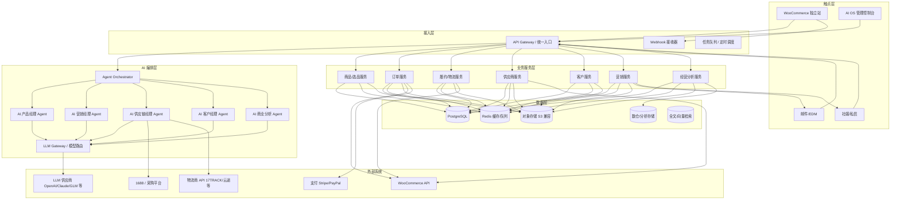
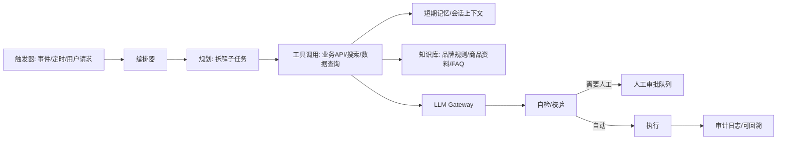
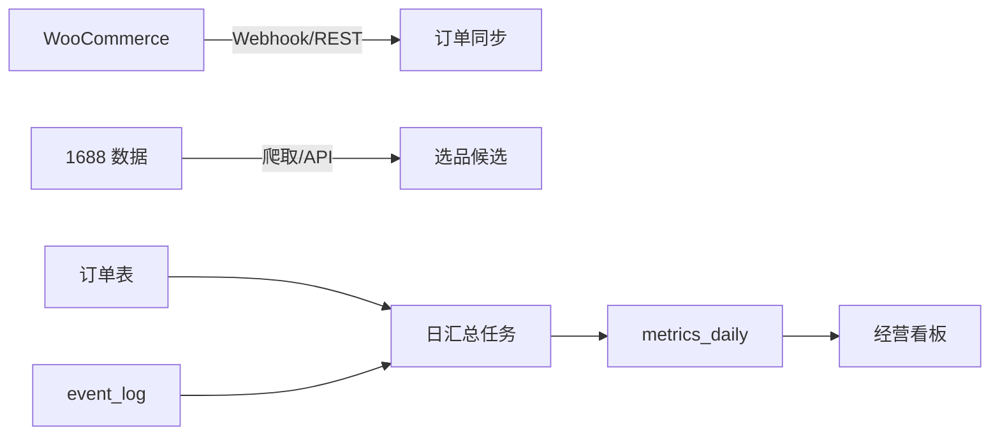

# Nuotao Outdoor AI OS — 项目架构分析

> 版本：v0.3（架构规划草案）
> 状态：规划阶段，未开始编码
> 适用阶段：Phase 1（1688 选品 + WooCommerce DTC + 中国直发）
> 作者角色：首席架构师

---

## 1. 需求分析

### 1.1 业务背景

Nuotao Outdoor 是 AI 驱动的跨境户外品牌，采用「中国 1688 供应链 → WooCommerce 独立站 → 海外消费者直发」的轻资产模式起步。爆品验证后建立海外仓，最终发展海外代理商与 B2B 渠道。

### 1.2 系统目标

建设 **AI Native Outdoor Commerce Operating System（AI 原生户外电商操作系统）**，以数据为底座，用 AI Agent 替代传统人工运营环节，实现：

| Agent | 核心职责 | 替代的传统岗位 |
|---|---|---|
| AI 产品经理 | 1688 选品、市场趋势分析、定价、SKU 生命周期管理 | 产品经理 |
| AI 营销经理 | SEO 内容、广告投放、社媒内容、邮件营销、活动策划 | 营销专员 |
| AI 供应链经理 | 供应商管理、采购、库存、物流跟踪、履约异常处理 | 供应链专员 |
| AI 客户经理 | 售前咨询、售后处理、客诉、评价管理、复购运营 | 客服团队 |
| AI 商业分析系统 | 经营看板、财务核算、归因分析、预测、异常预警 | 数据分析师 |

### 1.3 功能需求（Phase 1 MVP 范围）

1. **DTC 交易**：WooCommerce 独立站，多币种（USD 主、EUR 次）、多语言（英文/德语）、国际支付与本地化税费（美国州销售税 + 欧盟 IOSS VAT）。
2. **选品引擎**：采集/同步 1688 商品与供应商数据，结合平台趋势、利润率模型输出选品建议。
3. **订单履约自动化**：WooCommerce 订单 → 供应商采购单 → 物流单号回填 → 自动发货通知。
4. **AI 客服**：全渠道（邮件 + 站内工单 + 社媒私信）机器人应答，人工兜底。
5. **AI 营销**：商品卖点提炼、SEO 文案、广告素材与投放建议、EDM 自动化。
6. **经营分析**：订单、成本、利润、流量、广告 ROI 的统一看板与周报自动生成。
7. **多市场合规**：美国州销售税（经济关联）、欧盟 IOSS VAT、GDPR；德国 LUCID（包装法）/ WEEE（含电子件时）登记。

### 1.4 非功能需求（NFR）

| 维度 | 要求 |
|---|---|
| 成本 | Phase 1 月运营成本控制在低水平（服务器 + SaaS + LLM API），以开源优先 |
| 可用性 | 独立站 99.5%+，AI 服务允许降级（LLM 不可用时回退规则/人工） |
| 扩展性 | 模块化单体起步，按域拆分为可独立部署的服务；订单量 ×10 无架构重写 |
| 数据安全 | 客户 PII、支付数据、供应商数据分级管理；GDPR 合规基线 |
| 可维护性 | 约定式目录结构、统一日志/监控/CI；新人 1 天可上手 |
| AI 可靠性 | Agent 行为可审计、可回滚、有兜底，关键操作需人审（Human-in-the-loop） |

---

## 2. 总体架构设计

### 2.1 架构风格

- **阶段 1：模块化单体 + 事件驱动**。所有业务能力作为同一代码库内的模块（Python 服务），通过 PostgreSQL + Redis 支撑；WooCommerce 作为独立 DTC 系统通过 REST/Webhook 集成。
- **阶段 2：按域拆分微服务**。订单、供应链、营销、客户成功独立部署，引入消息队列。
- **阶段 3：开放平台**。对外提供 B2B API、代理门户，第三方可编程接入。

> 决策依据：团队初期小、成本敏感，微服务会放大运维负担；模块化单体 + 清晰领域边界可以在业务增长后再拆分。

### 2.2 分层架构

### 2.3 AI Agent 架构（核心）

**原则：Agent 不直接改业务数据，全部通过业务服务 API 操作；每个 Agent 的输出先落库为「AI 任务 + 建议」，需要执行的关键动作走审批流。**

**Agent 技术要点**

- 编排框架：LangGraph（状态图，支持人审节点、重试、超时），或轻量自研编排器。
- 模型路由（LLM Gateway）：多供应商架构，**OpenAI 为主、DeepSeek 为备**；按任务类型与成本路由（选品分析用高推理模型、客服用低成本快速模型、翻译用专用模型），统一降级与配额，避免厂商锁定。
- 工具层：只暴露白名单 API，Agent 无法直接执行 SQL 或触碰文件系统。
- 记忆：短期会话记忆（Redis）+ 长期知识库（向量检索，只读）。
- 审计：每次 Agent 运行的输入、规划、工具调用、输出、审批人全量落库（`ai_agent_runs`）。
- 护栏：金额/折扣/退款/发货等高风险操作必须人审；所有对外文案需规则校验（禁词、事实核对）。

### 2.4 模块划分（领域边界）

| 领域 | 模块 | 说明 |
|---|---|---|
| 商品域 | catalog | 商品、变体、价格、上下架 |
| 选品域 | sourcing | 1688 数据、供应商、选品建议、利润率测算 |
| 交易域 | orders | WooCommerce 订单同步、售后 |
| 履约域 | fulfillment | 采购单、物流轨迹、异常处理 |
| 客户域 | customers | 客户档案、工单、客服会话 |
| 营销域 | marketing | 内容、活动、EDM、广告 |
| 分析域 | analytics | 指标、报表、预测、预警 |
| AI 编排域 | ai-core | Agent 运行时、LLM Gateway、审批流、审计 |

### 2.5 关键流程设计

**选品流程（AI 产品经理）**
1. 手动录入/批量导入 1688 候选商品与供应商信息（Phase 1），触发选品任务；AI 负责结构化、分析与评分。
2. 计算落地成本模型（采购价 + 头程 + 尾程 + 平台费 + 营销预估 + 损耗）。
3. LLM 结合趋势数据（Google Trends / 平台搜索量）生成选品建议与卖点。
4. 建议进入审批队列，产品负责人确认后创建商品草稿。

**订单接收与审计流程（M1.5 已落地：WooCommerce → Webhook → Order → Event → Rule → Audit）**

1. WooCommerce 在订单创建时推送 `order.created` Webhook 到 `POST /api/v1/webhooks/woocommerce`。
2. 后端校验 HMAC-SHA256 签名（`X-Wc-Webhook-Signature`，密钥来自 `WOOCOMMERCE_WEBHOOK_SECRET`）与 payload 结构；支付网关 topic 返回 404 兼容；失败策略：4xx 不重试、5xx 由 WooCommerce 指数退避重试。
3. 幂等落库：`(workspace_id, external_order_id)` 唯一约束，重复投递返回 `duplicate` 不产生新数据。
4. 利润引擎计算 Contribution Margin 快照（Decimal，含商品落地成本、支付手续费估算、折扣），与订单一同持久化。
5. 规则引擎对 `PRICE` / `PROFIT` / `FULFILLMENT` 三个规则域执行 `check()`，结果写入 `rule_results` 与 `rule_execution_logs`；M1.5 不自动执行任何高风险动作。
6. `order.created` 事件写入 `event_log`，`trace_id` 贯穿 Webhook → 订单 → 规则日志 → 事件，形成完整审计链。

**订单履约流程（AI 供应链经理）**

1. WooCommerce 新订单 Webhook → 订单服务落库。
2. 自动匹配供应商与采购规则（库存/成本/时效）生成采购单。
3. 1688/物流商接口下单，回填物流单号。
4. 物流轨迹自动同步，异常（超时/退件）触发客服 Agent。

---

## 3. 数据库设计

### 3.1 设计原则

- 单一事实来源：业务库（PostgreSQL）为主，WooCommerce 数据以订单为主键映射，不同步原始表。
- 事件日志化：重要状态变更写 `event_log`，支撑审计与下游分析。
- 成本控制：分析型查询尽量走数仓/只读副本，避免影响在线交易。

### 3.2 核心表设计（Phase 1）

| 表 | 用途 | 关键字段 |
|---|---|---|
| `products` | 商品主数据 | id, sku, title, variants(jsonb), cost_cny, price, status, supplier_id |
| `suppliers` | 供应商档案 | id, name, 1688_shop, rating, payment_terms, status |
| `sourcing_candidates` | 选品候选 | id, source_url, title, cost, moq, trend_score, profit_model(jsonb), status |
| `purchase_orders` | 采购单 | id, order_ids[], supplier_id, items(jsonb), total_cost, status |
| `orders` | 订单（映射 WC） | id, wc_order_id, customer_id, items(jsonb), payment_status, fulfillment_status |
| `shipments` | 物流单 | id, order_id, carrier, tracking_no, events(jsonb) |
| `customers` | 客户 | id, email(enc), name(enc), country, lifetime_value, tags[] |
| `conversations` | 客服会话 | id, customer_id, channel, messages(jsonb), resolved_by, status |
| `tickets` | 工单 | id, conversation_id, issue_type, priority, status |
| `campaigns` | 营销活动 | id, name, channel, budget, content, start_at, end_at |
| `content_assets` | 内容资产 | id, type, lang, body, seo_meta(jsonb), status |
| `ai_agent_runs` | Agent 运行审计 | id, agent, trigger, input(jsonb), plan(jsonb), tool_calls(jsonb), output(jsonb), approval(jsonb), cost, status |
| `ai_suggestions` | Agent 建议 | id, agent, target_type, target_id, summary, payload(jsonb), status(待审/通过/拒绝) |
| `event_log` | 事件日志 | id, entity_type, entity_id, event, payload(jsonb), created_at |
| `metrics_daily` | 日汇总指标 | date, orders, revenue, cogs, ad_spend, roi, profit |

> 注：Phase 1 不引入独立数仓，`metrics_daily` 由定时任务聚合；数据量到达一定规模后再迁移分析存储（如 ClickHouse / BigQuery）。
> 多市场支持：`products` 按市场差异化定价（`price_by_region` jsonb）；多语言内容独立表（lang / title / description / seo_meta）；税务按市场走「税制适配器」（美国州销售税 / 欧盟 IOSS）。

### 3.3 数据流

---

## 4. 技术选型

### 4.1 选型原则

- 开源优先、低成本；付费项仅限 LLM API 与必要 SaaS（支付、物流）。
- 生态成熟、招人容易；避免小众框架。
- WooCommerce 已是业务决策（用户指定），围绕它集成。

### 4.2 选型对比

| 层级 | 候选 | 选择 | 理由 |
|---|---|---|---|
| DTC 电商 | WooCommerce / Shopify / Magento | **WooCommerce**（已指定） | 开源、无订阅费、API 生态成熟；自托管成本可控 |
| 后端语言 | Python / Node / PHP | **Python 3.12（FastAPI）** | AI 生态最强；FastAPI 异步高性能、自动文档 |
| AI 编排 | LangGraph / 自研 | **LangGraph 起步，自研薄封装** | 状态图原生支持人审/重试；避免过度依赖 |
| 模型访问 | 多供应商直连 / LiteLLM | **LiteLLM Gateway（OpenAI 主、DeepSeek 备）** | 统一路由、降级、成本统计，避免厂商锁定 |
| 主数据库 | PostgreSQL / MySQL | **PostgreSQL 16** | JSONB 适合变体/事件；扩展能力强 |
| 缓存/队列 | Redis / RabbitMQ | **Redis 7** | 缓存 + 轻量队列二合一，Phase 1 足够 |
| 对象存储 | S3 / Cloudflare R2 / MinIO | **Cloudflare R2（海外）或 MinIO（自托管）** | 零出口流量费/低成本；S3 兼容 |
| 搜索/向量 | pgvector / Elasticsearch | **pgvector** | 免新增组件，PostgreSQL 扩展即可 |
| 前端控制台 | React / Vue | **React + Next.js（或轻量 Vite SPA）** | 生态大、AI 工具链成熟 |
| 部署 | 云 VPS / 容器 | **Docker Compose 单机起步** | 成本最低、可迁移；规模上来再上 K8s |
| CI/CD | GitHub Actions / GitLab CI | **GitHub Actions** | 与代码托管同栈、免费额度够用 |
| 监控 | Prometheus + Grafana / SaaS | **Prometheus + Grafana + Sentry** | 开源免费；Sentry 免费档用于错误追踪 |
| 支付 | Stripe / PayPal | **Stripe + PayPal** | 跨境主流，WooCommerce 插件成熟 |
| 税务 | Stripe Tax / TaxJar / 自研适配器 | **Stripe Tax 起步，预留税制适配器** | 美国州税自动计算；欧盟 IOSS 需登记号与申报对接 |
| 物流 | 17TRACK / 云途 / Shippo | **按需接入 1-2 家 + 17TRACK 查单** | 覆盖中国直发主流渠道 |
| 多语言 | WPML / Polylang / TranslatePress | **Polylang（或 TranslatePress）** | 开源低成本；商品与页面多语言管理 |
| 1688 数据 | 官方 API / 采集 / 人工录入 | **Phase 1 人工录入 + AI 分析；Phase 2 探索 API/数据集成** | 先保合规与数据质量，量上来再自动化 |

> 假设：Phase 1 服务器用 1 台 4C8G 海外 VPS（约 $30–60/月）；WooCommerce 独立站与 AI OS 可同机部署，DB 与 Web 分离（同机多容器）。

### 4.3 成本估算（月，Phase 1，单位 USD）

| 项目 | 估算 | 说明 |
|---|---|---|
| VPS/托管 | 30–60 | 海外 VPS 或轻量云 |
| 域名/邮箱 | 5–15 | 域名 + Google Workspace 或 Zoho |
| LLM API | 50–200 | 随业务量波动，设预算上限与降级策略 |
| SaaS（支付/物流/CRM） | 30–80 | Stripe 按交易抽成另计 |
| 监控/CI | 0–20 | 开源 + 免费额度 |
| **合计** | **约 115–375** | 不含人工成本 |

---

## 5. 开发步骤（按依赖排序）

1. **项目脚手架**：仓库初始化、目录结构、CI、Docker Compose、配置管理、日志与错误追踪接入。
2. **基础设施代码**：PostgreSQL schema（Flyway/Alembic 迁移）、Redis、对象存储、后台任务框架。
3. **WooCommerce 集成**：订单 Webhook 同步、商品双向同步、支付回调。
4. **订单与履约域**：订单服务、采购单、物流单、状态机。
5. **ai-core 骨架**：LLM Gateway、Agent 运行时、审批流、审计日志。
6. **AI 客户经理**：知识库、客服 Agent、工单转人工（首个子 Agent，价值即时可见）。
7. **AI 供应链经理**：选品数据录入/导入（模板与质检）、成本模型、采购建议、物流异常监控。
8. **AI 产品经理**：趋势数据接入、选品建议、商品草稿生成。
9. **AI 营销经理**：卖点/SEO 内容生成、EDM 自动化、投放建议。
10. **AI 商业分析**：指标聚合、周报生成、异常预警。
11. **管理控制台**：以上能力的统一界面（审批队列、看板、Agent 运行日志）。

---

## 6. 测试方案

| 层级 | 内容 | 工具 |
|---|---|---|
| 单元测试 | 业务规则、成本模型、状态机、Agent 工具函数 | pytest |
| 集成测试 | API、DB、WooCommerce Webhook（Testcontainers） | pytest + Testcontainers |
| Agent 评测 | 固定评测集（客服回答质量、选品建议合理性、文案合规），回归防退化 | pytest + 评测集 + LLM-as-judge |
| E2E 测试 | 订单全流程：下单→采购→发货→通知 | Playwright |
| 安全测试 | 依赖扫描、权限、PII 加密、OWASP 基线 | pip-audit、OWASP ZAP |
| 性能测试 | 下单峰值、Webhook 并发、LLM 并发降级 | Locust |
| 可观测性 | 日志、指标、告警演练 | Grafana + Sentry |

**验收门禁（合并到主干前）**：单测/集成通过 → 代码覆盖率达标（核心域 ≥ 80%）→ lint/格式通过 → Agent 评测集通过 → 无高危依赖漏洞。

---

## 7. 演进路线（架构视角）

| 阶段 | 架构动作 |
|---|---|
| Phase 1（MVP） | 模块化单体 + Docker Compose；WooCommerce 单店 |
| Phase 1.5（放量） | 只读副本 + 分析存储；任务队列升级；CDN 与缓存 |
| Phase 2（海外仓） | 履约域独立部署；多仓库存模型；物流商多接入 |
| Phase 3（B2B） | API 开放平台、代理门户、多租户数据隔离、合规升级 |

---

## 8. 待确认事项（假设清单）

1. ✅ 已确认：目标市场 = 美国（主）、德国/欧盟（次），未来英国/加拿大/澳大利亚；架构按多市场（多币种/多语言/多税制）设计。
2. ✅ 已确认：1688 数据 = Phase 1 人工录入 + AI 分析；Phase 2 探索 API/数据集成。
3. ✅ 已确认：LLM = 多供应商架构（OpenAI 主、DeepSeek 备），LiteLLM 网关防锁定；预算上限待运营期设定。
4. 客服渠道范围（邮件 + 工单是基线，社媒私信是否 Phase 1 接入）。
5. 品牌自有设计能力 vs 1688 现成产品贴牌（影响商品数据模型）。

> 以上假设在后续文档与评审中逐步收敛，任何变更需更新本文档版本号并记录变更日志。

| v0.3 | 2026-08-11 | 确认 1688 数据策略（Phase 1 人工录入+AI 分析，Phase 2 探索 API）与 LLM 多供应商策略（OpenAI 主、DeepSeek 备，防锁定）；同步更新选品流程与开发步骤 |

### 3.4 M1.5 订单域落地表（已实现）

| 表 | 关键字段 | 约束/说明 |
|---|---|---|
| `orders` | id(uuid), workspace_id, external_order_id, status, payment_status, currency, country, total/subtotal/shipping_total/discount_total/tax_total/payment_fee/refunded_amount/advertising_cost(numeric(12,2)), profit_snapshot(jsonb), rule_results(jsonb), trace_id, received_at | 唯一 `(workspace_id, external_order_id)` 保证幂等；不保存姓名/邮箱/地址等 PII |
| `order_items` | id(uuid), order_id(fk), external_item_id, product_id(fk), sku, name, quantity, unit_price, line_total | 订单行明细，`ondelete=CASCADE` |

## 9. 变更记录

| 版本 | 日期 | 变更 |

|---|--|---|

| v0.4 | 2026-08-11 | M1.5 订单域落地：orders/order_items、WooCommerce Webhook（HMAC 验签 + 幂等 + 网关 topic 404 兼容）、利润引擎（Contribution Margin）、PRICE/PROFIT/FULFILLMENT 规则接入、全链路 trace_id 审计 |

| v0.3 | 2026-08-11 | M1 数据底座：workspace/event_log/products/suppliers/rules/rule_execution_logs/ai_agent_runs 与事件、规则引擎骨架 |

| v0.2 | 2026-08-11 | 确认多市场战略（美国主、德国/欧盟次、未来英/加/澳）；需求、数据模型、技术选型同步补充多币种/多语言/税制适配 |

| v0.1 | 2026-08-11 | 初稿 |
